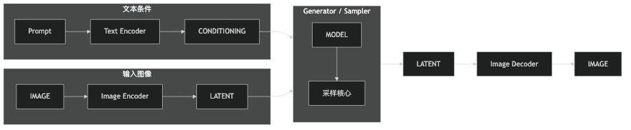
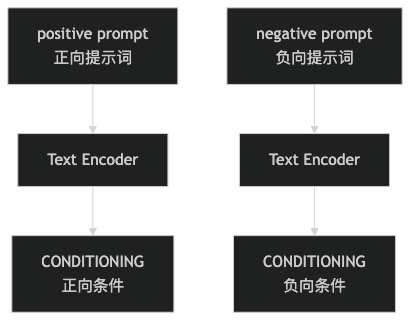
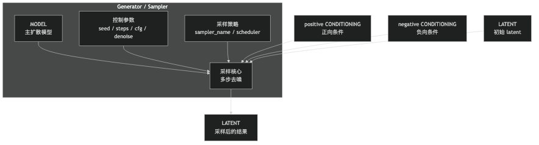

# 从噪声到图像：图片生成的第一性原理

> ComfyUI 很适合拿来观察这条链路，但这篇文章真正想讲的，是它背后的通用原理。

很多人第一次看这类生成系统，都会被一堆名字劝退：`MODEL`、`CLIP`、`VAE`、`CONDITIONING`、`LATENT`、`KSampler`、`IMAGE`。

这些词单独看都眼熟，连在一起就开始混乱。

如果你正在学 ComfyUI，这篇文章就是给你打地基的。它不直接教你怎么搭节点，而是先讲清楚一件更重要的事：文生图、图生图，以及最常见的图像编辑工作流，到底遵循什么样的基本链路。

之所以借 ComfyUI 来讲，是因为它把很多平时藏在模型内部的步骤拆开了，让你能直接看见“文字怎么变成条件”“图像怎么变成 latent”“采样器到底吃进去什么”。所以为了方便对照，下文会沿用一些 ComfyUI 里的名字，但要讲清楚的是这些名字背后的通用原理。

整篇文章都围绕这条链路展开。目标只有一个：把生成系统里最常遇到的概念，重新放回它们在系统里的位置。这样后面你再学节点，才不会觉得自己在背咒语。

## 一张图先看懂

如果你现在更关心“生成系统到底怎么运转”，而不是一上来就记节点名字，最适合的办法不是把所有细节塞进一张图里，而是先看主干，再看子图。

先看总览图：



这张图故意省略了很多细节。它只强调一件事：这类工作流的主干可以先压缩成

`CONDITIONING + LATENT -> Generator / Sampler -> LATENT -> Image Decoder -> IMAGE`

而 `MODEL` 是整个生成过程依赖的核心部件。

如果你觉得奇怪：既然 `MODEL` 这么重要，为什么没直接写进这条箭头里？原因是它更像 `Generator / Sampler` 在工作时要调用的核心引擎，而不是一段单独往前流动的数据。换句话说，主干写的是“数据怎么流”，`MODEL` 更像让这条流动真正发生的发动机。

这里要先补一个边界：这条链路并不是所有图像生成技术的统一公式。它更准确地描述的是当前最常见的一类工作流，也就是以 **潜在扩散模型**（Latent Diffusion Model）为核心的图片生成和编辑系统。ComfyUI 之所以特别适合拿来入门，也是因为它正好把这条链路拆开了。

如果再往外看，图像生成当然不只有这一套路线。GAN 更接近 `噪声 / 条件 -> Generator -> IMAGE`。自回归图像生成更像先生成图像 token，再把 token 解码成图片。像素空间 diffusion 虽然也走逐步去噪，但不一定先进 latent 空间。这里不展开这些分支，因为这篇文章真正想讲清楚的，是 **ComfyUI 最常见、也最值得先理解的 latent diffusion 工作流**。

如果放回 ComfyUI / Stable Diffusion 这套更具体的语境里：

- 上面的 `Text Encoder`，常见实现就是 `CLIP Text Encode`
- 上面的 `Image Encoder / Image Decoder`，常见实现就是 `VAE Encode / VAE Decode`
- 上面的 `Generator / Sampler`，在 ComfyUI 里最常见的对应节点就是 `KSampler`

先记住这个骨架，后面那些名词才有位置。

## 先把两张子图看明白

上面那张图只画了主干。接下来把两个最容易混的地方单独拆开。

第一张子图，讲的是文本条件是怎么来的：



这张图想说的不是“prompt 很重要”这种空话，而是更具体的一点：

- 你输入的是自然语言
- 模型真正接收的不是自然语言本身
- 它接收的是编码后的 `CONDITIONING`

第二张子图，讲的是采样器到底在吃什么：



如果只抓一句话，那就是：这条主流程里最重要的是 `MODEL / CONDITIONING / LATENT / Sampler / IMAGE`，而 `Text Encoder`、`Image Encoder`、`Image Decoder` 分别负责把文字和图像接到这条主干上。

如果从第一性原理去看，`KSampler` 这类节点的输入可以先分成 3 类：

- 核心数据输入：`MODEL`、`positive CONDITIONING`、`negative CONDITIONING`、`LATENT`
- 控制参数：`seed`、`steps`、`cfg`、`denoise`
- 采样策略：`sampler_name`、`scheduler`

这样一分，很多人第一次看到参数面板时的混乱感会少很多。

## 文生图不是“画出来”，而是“修出来”

很多人一听“图像生成模型”，脑子里会浮现一个很拟人的画面：模型像画家一样，先理解 prompt，再从空白画布开始下笔。

这其实很误导。

更接近真实的理解是：模型先学会一种能力，叫“怎么把被打坏的图片修回来”。有了这个能力之后，它才有机会从一团噪声里，一步步修出一张图。Ho 等人在 `2020-06-19` 发布的 **去噪扩散概率模型**（Denoising Diffusion Probabilistic Models，DDPM）论文，就是这条路线最经典的表述。[DDPM](https://arxiv.org/abs/2006.11239)

你可以把训练过程想成这样。

先拿一张正常照片，比如一张海边的人像照。然后故意把它一点点打坏。最开始只是一些细碎颗粒，像手机夜拍时的噪点。再往后，图像会越来越模糊，边缘和纹理开始散掉。继续加下去，人物轮廓、衣服褶皱、背景层次都会被冲散。最后，整张图几乎只剩一团随机斑点。

模型训练时反复在做的，就是另一件事：如果一张图已经坏到这个程度，往哪个方向修一点，会更像真实世界里的图片。

生成的时候，过程就反过来了。

它不是凭空创作，而是从最坏的起点开始，一步步往回修：

```text
一团噪声 -> 少一点噪声 -> 轮廓开始出现 -> 纹理慢慢稳定 -> 最终图像
```

所以我一直觉得，把扩散模型理解成“修图机器”比理解成“画图机器”更准确。

这件事很关键。因为你一旦这么看，prompt 就不再像 Photoshop 里的硬指令，而更像在整个修复过程中持续施加的约束。

但这里还有一个很实际的问题：如果每一步修复都直接发生在原始像素上，代价会高得不合理。

于是下一步自然会落到另一个问题：这件事真正发生在哪里？

## 为什么真正的生成主战场不在像素空间

如果你直接在原始像素上做去噪，成本会非常高。

这也是为什么 Stable Diffusion 这一代系统普遍不直接在像素空间里工作。`2021-12-20` 提出的 **潜在扩散模型**（Latent Diffusion Model）做了一个非常关键的工程改进：先把图像压进更紧凑的潜空间，再在那个空间里做去噪。[Latent Diffusion](https://arxiv.org/abs/2112.10752)

这件事不用想得太玄。

你可以先把 **潜空间**（latent）理解成一块压缩后的内部画布。它保留了图像的关键结构，但不是你能直接打开预览的 PNG。

这么做的好处非常现实：

- 计算量更低
- 生成速度更快
- 大规模应用更可行

于是很多你以为在“图片上”发生的事，其实都发生在 latent 上。

## Text Encoder：把文字变成模型能理解的输入

先讲上面总览图里的 `Text Encoder`。

在 Stable Diffusion / ComfyUI 这套语境里，这个角色最常见的具体名字就是 `CLIP`，对应节点常写成 `CLIP Text Encode`。但从更普适的角度看，你先把它理解成“文本编码器”就够了。

它的工作不是画图，而是把你写的 prompt 变成模型可以消费的内部表示。

比如你写：

> a cat sitting by the window, cinematic lighting

这句话对人类来说很好懂，但对神经网络来说，必须先被编码成向量或 embedding 一类的表示。借 ComfyUI 来看，这个动作就被显式拆成了一个单独节点。

所以：

- `prompt` 是人类语言
- `Text Encoder` 是翻译器
- 输出结果是 `CONDITIONING`

理解到这一步，你就不会再把“我写的词”和“模型吃进去的东西”混成一团。

## CONDITIONING：编码后的提示条件

`CONDITIONING` 直译就是“条件”。

在扩散模型里，生成不是无条件瞎画，而是在某些条件约束下进行的。文字提示词是一种条件，负面提示词也是一种条件。

所以 `CLIP Text Encode` 的输出 `CONDITIONING`，可以理解成：

**编码后的提示条件**

这里特别容易和上面的 `Text Encoder` 混淆。两者关系其实很简单：

- `Text Encoder` 是编码器
- `CONDITIONING` 是编码结果

就像压缩软件不是压缩包，翻译器也不是翻译后的文本。

为了和 ComfyUI 的图对应起来，可以继续沿用 `positive` 和 `negative` 这两个名字：

- `positive`：你想让图里出现什么
- `negative`：你不想让图里出现什么

这两者都会交给采样器。比如你想把一张猫的照片改成“戴墨镜、坐在沙发上”，那正向条件可以理解成“保留猫，增加墨镜和室内场景”，负向条件则可能是“不要模糊、不要多余肢体、不要卡通风”。

## MODEL：真正执行去噪的主模型

到了这里，很多人又会卡住：`MODEL` 是什么？它是不是就是 `UNet`？

可以说，在很多经典 Stable Diffusion 模型里，`MODEL` 背后主要就是那个负责去噪的 `UNet`。但如果站在整条生成链路上看，`MODEL` 这个名字比 `UNet` 更通用。

原因很简单。

`UNet` 是一种具体网络结构名。`MODEL` 是工作流里的抽象角色名。

像 ComfyUI 这样的可视化工具关心的是：

- 这个东西能不能拿来做扩散去噪
- 它能不能接到采样器上工作

至于底层到底是 `UNet`、`DiT`、`MMDiT`，还是别的结构，那是实现细节，不一定要暴露在节点层。

所以更准确的关系是：

- `MODEL` 是对“主扩散模型对象”的抽象
- `UNet` 是某些 `MODEL` 的具体实现形式之一

这也是为什么把它叫 `MODEL` 比叫 `UNet` 更稳。比如你给的是同一张猫照片和同一个 prompt，不同的 `MODEL` 可能会让结果偏写实、偏插画，或者对面部细节的处理方式明显不同。

## LATENT：生成发生的画布

`LATENT` 通常会被翻译成“潜变量”或者“潜空间表示”。在这篇文章里，你可以先把它理解成：

**压缩后的图像画布**

这不是普通图片，不是 PNG，也不是你能直接看的像素图。它是模型内部工作时使用的一种更紧凑的表示。

如果想用一个更有画面感的类比，你也可以先把它理解成装修前的平面图，或者施工图。

很多关键修改，直接在已经装修好的房子上动刀，成本很高。你要改墙体位置、房间比例、动线关系，先在图纸层改，再重新施工，会高效得多。

图像生成也是类似的。模型通常不是直接在最终像素图上反复修改，而是先把图片放进一层更适合操作的内部表示里，也就是 `latent`。主要生成发生在这里，最后再把结果还原成最终图片。

当然，这个类比只是帮助你理解“为什么要换一层表示来操作”。`latent` 不是人类能直接读懂的平面图，它更像模型内部自己的施工图。

于是整个过程就变成了：

- 先准备一块 `LATENT` 画布
- 在这块画布上做去噪生成
- 最后再转成 `IMAGE`

如果借 ComfyUI 来看，文生图时常见的是先用 `Empty Latent Image` 准备一块初始 latent 画布。图生图和文 + 图生成图时，则是先经过 `VAE Encode` 把原图压进 latent 空间，再把那个 latent 送进采样器。

比如你上传一张正面的猫脸照片，latent 里通常还会保留“脸朝前、耳朵位置、主体构图”这些关键信息，只是它已经不是肉眼可读的像素图了。

## Generator / Sampler：真正执行生成的模块

现在来到整条链路的中心：`Generator / Sampler`。在 ComfyUI 里，这个角色最常见的节点名就是 `KSampler`。

如果只记一句话，那就是：

**Generator / Sampler 是真正负责生成的模块。**

在图像编辑这类场景里，前面的模块都在做准备工作：

- `CLIP Text Encode` 编码提示词
- `VAE Encode` 准备初始 latent

但真正把“噪声一步步变成图”的，是这个生成器 / 采样器。

它会吃进这些输入：

- `MODEL`
- `positive CONDITIONING`
- `negative CONDITIONING`
- `LATENT`

然后做多步采样和去噪，输出一个新的 `LATENT`。

所以它的角色不是加载模型，不是翻译 prompt，也不是解码图片。它做的事非常专一：按照条件，在 latent 空间里生成内容。

这也是为什么它叫 sampler。它的核心过程不是“一次性算出一张图”，而是沿着采样过程，一步步把噪声推向结果。

## Sampler 的关键参数

光知道“有一个采样器”还不够。很多人第一次看到参数面板时，真正懵的反而是下面这些旋钮。

不过先说清边界：这一节你现在不需要全部记住。这里先有个模糊印象就够了，后面真正上手 ComfyUI 时，再回来对这些参数建立手感会更自然。

### seed

`seed` 是随机种子。

它决定初始噪声怎么生成。同样的模型、同样的 prompt、同样的参数、同样的 seed，通常会得到高度一致的结果。

所以 seed 的作用主要是两件事：

- 让结果可复现
- 让你在“随机”里保留控制力

### steps

`steps` 是采样步数，也就是去噪迭代多少步。

步数越高，通常细节会更多，但也会更慢。不过它不是越大越好，超过某个范围后，收益会明显下降。

### cfg

`cfg` 通常指 **无分类器引导系数**（Classifier-Free Guidance scale）。

你可以先把它理解成：模型听 prompt 的程度有多强。

- 低一点，图更自由
- 高一点，图更贴 prompt
- 太高，可能会过拟合提示词，反而变怪

它不是“质量开关”，而是“服从程度旋钮”。

### sampler_name 和 scheduler

`sampler_name` 是具体采样算法。`scheduler` 是采样调度方式，控制每一步噪声如何安排。

如果想用人话理解：

- `sampler_name` 更像“走哪种路线”
- `scheduler` 更像“这条路线的节奏怎么分配”

### denoise

这个参数在图生图里尤其重要。

- `1.0` 接近完全重做
- 越低，越保留原图结构

所以它本质上控制的是：你允许采样器改动原有 latent 的幅度有多大。

如果你只想让猫戴上墨镜，不想改脸型和构图，`denoise` 通常就不能开太高。

## 为什么 Sampler 输出的还是 LATENT，不是 IMAGE

这是新手最常见的疑问之一。

答案其实很直接：因为 Sampler 工作在潜空间，不工作在像素空间。

它生成完之后，得到的仍然是潜空间里的结果，也就是新的 `LATENT`。这时候你还不能直接“看图”，因为它还没被翻译回像素。

这就轮到上面的 `Image Decoder` 出场了。

## Image Encoder / Image Decoder：LATENT 和 IMAGE 之间的桥

上面总览图里的 `Image Encoder / Image Decoder`，在 Stable Diffusion / ComfyUI 这套语境里，最常见的具体名字就是 `VAE Encode / VAE Decode`。

`VAE` 的全称是 **变分自编码器**（Variational Autoencoder，VAE）。如果直接讲数学定义，通常会把人讲跑。对大多数使用者来说，更实用的理解是：

**Image Encoder / Image Decoder 是 latent 和 image 之间的转换器。**

它负责两件事：

- `Image Encoder`：把普通图片压进 latent 空间
- `Image Decoder`：把 latent 空间结果还原成普通图片

所以：

- 生成时，采样器产出 `LATENT`
- 显示时，`Image Decoder` 把它变成 `IMAGE`

你可以把它想成一座桥：

`LATENT <-> Image Encoder / Decoder <-> IMAGE`

没有这座桥，潜空间里的结果就没法变成你能看到的图。

## IMAGE：你最终看到的图

`IMAGE` 就简单了。

它就是普通像素图，也就是你真正能预览、保存、后处理的图片数据。

前面那一堆抽象，最后都要落到这里。因为用户真正关心的，不是 latent 里发生了什么，而是屏幕上出现了什么。

所以整条链路的终点，就是：

`Image Decoder -> IMAGE`

## 文生图、图生图、文加图生成图，其实共用一条主干

如果把前面的概念都放回流程里，你会发现文生图、图生图、文加图生成图并不是三套系统，而是同一条生成主链路的不同入口。

它们共享的部分完全一样：

- `Text Encoder` 把提示词编码成 `CONDITIONING`
- `MODEL` 负责去噪
- `Generator / Sampler` 负责采样生成
- `Image Decoder` 把结果转回 `IMAGE`

真正不同的地方只有一个：采样器吃进去的初始 `LATENT` 是怎么来的。

文生图时：

- 你没有原图
- 所以用 `Empty Latent Image` 先创建一块空的 latent 画布
- 然后从这块画布开始生成

图生图时：

- 你已经有一张原图
- 所以先用 `Image Encoder` 把原图压进 latent 空间
- 再把这个 latent 交给采样器去继续改写

文 + 图生成图时：

- 你既有输入图像，也有明确的文字条件
- 所以会同时把图像压进 latent 空间，再把文字编码成 `CONDITIONING`
- 最后让采样器在“原图结构”和“文字条件”之间找到新的结果

SDEdit 在 `2021-08-02` 给出的思路，正好能解释这件事：从已有图像开始，加噪，再在条件约束下重建回来。[SDEdit](https://arxiv.org/abs/2108.01073)

这也是为什么我一直觉得，“P 图”和“生图”不是两件完全不同的事。它们底层用的是同一种生成逻辑，只是起点和自由度不同。

## 把整条链路再翻成人话

现在我们把这条链路重新翻译成人话。

第一步，把 prompt 翻译成模型能理解的条件。

`prompt -> Text Encoder -> CONDITIONING`

第二步，把输入图像压进 latent，或者先准备一块初始 latent 画布。

`IMAGE -> Image Encoder -> LATENT`

第三步，让采样器开始工作。

它拿着主模型、正向条件、负向条件和初始 latent，一步步去噪，生成新的 `LATENT`。

第四步，把内部结果还原成你能看的图片。

`Image Decoder -> IMAGE`

如果你能把这四步在脑子里连起来，后面再学节点就会顺很多。因为你已经不是在死记 `CLIP`、`VAE`、`KSampler` 这些名字，而是在理解一套完整系统。

这才是学 ComfyUI 最值得先做的那一步。
