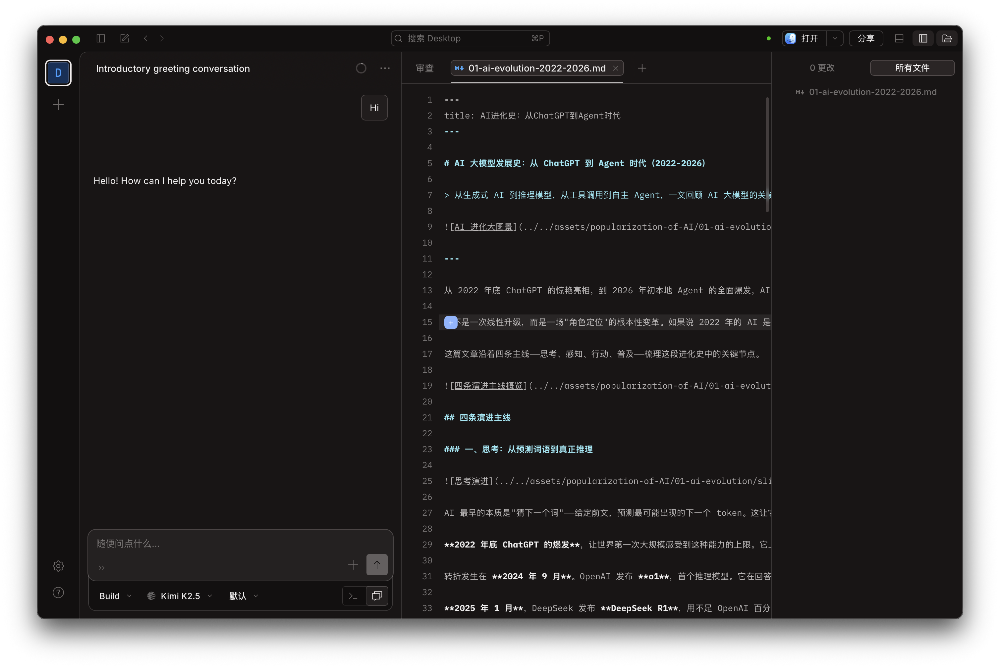
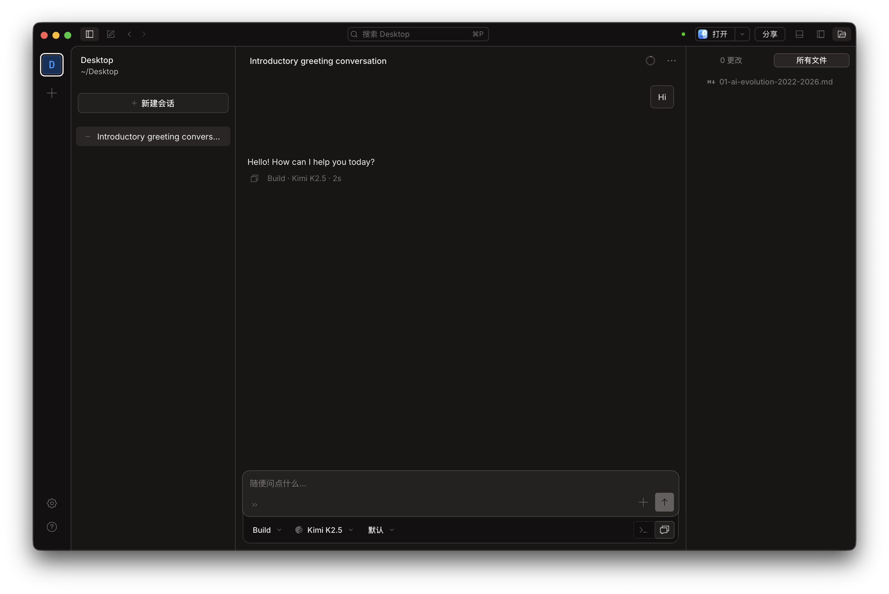

在"从零构建 AI Agent"系列里，我们花了 7 篇文章，亲手造了一个 Agent。聊天、调工具、记忆、执行代码，一块一块拼起来。那个系列的目的不是造出一个能用的产品——而是搞清楚 Agent 到底是怎么运转的。

理解了原理，就够了。没必要自己造轮子。

这就是这个新系列要解决的问题。

## 这个系列是关于什么的

不讲原理，不谈架构。

每篇文章聚焦一个真实场景，面向一类真实用户，从头到尾走完整个流程。你是老师，想用 AI 做教学视频；你是公众号写手，想用 AI 提升写稿效率；你是上班族，想用 AI 处理每天堆积的材料——这个系列就是为你写的。

目标只有一个：如果某一篇刚好说到你的痛点，看完就能自己试。

## 为什么选 OpenCode

现在市面上的 AI Agent 工具已经不少了。OpenAI 有 Codex，Anthropic 有 Claude Code，国内也有通义灵码、Qodework 这类产品。它们各有各的优点，但有一个共同的问题：与特定模型或平台深度绑定。用 Codex，你就在 OpenAI 生态里；用 Claude Code，你离不开 Anthropic。工具本身的逻辑和背后厂商的利益很难完全剥离。

对于一个教学系列来说，这不是一个好的起点。

我希望这个系列的演示工具是中立的——它不替任何一家厂商站台，你用什么模型，它就接什么模型。这就是我选 [OpenCode](https://opencode.ai/) 的原因。它完全开源（MIT 协议），由社区驱动，没有任何商业立场。目前在 GitHub 上有超过 10 万个 star，700 多位贡献者参与开发。你可以随时查看它在做什么，也可以参与改进它。

## OpenCode 是什么

一句话：一个开箱即用的 AI Agent，支持终端、桌面应用和 IDE 插件三种使用方式。

它最初是为写代码而生的。但在"从零构建"系列里，我们已经知道：一个具备 MCP、Skill 和 Shell 工具的 AI Agent，本质上是一个通用 Agent——它能做的事情远不止写代码。文件处理、网络请求、调用外部服务、自动化任务……只要能用命令行或工具描述的事，它都可以接手。写代码，很多时候只是它解决问题的一种途径，而不是目的本身。这个系列后续的文章里，你会不断看到这一点。

本系列用**桌面版（Desktop）**演示——界面直观，操作可见，截图也更友好。桌面版目前处于 Beta 阶段，支持 macOS、Windows 和 Linux，可以直接在 [opencode.ai/download](https://opencode.ai/download) 下载。

打开之后，你会看到默认的三分布局：左侧是对话历史，中间是文件编辑器，右侧是文件浏览器。这个布局是为写代码设计的，方便边聊边看代码改动。

如果你不需要写代码，右上角有个布局切换按钮，点一下就能切换到更简洁的对话模式——左侧是工作目录和会话列表，中间是对话区，右侧显示文件变更。这个系列大部分时候我们用这个布局演示。

左侧还有一个重要概念：**工作目录**。OpenCode 的每个会话都绑定一个目录，Agent 的所有操作——读文件、写文件、执行命令——都在这个目录里进行。做不同的任务时，切换到对应的目录就行。

关于 OpenCode 的更多用法，官方文档（[opencode.ai/docs](https://opencode.ai/docs)）写得很详细，网上也有不少教程，这里不再展开。

它不绑定任何一家 AI 厂商。Claude、ChatGPT、Gemini，甚至本地模型，都可以接入。如果你已经订阅了 ChatGPT Plus 或 GitHub Copilot，直接用你的账号登录就行，不用额外付费。

内置两个主要 Agent：**Build**（默认，可以读写文件、执行命令，适合真正干活）和 **Plan**（只读模式，适合分析和规划）。这个系列大部分场景用的是 Build。

## 从下一篇开始

下一篇，我们做一件具体的事——对一个和各种材料的打交道的文员，如何用 OpenCode 提高你的工作效率。

不是讲理论。是真的做一遍，把遇到的问题、踩过的坑，都写进去。
