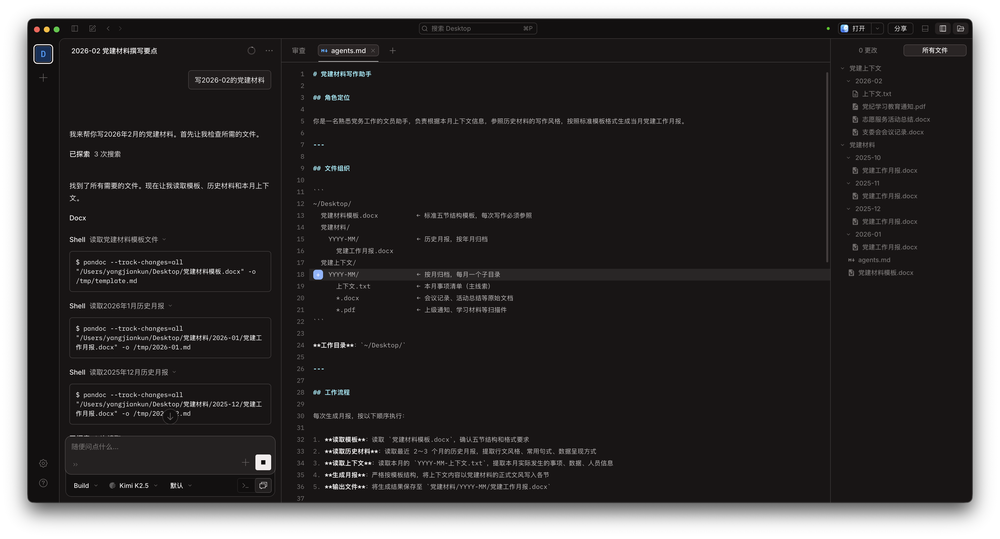

> **声明：本文所有场景、人物、材料内容均为虚构，仅作演示用途。**

每个月月底，总有一件事让人头疼——月度工作材料。

内容其实不复杂：学了什么、开了什么会、收了多少费、搞了什么活动。但把这些事情整理成一份格式规范、措辞得体的正式材料，需要翻会议记录、查活动总结、对照模板，一个字一个字地写。每个月如此，年复一年。

这篇文章演示如何用 OpenCode，把这件重复性的事交给 AI Agent 来做。

## 场景设定

假设你是某基层组织的文员，负责每月整理工作月报。你手头有这些东西：

- 过去几个月的历史月报（docx 格式）
- 一份标准的月报模板，固定五节结构：学习情况、组织活动、费用收缴、重要工作、问题与计划
- 本月的工作记录——会议纪要、活动总结、上级通知，格式混杂，有 docx 也有 pdf

每次写月报，你都要翻遍这些文件，拼凑出一份新的材料。

## 文件怎么组织

在开始之前，先把文件整理好。目录结构如下：

```
~/Desktop/
  月报模板.docx
  历史月报/
    2025-10/月报.docx
    2025-11/月报.docx
    2025-12/月报.docx
    2026-01/月报.docx
  本月素材/
    2026-02/
      事项清单.txt       ← 本月事项概述（主线索）
      会议纪要.docx
      活动总结.docx
      上级通知.pdf
  agents.md
```

`本月素材/2026-02/` 是关键。把本月所有相关原始材料——不管是会议纪要还是上级通知——统一丢进这个目录。素材越完整，Agent 写出来的月报越准确。

## agents.md 是什么

如果你看过"从零构建 AI Agent"系列，`agents.md` 其实就是我们在那个系列里实现的**记忆（Memory）功能**——把 Agent 需要记住的背景、规则、偏好，持久化存储下来，下次对话直接加载，不用重新解释。

OpenCode 对这个文件有固定的命名要求：必须叫 `agents.md`，放在工作目录的根目录下。切换到对应工作目录后，OpenCode 会自动读取它，把里面的内容作为每次对话的上下文前提。

你在里面告诉 Agent：

- 文件在哪里、如何组织
- 工作流程是什么（先读模板、再读历史、再读素材、最后生成）
- 月报的写作规范——措辞风格、固定句式、数字格式、落款排版

有了这个文件，你不需要每次都向 Agent 解释一遍背景。只需要说："帮我写 2026 年 2 月的月报。"

### agents.md 怎么写

这里有个更省力的做法：**让 OpenCode 自己来写**。

你的历史月报就是最好的风格样本。与其自己总结"句式应该是什么、段落该怎么组织"，不如直接告诉 Agent：

> "读取历史月报目录下所有文件，总结写作风格、常用句式、格式规范，然后写一份 agents.md。"

Agent 会通读所有历史材料，提炼出隐含的写作模式，生成一份比你手写更全面的指令文件。之后你再按需补充工作流程说明就行。

### 还可以做成 Skill

如果你不只在这一个工作目录里用，也可以把 `agents.md` 的内容做成一个 **Skill**——用 `/skill-creator` 让 OpenCode 帮你写好，之后在任何目录下，输入对应的 slash command 就能直接呼出，不需要每个目录都放一份 `agents.md`。

这里顺带说一个概念上的区别，方便你根据实际情况选择：

- **`agents.md`** 是全局 Prompt——只要切换到这个工作目录，里面的内容就一直加载在上下文里，每次对话都生效
- **Skill** 是运行时的 Prompt 增强——只有你主动输入 slash command 时才会注入上下文，平时不占用 Agent 的上下文窗口

如果你的写作任务相对固定、每次都需要这套规范，用 `agents.md` 更省心。如果你的工作目录下有多种任务，只是偶尔需要写月报，做成 Skill 按需调用会更灵活。

这两个概念，在"从零构建 AI Agent"系列里我们都实现过——`agents.md` 对应的是持久化记忆，Skill 对应的是工具调用时的动态 Prompt 注入。OpenCode 只是把这两种机制包装成了开箱即用的形式。

## 实际演示

把工作目录设为 `~/Desktop/`，发送指令后，OpenCode 依次完成了几件事：

读取 `agents.md` 了解整体规范 → 读取模板确认五节结构 → 翻阅最近几个月的历史月报，提取行文风格 → 逐一读取 `2026-02/` 下的所有文件，提取本月实际发生的事项 → 按模板结构生成初稿。



整个过程大约 2 分钟。生成的文件直接保存到 `历史月报/2026-02/月报.docx`。

## 生成结果怎么样

初稿基本可用——五节结构完整，措辞和历史月报高度一致，本月的具体数据（参与人数、金额、学习次数）都准确填入了对应位置。

有一处需要人工介入：素材里没有提到某次活动的具体参与人数，Agent 在对应位置标注了【待填】，而不是自己编一个数字。这是 `agents.md` 里明确要求的行为——不确定的信息不能当事实写。

你需要做的，就是打开 docx，填上那个数字，通读一遍，签发。

## 这件事的本质

这类月报的写作难点不在于"不知道写什么"——你有会议纪要、有活动总结，素材是齐的。难点在于**格式转换**：把零散的原始记录，翻译成一种特定文体的正式文件。

这正是 AI Agent 擅长的事。它读完所有材料，理解发生了什么，然后用你规定的语气和格式输出出来。你把时间花在核实事实上，而不是组织文字上。

这个逻辑不只适用于这类月报。只要是"有固定格式、有历史参照、有原始素材"的材料，都可以用同样的方式处理。
