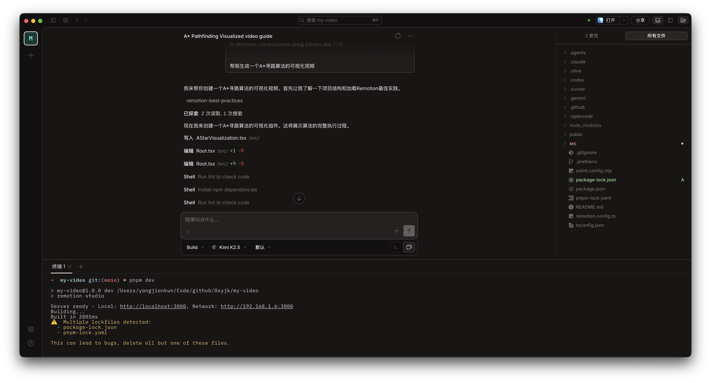
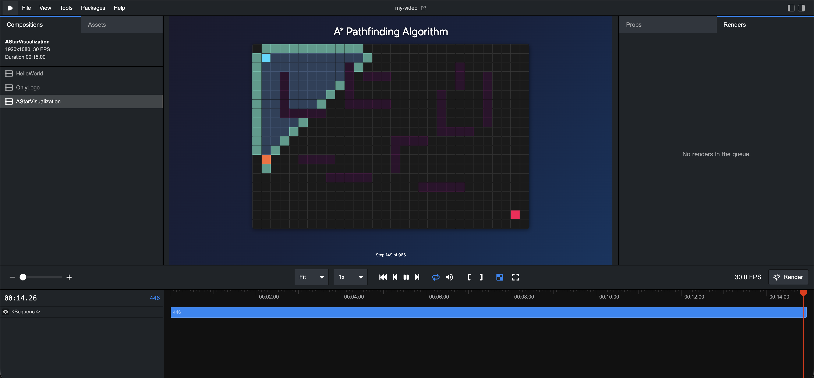

有些东西，画图讲不清楚。

傅里叶变换为什么能把信号拆成频率？贝塞尔曲线的控制点是怎么影响曲线形状的？A* 算法在网格上是怎么一步步展开搜索的？这些问题，你可以写公式、画图、反复解释——但学生就是"懂了，又没完全懂"。关键不在于公式对不对，而在于那个**过程**看不见。

一段好的可视化视频能解决这个问题。但做这样一段视频的门槛，历来不低。

## 做可视化视频，门槛卡在哪里

传统路径是这样的：用 After Effects 或 Blender 手动制作动画，或者录屏、剪辑，加字幕、调时间线。每一步都需要专门的工具，每个工具都有自己的学习曲线。

3Blue1Brown 的视频大家都看过，动画精良、直觉感强。但他背后用的是自己开发的 Python 库 [Manim](https://www.manim.community/)，专门为数学动画设计，学习成本不低，上手要花不少时间。

这条路，对于老师来说门槛已经够高了。对于学生——比如想给课程作业做一个动态演示，或者想在答辩时展示算法运行过程——更是几乎走不通。

## 视频是一个函数

[Remotion](https://www.remotion.dev/) 提供了另一条路。它是一个用 React 写视频的开源框架，核心思想只有一句话：

> 视频，是图像关于时间的函数。

你不需要拖时间线、不需要手动打关键帧。你用 React 组件描述"第 N 帧应该显示什么"，Remotion 负责把每一帧渲染出来，拼成 MP4 文件。

这对写代码的人来说是一个直接的入口——你已经会用代码描述逻辑，现在可以用同样的方式描述"过程的每一帧长什么样"。Remotion 目前在 GitHub 上有 38,000+ star，每月 npm 下载量超过 90 万次，是这个方向最主流的工具之一。

## 和 Sora、Seedance 这类 AI 视频有什么不同

这是一个值得说清楚的问题。现在 AI 生成视频的工具越来越多，Sora、Seedance、即梦……输入一段文字，几分钟出一段视频。那为什么还要用 Remotion 这种需要写代码的东西？

两类工具解决的根本不是同一个问题。

AI 视频生成的优势在于**创造画面**——"一只穿西装的猫在月球上跳芭蕾，光影符合物理规律"，这类在现实中不存在、需要复杂纹理和生物动态的画面，是 Prompt 驱动的 AI 系统的强项。Remotion 写不出这个，或者说，要写出来需要极高的数学功底和 3D 建模能力。

但 Remotion 的优势在另一个维度：**精确控制**和**数据驱动**。

精确到帧的控制，意味着你可以明确指定"背景音乐在第 120 帧达到高潮时，文字同步放大到 1.5 倍"。这种精细度，用 Prompt 去描述，AI 视频很难稳定复现。更关键的是修改成本——视频导出后发现一个数据写错了，Remotion 改一行代码，重新渲染；AI 视频则可能需要重新生成整段，且无法保证其余画面完全一致。

数据驱动则是 Remotion 真正的杀手锏。你见过支付宝年度账单、网易云音乐年度报告吗？每个人看到的视频内容不同，但视觉风格完全一致。这背后就是 Remotion 这类工具的逻辑——视频模板固定，数据是变量，批量生成。一个班 50 个学生，每人的数据不同，50 段个性化的学习报告视频可以自动生成。这是 AI 视频生成目前做不到的事。

所以选哪个，取决于你想做什么。想要"震撼的视觉奇观"，用 AI 视频；想要"精确可控、可重复、可批量生成"，Remotion 是更合适的工具。教学可视化恰好落在后者——你要的不是炫目，而是准确和可靠。

## 一个具体例子：A* 寻路算法

我让 AI 帮我用 Remotion 做了一个 A* 算法寻路可视化。

A* 是路径规划里的经典算法。它在网格上从起点出发，评估每个邻居节点的代价，逐步找到最优路径。这个"逐步"的过程，用文字和静态图很难描述清楚；做成视频，一遍就能看懂。

最终效果：格子地图出现，起点终点高亮；算法开始搜索，已访问节点染成蓝色，候选节点染成黄色，实时更新；搜索结束后，最优路径从终点回溯，绿色连接。整段视频约 20 秒。


代码结构分三层：

1. **数据层**：先完整运行 A* 算法，把每步的状态——当前节点、开放列表、关闭列表、路径——记录成数组
2. **时间映射层**：用 `useCurrentFrame()` 把帧号映射到算法的第几步
3. **渲染层**：根据当前步骤的状态，用不同颜色渲染每个格子

这个三层结构是做过程可视化的通用模式，不只适用于算法。数学上的迭代求解过程、物理模拟的每个时间步、数据结构的增删操作——只要能把"状态序列"记录下来，就能用这个方式播放出来。

## 从零到视频：完整流程

**第一步：创建项目。**

```bash
npx create-video@latest
```

这条命令会初始化一个标准的 Remotion 项目——本质上就是一个代码仓库，里面已经有了项目结构和依赖配置。选 Hello World 模板，安装完成后用 OpenCode 打开这个目录。

**第二步：用一句话告诉 AI 你想要什么。**

OpenCode 支持 Skill——可以理解为预先加载了某个工具的文档和最佳实践，让 AI 在写代码之前就知道这个框架怎么用。Remotion 官方提供了对应的 Skill，先安装：

```bash
npx skills add https://github.com/remotion-dev/skills --skill remotion-best-practices
```

安装完成后，输入提示词：

> "/remotion-best-practices 用 Remotion 做一个 A* 算法寻路可视化视频，网格 20×15，有起点、终点和障碍物，展示算法搜索过程，最后高亮最优路径。"

OpenCode 开始写代码——算法实现、状态记录、React 组件、渲染逻辑，逐一生成，改动的文件实时显示在右侧面板。



**第三步：在浏览器里预览。**

```bash
npm run dev
```

Remotion Studio 在浏览器打开。左侧是组件树，中间是视频预览，底部是时间轴。你可以直接拖动时间轴，在任意帧暂停，逐帧检查动画是否符合预期。



## 不只是算法，也不只是老师

A* 只是一个具体例子。Remotion 能做的场景，远比"算法可视化"宽。

数学：函数图像的动态绘制、几何变换的步骤演示、傅里叶级数逼近的过程展示。物理：抛体运动的轨迹、电场线的分布动画、弹簧振动的模拟。还有数据结构的插入删除过程、统计图表的动态生长、机器学习模型的训练曲线——任何可以用状态序列描述的东西，都可以用这种方式做成视频。

受益的也不只是老师。学生可以用它来做课程作业的动态演示、制作答辩时的可视化补充，甚至整理自己的学习笔记——把推导过程做成一段视频，比截图清晰得多。

这里出现的模式值得记住：**让 AI 写代码，运行代码，解决问题**。不需要自己精通这个工具，不需要啃完文档——描述你想要的结果，AI 来翻译成代码，你来验收。这个模式不只适用于 Remotion，后续文章里还会不断出现。
