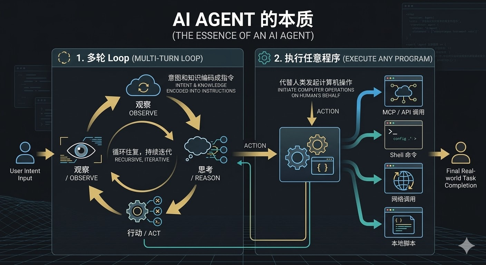

一个名字里带"Code"的工具，现在被人拿来写文章、整理税务、分析数据。Claude Code 的用户们甚至专门写了一篇文章叫 *"Claude Code Without the Code"*，列举了 [50 多种非编程用途](https://www.masteringai.io/guides/50-non-coding-uses-claude-code)。这个错位本身就是一个信号——通用 Agent 正在吞噬垂类 Agent 的领地。

## Agent 到底是什么

在我之前的"从零理解 Agent"系列里，我拆解过 Agent 的技术原理。这里我想用更直白的方式重新说一遍。

LLM 就是大脑。最早它只是一个 Chatbot——你问它答，一问一答,它很博学，但也很被动。像一个被关在玻璃房里的顾问，能给你建议，但没有手脚，什么也做不了。

2023 年 6 月 13 日，OpenAI 发布了 [Function Calling](https://openai.com/index/function-calling-and-other-api-updates/)。这是一个看起来不起眼但意义深远的更新：LLM 可以决定调用哪个函数、传什么参数，然后由外部程序去执行。大脑终于有了手脚。

这就是 Agent。

剥掉所有花哨的包装，Agent 的本质就两件事：

1. **多轮 Loop** — 不是一问一答，而是把你的意图和知识编码成指令，让 LLM 持续地观察、思考、行动，循环往复
2. **执行任意程序** — 不管是 MCP、Shell 命令、网络调用还是本地脚本，本质都是一回事：代替人类发起计算机可以做的操作

言出法随。你说"帮我查一下这个 API 的文档"，它就去查。你说"把这段代码重构一下"，它就去改。你说"帮我订一张机票"，它就去调用订票接口。大脑指挥手脚，手脚反馈结果，大脑再决定下一步。

## 2023：Agent 元年的狂热与退潮

Function Calling 发布前后，一波 Agent 热潮席卷了整个行业。

2023 年 3 月，AutoGPT 横空出世。它的创意很简单也很疯狂：让 GPT-4 自己给自己下任务、自己执行、自己评估结果，完全自主运行。6 周内拿下 [107,000 GitHub stars](https://en.wikipedia.org/wiki/AutoGPT)，成为当时增速最快的开源项目。紧随其后的是 BabyAGI、AgentGPT，各种"自主 Agent"层出不穷。

NVIDIA 的 AI 科学家 Jim Fan 评价说这些工具是"prompt engineering 的下一个前沿"。所有东西都可以是 Agent，所有问题都可以让 Agent 自动解决——至少当时大家是这么想的。

然后现实给了所有人一巴掌。

有人让 AutoGPT 帮忙找一个食谱。结果花了 [$14.40 的 API 费用](https://www.marktechpost.com/2023/07/11/breaking-down-autogpt-what-it-is-its-features-limitations-artificial-general-intelligence-agi-and-impact-of-autonomous-agents-on-generative-ai/)、经历了 47 个规划步骤，最后什么也没返回。不是因为架构不对，不是因为 Prompt 写得不好，原因很简单——LLM 还不够聪明。它无法可靠地分解任务、记住上下文、从失败中恢复。Agent 会陷入无限循环：计划的计划的计划，递归生成任务列表，但什么也不做。

这波热潮证明了一件事：**Agent 的天花板就是 LLM 的能力天花板。**框架再精巧、架构再优雅，底座不行，上面搭什么都是空中楼阁。

## 普通人的第一直觉：做垂类 Agent

到了 2025 年，LLM 的能力有了质的飞跃。Agent 重新变得可用，甚至好用。

对于一个普通人来说，接触到 Agent 后的第一反应通常是：它能帮我解决什么具体问题？我能不能用 AI 开发一个软件，解决生活或工作中的某个痛点？

然后自然而然地，你会想到护城河的问题。做一个通用 Agent？大厂分分钟碾压你。但如果我深耕一个垂直领域——比如法律文书、医疗问诊、财务对账——把领域知识和工作流 hardcode 进去，这才是别人不知道、也不容易复制的东西。

这背后还有一个更深层的惯性：专业的工具干专业的事。做 PPT 用 PowerPoint，修图用 Photoshop，写代码用 IDE——这是互联网时代留下来的观念。那个时代的工具都是针对特定领域开发的，用户的心智已经被训练成了"一个需求对应一个专业工具"。今天的垂类 Agent，本质上也是在争夺这种用户心智。

我不否认短期内垂类 Agent 还会大量存在。但我认为终局是通用 Agent。

这个直觉听起来很合理，但我有不一样的看法。

## 从 Claude Code 看通用吃掉垂类

让我们看看实际发生了什么。

Claude Code 在 2025 年 2 月[以 research preview 的形式发布](https://code.claude.com/docs/en/overview)，名字里带"Code"，定位是终端里的编程 Agent。Codex 也类似，OpenAI 在 2025 年 4 月发布了它的 CLI 版本，定位是代码生成和编辑。

都是"写代码的工具"。名正言顺，定位清晰。

但用户不管你的定位。

人们开始拿 Claude Code 写文章、整理发票、分析 CSV 数据、管理文件。不是少数极客的玩法，而是一种越来越普遍的趋势。有人拿它做[营销自动化](https://departmentofproduct.substack.com/p/how-to-use-claude-code-for-non-engineering)，有人拿它[处理法律和 HR 工作](https://natesnewsletter.substack.com/p/claude-code-without-the-code-the)。

Anthropic 注意到了。2025 年 10 月，他们发布了 [Skills 功能](https://www.anthropic.com/news/skills)——让用户可以给 Claude Code 加载领域特定的指令、脚本和资源。2026 年 1 月，他们直接发布了 [Claude Cowork](https://venturebeat.com/orchestration/anthropic-says-claude-code-transformed-programming-now-claude-cowork-is)——Simon Willison 看完后说了一句精准的话：

> Claude Code 是"伪装成开发者工具的通用 Agent"。它真正需要的只是一个不涉及终端的 UI 和一个不会吓跑非开发者的名字。

OpenAI 的路径几乎完全一样。2026 年 2 月发布的 [GPT-5.3-Codex](https://openai.com/index/introducing-gpt-5-3-codex/)，OpenAI 明确说："Codex 正在从编写代码转向使用代码作为工具来操作计算机并端到端完成工作。"定位从"代码生成器"变成了"通用计算机操作者"。

两家头部公司，同样的轨迹：从垂类出发，走向通用。

这不是巧合。回到 Agent 的本质——多轮 Loop + 执行任意程序。这两样东西没有一样是垂类特有的。你的垂类 Agent 里 hardcode 的领域逻辑，无非是一组特定的指令和一组特定的工具调用。而通用 Agent + 一个写得好的 Skill，就能做到同样的事。

你做了一个法律文书 Agent？通用 Agent 加载一个法律 Skill，效果一样。你做了一个财务对账 Agent？通用 Agent 加载一个财务 Skill，一样能跑。你 hardcode 的逻辑，别人用 Prompt 就能替代。你精心设计的工作流，别人用 Skill 配置就能复现。

垂类 Agent 和通用 Agent 之间，没有技术上的本质区别。

## 真正的护城河不在 Agent 本身

但我不是在说领域知识没有价值——恰恰相反。

**领域知识和工作流才是真正的壁垒。**你对法律条文的理解、对财务流程的熟悉、对医疗诊断逻辑的把握——这些是真正稀缺的。

但关键在于：这些知识不需要你从头开发一个 Agent 应用来承载。

它们可以是一个 Skill 文件，可以是一组精心设计的 Prompt，可以是一套工作流配置。形式不重要，知识才重要。你的护城河应该建在知识和经验上，而不是建在一个随时可能被通用平台替代的应用外壳上。

从头开发一个 Agent 应用意味着什么？意味着你要维护基础设施、处理模型升级、解决安全问题、打磨交互体验——这些都是通用平台已经替你做好的事情。你花在"造轮子"上的时间，本该用来深耕领域知识。

## 通用 Agent 的时代已经来了

2026 年 1 月，OpenClaw 发布。一个通用 Agent，3 月份在国内掀起了一波"养龙虾"的浪潮。

但对很多普通人来说，一个通用 Agent 摆在面前，第一反应是：我到底拿它干什么？

这是一个好问题。它不是 Agent 的问题，而是大多数人还没有想清楚自己的工作流中哪些环节可以被 Agent 化。

下一篇，我会从方法论的角度来聊这个话题：你为什么需要 Agent，以及 Agent 到底能帮你做什么。不是泛泛而谈，而是给你一套思考框架，让你知道怎么把 Agent 用起来。
