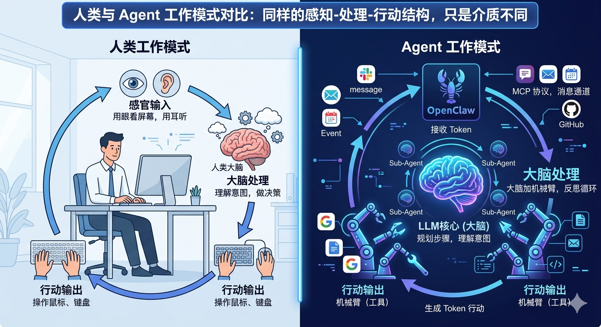

2026 年 3 月，深圳腾讯总部门口排起了长队——都是来装 OpenClaw 的。那个 Logo 是龙虾的开源 Agent，国内用户戏称"养龙虾"。

队伍里有人问旁边的人：这东西到底能帮我做什么？

先说清楚：标题蹭了龙虾的热度，这篇不是 OpenClaw 教程。我想聊的是一个更基础的问题——为什么大多数人拿到 Agent 之后，不知道从哪里下手。

## 大脑加机械臂，加一个反思循环

先忘掉所有产品名字。Agent 是什么？剥掉包装，只剩两样东西：一个大脑，加上一堆机械臂。

**大脑是 LLM**。它理解你的意图，规划步骤，做判断。它本身不执行任何操作——它只思考。

**机械臂是工具**。搜索网页、读写文件、发送消息、调用 API……每一个工具是一条机械臂。大脑指挥，机械臂执行。

但这还不够。真正让 Agent 区别于普通 Chatbot 的，是第三个要素：**反思循环**。

大脑下达指令，机械臂执行，把结果反馈给大脑。大脑读取结果，判断：任务完成了吗？需要调整吗？要不要再来一轮？这个"执行—反馈—决策"的循环，持续转动，直到任务完成或大脑决定停止。

用这个框架看 OpenClaw，它和我们在「从零构建 AI Agent」系列里实现的桌面 Agent，差的是什么？概念上没有差距。差距只在工程丰富度：机械臂更多（50+ 工具，覆盖日历、邮件、代码库）；机械臂会主动动（内置 cron 定时任务，不需要等你触发）；有了消息通道（Slack、Discord、Telegram，Agent 住进了你每天用的消息软件）；记忆系统更完善（自动提取关键信息，跨会话保留）。大脑是同一个大脑，循环是同一个循环。

## 人类的工作，其实一直都是这个模式

从传统时代到互联网时代，知识工作越来越基于电脑。无纸化办公，云端协作，人类程序员开发了大量软件提升效率。这些软件有一个共同点：**它们是面向人的**。

输入设备是鼠标和键盘。输出设备是屏幕和音响。人类用眼睛读屏幕，用大脑做判断，再用手操作鼠标键盘，触发下一个响应。

大部分知识工作的本质，就是在做这件事：串联这些软件的输入和输出，靠人脑推理和决策。

写周报？从日历和任务列表读取信息，大脑整理成文字，粘进文档发出去。回复客户邮件？读邮件，理解意图，查产品文档，写回复发送。监控竞品动态？搜网页，筛有用信息，更新内部文档。

每件事都是同一个结构：**感知输入 → 大脑处理 → 输出行动**。

Agent 的工作模式和这完全相同。只是输入输出从鼠标键盘换成了 Token；手脚从人类的双手换成了挂载的工具；大脑从人脑换成了 LLM。

Andrej Karpathy 把这个转变称为 [Software 3.0](https://www.latent.space/p/s3)：LLM 正在成为新的操作系统，Agent 是运行在上面的应用。人类从"UI 操作者"升级为"Agent 编排者"——鼠标和键盘不再是人机交互的终点，而是 Agent 感知和操控的中间层。

所以：Agent 能帮你做的，就是接管这套基于电脑的工作流。你需要它，是因为你想用它取代人来做这个过程。

## 为什么 Agent 比脚本好

这套工作流，过去也不是没办法自动化。让程序员写脚本。抓取网页、解析数据、生成报告、发邮件——技术上都能实现。

问题是代价太高，而且流程定死了。某个网页结构改了，脚本直接报错。没有人能自动处理，整个流程就卡死。

Agent 有两个根本差别。

**会反思。** 执行完一步，大脑读取结果，判断是否符合预期，决定下一步怎么做。遇到错误，它调整策略，不会直接崩掉。脚本的流程是定死的，Agent 的流程是动态生成的。

**理解模糊意图。** 脚本要求输入精确——格式对，参数对，逻辑预先写好。Agent 接受的是自然语言描述的任务，自己拆解步骤，遇到边界情况自己判断。"帮我整理一下这周的会议记录，提炼出待办事项"——不需要告诉它格式是什么、从哪里读、写到哪里去。

## 方法论：搞清楚你的输入、输出和数据流

工具有了，能力清楚了。但很多人面对 Agent 还是不知道从哪里下手。

Scott Brinker 在《The New Automation Mindset》里指出，大多数人的自动化思维还停留在工业时代的"factory mindset"：只对高频、重复、规则明确的任务做自动化，局部优化，自上而下推行。

> "The biggest constraints we face in harnessing the full potential of automation today are our own self-imposed limits of how to apply it."

真正需要的是**系统思维**：把整个工作流当成可编排的对象，从输入到输出，整体重新设计。

软件工程里有一个成熟的方法论——**领域驱动设计（Domain-Driven Design，DDD）**。它的核心是：面对复杂领域，先搞清楚边界，再拆成更小的子域，每个子域独立求解，最终汇总。

这套思路不只适用于软件。一家公司扎根于某个领域，内部有不同职位分工协作，数据在部门之间流转——和软件架构的逻辑一模一样。Agent 世界里的 Sub-agent 和 Agent Swarm，本质也是这套分工协作：每个专化 Agent 有自己的作用范围，之间通过数据层交换信息。

具体到你自己的工作，方法论分三步。

**第一步，搞清楚你的领域。** 你的工作在做什么？输入是什么，输出是什么，中间数据怎么流转？这不是技术问题，是业务理解的问题。不搞清楚这个，挂多少工具都没用。

**第二步，拆分子域。** 哪些环节相对独立？哪些可以并行，哪些必须串行？从第一性原理出发，确保每个组件充分必要。不要为了自动化而自动化，每个环节都要有明确的输入和输出。

**第三步，设计工作流。** 基于这个结构，把每个子域对应到一个 Agent 任务，定义触发条件（手动、定时、事件），定义数据如何从一个环节流入下一个。

McKinsey 研究了大量 Agentic AI 落地项目，得出一个结论：

> "Agentic AI efforts that focus on fundamentally reimagining entire workflows — the steps involving people, processes, and technology — are more likely to deliver a positive outcome."

关键词是"reimagining entire workflows"——不是在原有流程里塞一个 Agent，而是从头重新设计。大到管理一家公司，小到解决自己的一个工作问题，都是同一套思路。

## 找对工具，挂载给你的 Agent

搞清楚输入输出和数据流之后，剩下的是工具选型。你需要的工具，大部分都已经存在了：通过 MCP 协议接入外部服务，通过 Skill 给 Agent 加载领域特定的指令和脚本。邮件、日历、文档、代码库、数据库，都有现成的集成，直接挂载就行。

具体怎么选、怎么配？这是执行细节，不需要从这篇文章里找答案。直接问你自己的 Agent。

这篇讲的是方法论框架。如果你想看具体怎么落地——真实场景、完整流程、从头到尾能跟着做——可以看「如何用 AI Agent 做事」系列，那里每篇聚焦一个真实用例。

---

Agent 能帮你做什么，这个问题没有统一答案。答案在你自己的工作流里。搞清楚你的领域的输入、输出和数据流，这套思考比任何工具都难培养，也比任何工具都值钱。

---

最后说一句题外话。

看到这里有人可能会焦虑：工作流没想清楚，工具也不熟，从哪里开始？

AI 时代有一个实实在在的好消息：获取信息比以前容易多了。搜索引擎的时代，你还得学会怎么提问——关键词怎么选，结果怎么筛，哪些来源可信。现在你只需要和 AI 对话，信息自己找上来。

所以不用急。遇到不懂的东西，先把第一性原理搞清楚，再决定怎么做。比直接上手瞎试省力得多。

我的文章面向泛科技爱好者，不需要技术背景。你只需要跟着看。想打好基础，可以从「AI 知识科普」和「从零构建 AI Agent」两个系列开始——前者讲 AI 的底层逻辑，后者手把手把 Agent 拆开来看。哪里看不懂，把文章贴给你的 AI 问一问——这本身就是在用 Agent 的方式学东西。

下一篇，我们聚焦 AIOS 和 AI Native 应用——当 LLM 变成新的 CPU、Agent 变成新的 App，基础设施应该怎么重新设计？
