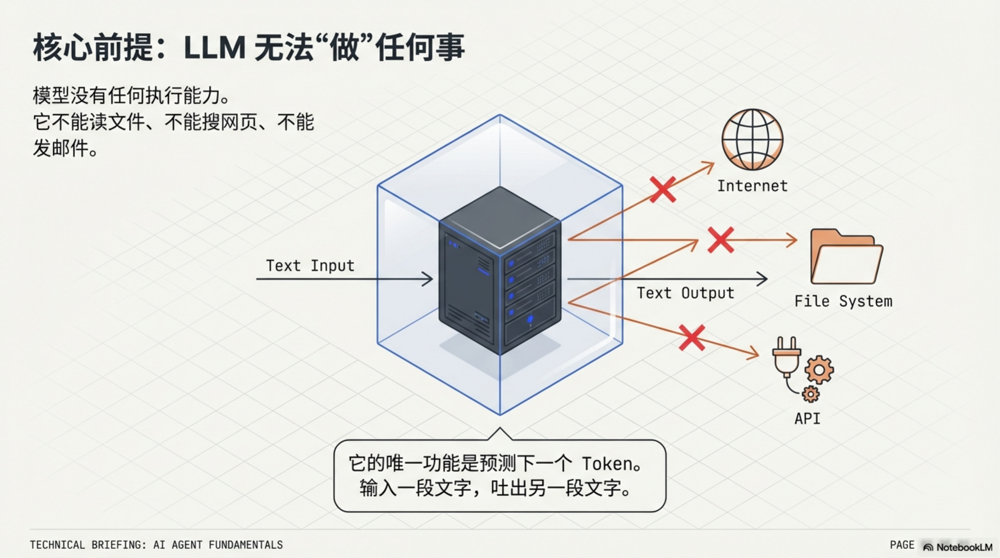
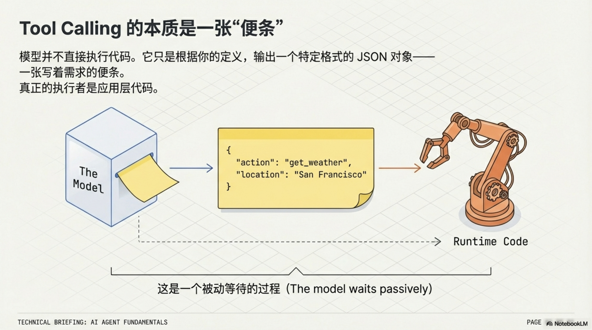
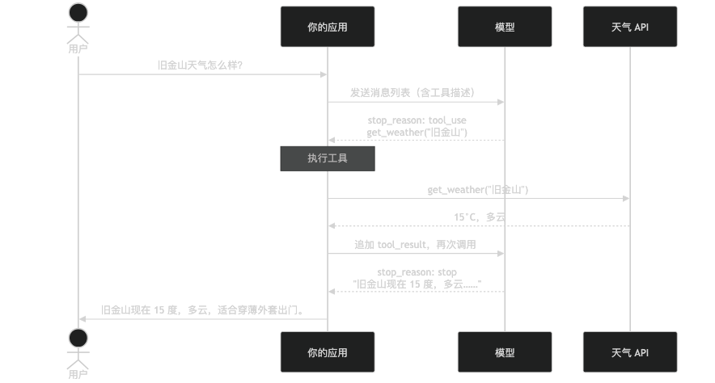

# 从零理解 AI Agent

**副标题**：tool calling、agent 循环和框架是什么——写代码之前先搞清楚这几件事

---

市面上有几十个 AI agent 框架，LangChain、LlamaIndex、Mastra、AutoGen……每一个都有自己的文档，自己的抽象层，自己的设计哲学。但它们核心的运行逻辑，其实是同一回事。

这不是在否定框架——框架有框架的价值，后面会讲。但如果你从框架的文档开始学 agent，很容易把框架当成 agent 本身，反而搞不清楚底层发生了什么。

这篇是这个系列的第 0 篇，不写代码，只讲概念：tool calling 是什么，agent 循环是什么，框架帮你省掉了哪些事。后面每一篇会在此基础上动手实现——从最简单的 chatbot 开始，一步步加能力，最终搭成一个真正能用的桌面 AI 助手。

---

## 模型不能"做"任何事

有一个前提要先说清楚：LLM 本身不能执行任何操作。

它不能读你的文件，不能搜索网页，不能发邮件。它唯一能做的事，是根据输入预测输出——把一段文字扔进去，它吐出另一段文字。



但这里有个关键：输出的文字可以是任意格式。包括 JSON，包括结构化指令：

```json
{
  "type": "tool_use",
  "name": "get_weather",
  "input": { "location": "旧金山" }
}
```

这就是 **tool calling（工具调用）** 的本质。模型输出了一张"便条"，上面写着"我需要查旧金山的天气"。模型本身不去查——它只是写了便条，然后等着。

执行这张便条是应用层的事。你的代码拿到这段 JSON，调用真正的天气 API，取回结果。然后——关键步骤——把结果告诉模型。告诉的方式是把结果塞进对话历史，让模型在下一次调用时读到它。



---

## 消息列表，就是 Agent 的整个世界

这里需要建立一个重要认知：**模型没有任何持久状态**。

你每次调用它，它都是"第一次见到你"。它知道的所有事——你问了什么、它调用了哪个工具、工具返回了什么——全部来自你传给它的消息列表，仅此而已。

一次完整的天气查询，消息列表长这样：

```
用户：      旧金山天气怎么样？
助手：      [tool_use: get_weather, location="旧金山"]
用户：      [tool_result: "15°C，多云"]
助手：      旧金山现在 15 度，多云，适合穿一件薄外套出门。
```



注意第三条消息——`tool_result` 的角色是 `user`，不是 `assistant`。这是因为工具结果是从外部回传的，在模型眼里，它和用户输入的地位一样：都是外部信息。

模型第二次被调用时，读到了这四条消息，知道天气已经查完了，直接给出回答。它不是"记住了"天气结果，而是"读到了"天气结果。

这个区别不是文字游戏。它决定了 agent 如何工作：所谓"感知"，是通过读消息列表实现的，不是通过某种神秘的意识。

---

## Agent = 一个 while 循环

有了上面两个认知，agent 的机制就清楚了。

把工具调用的过程重复下去，每次把结果追加进消息列表，直到模型决定停止——这就是 agent 循环。

用 Vercel AI SDK 写出来，核心只有一行参数的差别：

```ts
// 普通 chatbot
const result = await streamText({ model, messages, tools });

// agent：多了 stopWhen
const result = await streamText({
  model,
  messages,
  tools,
  stopWhen: stepCountIs(10),
});
```

`stopWhen: stepCountIs(10)` 的意思是：允许循环最多跑 10 步。这 10 步是**一条用户消息内部**的循环上限——不是对话轮数。用户说"帮我查旧金山和北京的天气再做对比"，agent 内部可能跑 3 步（查旧金山、查北京、生成对比），但对用户来说只是一问一答。步数上限防止的是 agent 在单次任务里陷入死循环，而不是限制整个对话的长度。

伪代码写出来是这样：

```
while (步数 < 上限) {
  调用模型
  if (模型说"完成了") break
  执行模型指定的工具
  把工具结果追加进消息列表
  步数++
}
```

这就是全部。

2022 年，Google 研究者发表了 ReAct 论文，系统验证了"推理 + 行动交替"这个模式的有效性。在 ALFWorld 决策任务上，它比当时最好的强化学习方法高出 34 个百分点；在 WebShop 电商任务上高出 10 个百分点（arXiv:2210.03629）。现在所有主流 agent 框架的核心设计，都源自这篇论文的洞察：**推理和行动应该交织，而不是分离**。

---

## 框架帮你解决了哪些事

理解了那个 while 循环，再看框架就清晰了。

**第一件事：循环管理。** `maxSteps`、终止条件、步数超限的处理、工具执行失败的重试逻辑——这些每个 agent 都要写，框架替你写好了。你只需要声明"最多跑几步"，不用关心循环怎么跑起来的。

**第二件事：Prompt 拼接。** 每一步调用模型之前，需要把 system prompt、完整对话历史、工具描述、上一步工具结果组装成一次 API 请求。格式要对，顺序要对，token 超限了还要做截断或摘要压缩。这个逻辑枯燥但关键，框架替你封装好了——你只声明"system prompt 是这个、工具是这几个"，其余的不用管。

**第三件事：工具路由。** 模型输出 `{ "name": "get_weather", "input": {...} }` 之后，框架负责找到对应函数、验证输入参数、执行函数、把结果格式化成正确的 `tool_result` 格式回传。你只需要定义函数，不需要手写这个分发逻辑。

Anthropic 在工程博客（[Building Effective Agents](https://www.anthropic.com/research/building-effective-agents)）里有一个值得记住的建议：

> "从简单设计开始，只有当性能改进能证明复杂性带来的代价时，才增加复杂性。"

这句话对框架选型同样成立。三个工具，自己管循环可能更清晰。工具多起来、需要多个 agent 协作，框架的价值就体现出来了。

还有一点框架文档不总是强调的：工具的 `description` 写得好不好，直接影响模型选不选这个工具、参数填得对不对。工具工程，和 prompt engineering 本质上是一回事——两者都在告诉模型"这个东西是干什么的"。

---

## 这个系列要做什么

这个系列从零搭一个桌面 AI 助手，技术栈是 Vercel AI SDK + Electron。

选 AI SDK 的理由：TypeScript 原生，用 Zod 定义工具输入，不用手写 JSON schema；统一接口支持 OpenAI、Anthropic、Google 等主流提供商；`stopWhen`、`prepareStep`、`onStepFinish` 这几个回调覆盖了大多数 agent 场景，不需要额外框架。选 Electron 的理由：能访问本地文件系统，为后面的工具调用打基础，也让最终产品真正能用。

系列路线：

- **篇 1**：最简单的 chatbot——先让它能说话
- **篇 2**：Tool calling——让它从"说话"变成"做事"
- **篇 3**：MCP——一个协议，接入所有外部服务
- **篇 4**：Skill 系统——可插拔的专业能力
- **篇 5**：代码执行——沙箱里跑 Python 和 JS
- **篇 6**：记忆系统——让它记住你是谁

每篇文章在已有基础上加一个能力，跟完整个系列，你有一个真正能用的本地 AI 助手，也搞懂了 agent 每一层的技术。

下一篇从最简单的开始——一个窗口，一个输入框，一个会回答的模型。
