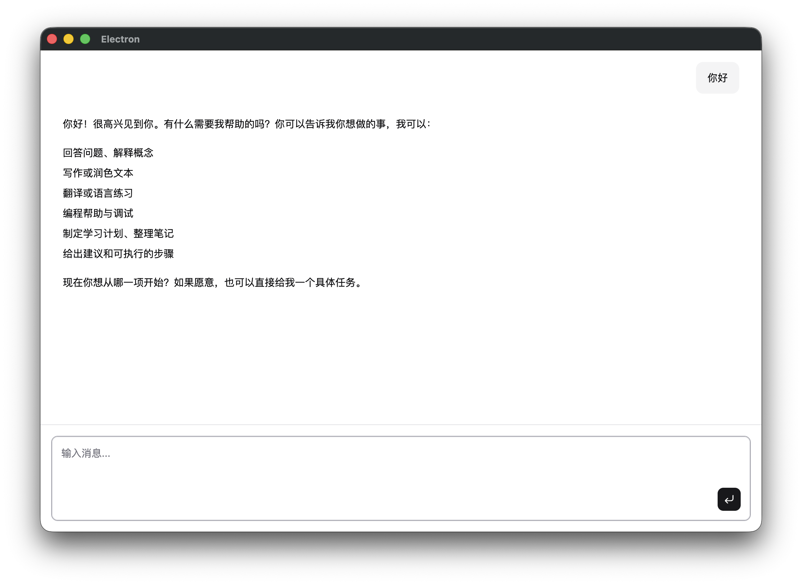

# 30 分钟搭一个桌面 AI 助手

---



这是你这篇文章结束时会得到的东西：一个运行在自己电脑上的桌面窗口，你打字，它回答，回答的时候一个字一个字地往外蹦——那种打字机动画效果。

上一篇讲了 tool calling、agent 循环和框架是什么。这篇开始动手。第 1 篇不涉及工具调用，先做最简单的一件事：**让它能开口说话**。

---

## Vibe Coding 是什么

**Vibe coding** 是用 AI 编程工具写代码——你告诉 AI 要做什么，它写代码，你审代码、发指令、处理它搞不定的边角情况。整个过程不需要逐行读懂每一行代码，也不需要记住 API 文档。

这个系列本身就是 vibe coding 的产物。每一篇文章背后，我先用一份规格说明描述要做什么，然后用 AI 工具把代码搭出来。每篇对应的规格说明都放在仓库的 [docs/chapters/](https://github.com/0xyjk/desktop-agent-template/tree/main/docs/chapters) 里。

你也可以这样做。把 [ch1-basic-chatbot.md](https://github.com/0xyjk/desktop-agent-template/blob/main/docs/chapters/ch1-basic-chatbot.md) 的内容粘给你的 AI 工具，说"按这个规格帮我从头搭一个项目"——它会帮你创建文件、装依赖、写代码。这是体验 vibe coding 最直接的方式。

当然，clone 仓库跟着走也完全可以。遇到不明白的地方，把代码或报错直接丢给 AI 问。可以用：

- **Claude Code**：终端里运行 `claude`，直接在项目目录问
- **Cursor / Windsurf**：编辑器插件，改代码时随时问
- **Kimi Code、通义灵码**：国内替代，功能类似

不用全装，选一个顺手的就行。

---

## 你其实在搭积木

Vibe coding 能成立，有一个前提：你写的代码只是冰山一角。

这个项目里，你实际写的代码大概 50 行。之所以能用这 50 行做出一个完整的桌面 AI 助手，是因为下面这些库帮你搞定了剩下的部分：

- **Electron**：把网页变成桌面应用的框架。VS Code、Slack、Figma 都用它。进程管理、原生 API、跨平台打包——全都内置，你只需要写网页逻辑。
- **Vercel AI SDK**（代码里的 `ai` 包）：处理跟 AI API 通信的所有复杂性——流式传输、消息格式、工具调用协议。没有它，光是让回复一字一字流出来就要写几百行。
- **Hono**：轻量 HTTP 框架。一行代码定义一个 API 路由。
- **ai-elements**：专为 AI 聊天界面设计的 UI 组件库。打字机动画、Terminal 组件、加载状态——现成的。

这些库加起来是几十万行代码，背后是各自团队多年的工程积累。你站在他们肩膀上，把积木拼起来。

这是现代软件开发的本质，不只是 vibe coding——没有人从零写 HTTP 协议，也没有人从零写渲染引擎。区别只是 vibe coding 把这件事推到了极端：连怎么拼，你也可以直接问 AI。

---

## 先打开终端

这个系列的大多数操作都在**终端**（也叫命令行）里完成。如果你平时从来不用它，先花 30 秒了解一下。

终端是操作系统的文字界面。你输一条命令，电脑执行，然后告诉你结果。移文件、安装软件、启动服务——任何你平时点鼠标、敲键盘能做到的事，终端里一行命令就搞定，而且能做的远不止这些。

怎么打开：
- **Mac**：Command+Space，搜索"终端"，回车
- **Windows**：开始菜单搜索"PowerShell"，回车

打开后会看到一个等待输入的光标，那就对了。

> 到第 2 篇，我们会把终端能力直接交给 AI——让它代替你决定执行哪些命令。你现在用终端做的事，以后 AI 会帮你做。

---

## 准备工作

需要 3 样东西：

**1. Node.js v18 或更新的版本**

Node.js 是运行 JavaScript 代码的环境，这个项目的后端逻辑靠它运行。打开终端，输入：

```bash
node -v
```

如果输出的版本号低于 `v18.0.0`，去 [nodejs.org](https://nodejs.org) 下载最新的 LTS 版本。

**2. pnpm**

pnpm 是包管理器，用来安装项目依赖的各种库——类似手机上的应用商店，帮你把需要的东西下载好。如果没装过，运行：

```bash
npm install -g pnpm
```

**3. 一个 LLM 的 API Key**

API Key 是你调用大模型服务的凭证，相当于账号密码。OpenAI、DeepSeek、本地跑的 Ollama 都可以——项目支持任何 OpenAI 兼容的接口，后面配置部分会说怎么填。

> 不知道怎么申请 API Key？把这句话发给你的 AI 助手："我想用 [服务名] 的 API，请告诉我怎么注册、在哪里获取 API Key。"

---

## Clone 并跑起来

我为这个系列准备了一个模板仓库，不需要从零搭。你要做的只是 clone 下来、装依赖、启动。

打开终端，运行下面 4 条命令：

```bash
git clone https://github.com/0xyjk/desktop-agent-template.git
cd desktop-agent-template
git checkout ch1
pnpm install
```

> `git clone` 就是把这个项目的代码下载到你电脑上；`git checkout ch1` 是切换到第 1 篇对应的代码版本；`pnpm install` 是安装项目依赖的所有库。

装依赖可能要 1~2 分钟，耐心等一下。

装完之后，先别急着启动——还有一步配置要做。

---

## 配置模型

在项目根目录创建一个 `.env` 文件。这个文件不会被提交到 git，存放你的 API Key 和模型配置。

创建 `.env`，写入三个变量，把值替换成你自己的：

```
LLM_API_KEY=你的 API Key
LLM_BASE_URL=服务商提供的 Base URL
LLM_MODEL=模型名称
```

三个变量的含义一目了然：Key 是身份凭证，URL 是服务地址，Model 是用哪个模型。项目支持任何 OpenAI 兼容的接口，填哪家都行。

> **不知道从哪里找这些值？** 把这句话发给你的 AI 工具：
> "我在用 [你用的服务] 的 API，请告诉我 API Key 在哪里获取，Base URL 是什么，以及推荐用哪个模型名称。"

---

## 启动

配置好 `.env` 之后，运行：

```bash
pnpm dev
```

一个 Electron 窗口会弹出来。

---

## 发一条消息

在底部的输入框里打一条消息，按 Enter 发送。

几秒钟之后，AI 开始回答——一个字一个字地出现，就是那种打字机效果。这不是动画特效，是真实的流式输出（Streaming）：模型生成出来一个 token，立刻推送到界面上，不等全部生成完。

能看到打字动画，说明整个链路通了：你打的字 → 发给 AI → 回复流回来 → 一个字一个字显示在界面上。

> **想看清楚这个项目是怎么工作的？** 打开 Claude Code，进入项目目录运行 `claude`，然后问它：
> "请给我解释一下这个项目的整体架构，特别是 `src/main/server.ts` 这个文件做了什么事情。"

---

## 如果出了问题

**窗口弹出来了，但发消息没有回复，或者一直转圈**

大概率是 `.env` 配置有问题：API Key 填错、Base URL 多了或少了斜杠、模型名字拼错了。打开 `.env` 对照检查一遍。

打开终端，看是否有报错信息。把报错信息复制下来，发给 AI 工具：

> "我在运行一个 Electron + Hono 的项目，遇到了这个报错，请帮我定位原因：[粘贴报错]"

**`pnpm install` 失败**

通常是网络问题，尤其是下载 Electron 二进制文件那一步。把报错信息发给你的 AI 工具，说明你在用什么系统、卡在哪一步，它会给你对应的解决方案。

**其他任何问题**

遇到报错不要慌。把终端里的完整报错复制，发给 Claude Code 或者 Cursor，说明你在做什么操作。99% 的问题 AI 工具能帮你解决。

---

## 它现在能做什么

一个聊天界面，流式输出，多轮对话——这是一个完整的 chatbot。

但它现在只会说话，不会做事。你问它"帮我查一下今天的天气"，它只能用训练数据里的知识回答，没法真的去查。你问它"帮我读一下这个文件"，它看不到你的文件系统。

这是有意为之的起点。把基础跑通之后，能力可以一层层往上加。

下一篇加入工具调用——给它一个能执行 shell 命令的工具，让它从"描述操作"变成"真正执行操作"。你输入一句话，它会自己跑命令、看结果、再决定下一步。

有了工具，它才从一个聊天框，变成一个真正能用的助手。
