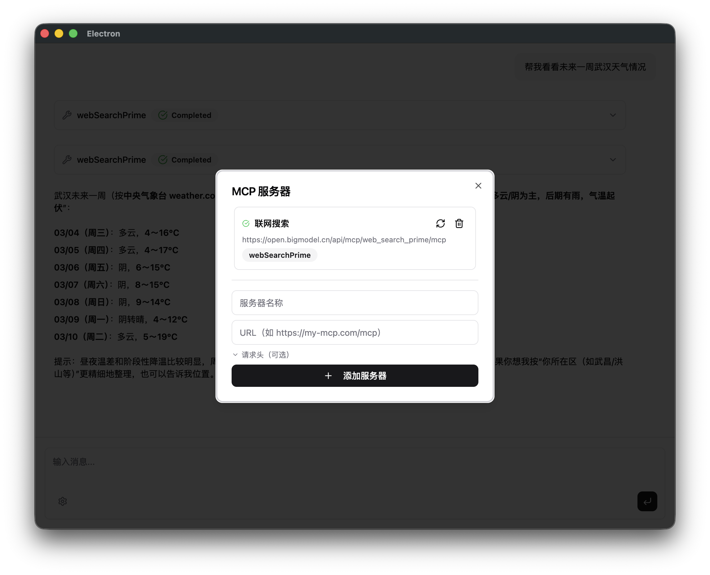
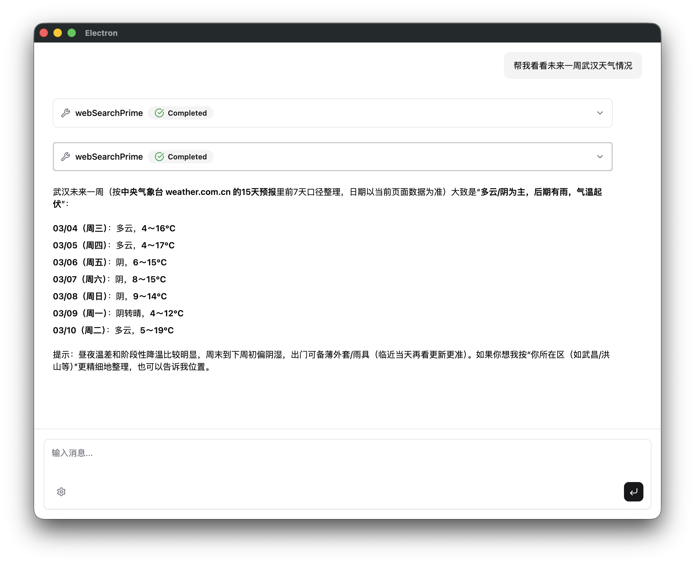

# 一个协议，接入所有外部服务

---

上一篇结束时，agent 有了一个工具：shell。一个工具，覆盖了本地大多数操作。

但这种满足感不会持续太久。

你很快会想要更多：能不能查 GitHub Issues？能不能搜索网页？能不能读写 Notion 笔记？每一个新能力，都意味着你要写一个新工具——定义 schema、处理认证、写 execute 函数、更新服务器配置。三个工具之后，代码开始变杂。十个工具之后，维护成本已经超过工具本身的价值。

Anthropic 在 2024 年 11 月推出了 MCP（Model Context Protocol），就是要解决这件事。

---

## 插头和插座

在 MCP 之前，每个 AI 应用都有自己的工具格式，每个工具提供方要为不同的 AI 单独适配——就像不同国家的电源插头形状不同，同一个设备出国要换转接头。

**MCP 定了一套统一标准：工具只管做插头，AI 只管做插座。**

具体来说：

**MCP Server**（服务端）：任何人都可以把自己的服务封装成一个 MCP server，暴露一套工具。GitHub 官方有，Cloudflare 有，社区有几百个现成的。你想接的服务，大概率已经有人做了。

**MCP Client**（客户端）：你的 agent 只需要实现一次 MCP 客户端，就能连接任意 MCP server，自动发现它暴露的工具。不需要为每个服务写专属代码。

MCP 发布半年后，几乎所有主流 AI 工具都跟进支持——Claude Desktop、Cursor、VS Code Copilot、Windsurf。2025 年 3 月，OpenAI 也宣布支持 MCP。这已经不是 Anthropic 一家的主场，而是行业共识。

---

## 先看效果

这篇文章结束后，界面会多一个 ⚙️ 按钮。点开它，是 MCP 服务器管理面板：



填入一个 MCP server 的 URL，点"添加服务器"——状态先变"连接中"，然后变"已连接"，这个 server 暴露的工具名以 badge 形式列出来。

连上之后，就可以问它训练数据回答不了的问题：

**输入：**

> 帮我看看武汉未来一周的天气情况

大模型的知识有截止日期，实时天气它回答不了。但接上了联网搜索，agent 会自己去搜：



值得注意的是：agent 搜了**两次**。它自己判断一次搜索不够，多搜了一轮来补充信息。这正是 agent loop 的意义——不是你规定它调用几次工具，而是它根据中间结果自己决定。

这里用联网搜索来查天气，是个有点"将就"的方案。搜索引擎的天气结果不够结构化，有时要解析几个页面才能拼出完整数据。

如果你经常需要查天气，有更好的选择——接一个专门的天气 MCP server。天气类的 MCP 会直接返回结构化数据：温度、湿度、风速、逐小时预报，干净整齐，不需要 agent 从搜索摘要里推断。这就是 MCP 生态的意义：**万能工具解决大多数问题，专用工具把特定问题解决得更好**。两类工具可以同时接入，让 agent 按需选择。

---

## 它怎么工作

MCP 的通信流程比你想象的简单。连接建立之后，client 第一件事是拉工具列表：

```
client → server：你有哪些工具？
server → client：[{ name: "webSearchPrime", description: "...", schema: {...} }, ...]
```

client 拿到这个列表，直接传给 `ToolLoopAgent`。模型在推理时能看到这些工具，判断要不要调用、怎么调用——和本地工具没有区别。

调用发生时：

```
model → client：调用 webSearchPrime，参数 { query: "武汉未来一周天气" }
client → server：执行 webSearchPrime
server → client：返回搜索结果（标题、URL、摘要）
client → model：结果塞进消息列表，继续下一步判断
```

对模型来说，MCP 工具和本地工具的区别只有一点：本地工具在 agent 进程里执行，MCP 工具在远端 server 里执行。这一层封装，是 `@ai-sdk/mcp` 帮你做的事。

---

## 改了什么

总共 4 处：

| 文件 | 操作 |
|---|---|
| `src/main/mcp.ts` | 新建，MCP 客户端生命周期管理 |
| `src/main/server.ts` | `ToolLoopAgent` 改为动态重建 + MCP 管理 API |
| `src/renderer/src/components/MCPSettings.tsx` | 新建，Settings 弹窗 |
| `src/renderer/src/components/ChatWindow.tsx` | 加 Settings 按钮 + MCP 工具渲染 |

想直接 vibe coding 的话，把 [docs/chapters/ch3-mcp-integration.md](https://github.com/0xyjk/desktop-agent-template/blob/main/docs/chapters/ch3-mcp-integration.md) 的内容粘给 AI 工具，说"按这个规格帮我改"，它会帮你搞定所有文件。

手动改的话，`git checkout ch3 && pnpm install` 切到这篇的代码版本，跟着上面的规格文件逐步操作。

这里说两个理解上值得停一下的设计决策：

**为什么 agent 要动态重建？**

上一篇的 `ToolLoopAgent` 是启动时创建一次，工具集固定不变。现在用户可以在运行时增删 MCP server，工具集会变。每次增删之后调用 `rebuildAgent()`，用 `{ shell: shellTool, ...getAllMCPTools() }` 重新构建——最新的工具集就生效了，不需要重启。

**MCP 工具为什么渲染不一样？**

本地 shell 工具调用后，`part.type` 是 `'tool-shell'`，我们用 Terminal 组件渲染（黑底终端）。MCP 工具调用后，`part.type` 是 `'dynamic-tool'`，用 ai-elements 的 `Tool` 组件族渲染（结构化卡片，可折叠，显示 JSON 入参和出参）。

一个容易踩的坑：`ToolHeader` 需要显式传 `toolName={part.toolName}`，否则标题只显示 `dynamic-tool` 四个字，而不是具体工具名。

---

## 验收

```bash
pnpm dev
```

打开应用，按顺序：

1. 点击输入框左下角 ⚙️，弹出 MCP 设置面板
2. 填入一个 MCP server 的名称和 URL，点"添加服务器"
3. 状态变为"已连接"，工具名 badge 出现
4. 发一条需要实时信息的消息，看 agent 调用 MCP 工具
5. 工具卡片出现在对话里，展开能看到传入参数和返回结果

---

## 去哪里找 MCP server，能做什么

我们的实现用的是 Streamable HTTP transport，需要 server 暴露 HTTP 端点——不支持 stdio 那种需要本地启动进程的 server。

起步推荐两个地方：
- **[modelcontextprotocol.io/examples](https://modelcontextprotocol.io/examples)**：官方维护的示例列表
- **[awesome-mcp-servers（中文版）](https://github.com/punkpeye/awesome-mcp-servers/blob/main/README-zh.md)**：社区整理的几百个 server，按分类排列，找你需要的直接搜关键词

需要认证的 server，把 API Key 填进请求头——大多数是 `Authorization: Bearer <your-key>` 或 `x-api-key: <your-key>`，具体看那个 server 的文档。

---

真正有意思的地方，是你开始意识到：**很多以前需要学习的技能，现在可以直接用自然语言完成。**

举一个具体的例子。你用 vibe coding 写了一个 Web 应用，功能跑通了，但不知道怎么部署——服务器、域名、环境变量、CI/CD，一堆陌生概念。

以前的路是：查文档、看教程、跟着复制命令、出错、再查、再试。搞半天，代码没动，时间花在跟工具搏斗上了。

现在可以这样：接入 Vercel 或 Railway 的官方 MCP server，然后直接告诉你的 AI 助手：

> 帮我把这个项目部署到 Vercel，用生产环境配置

AI 自己调用 Vercel 的 MCP 工具，创建项目、配置环境变量、触发部署、返回线上地址。你全程用中文，不需要记任何命令。

这只是一个例子。MCP 生态覆盖的范围远不止这些——操作 GitHub 仓库、查询自己的数据库、控制浏览器、管理 Notion 笔记、发 Slack 消息……凡是有 API 的服务，迟早都会有对应的 MCP server。

接入什么，agent 就能做什么。

---

## 下一步

现在 agent 有两类工具：自己写的 shell，以及通过 MCP 接入的任意外部服务。工具集随时可以扩展，不需要改代码。

但有个问题还没解决：所有工具对所有对话都是一样的。如果你想针对不同场景切换不同的工具集和行为——写代码时用这套，处理邮件时用那套——现在没有办法。

下一篇讲 Skill 系统——一种可插拔的方式，让 agent 根据上下文激活不同的能力模块。
