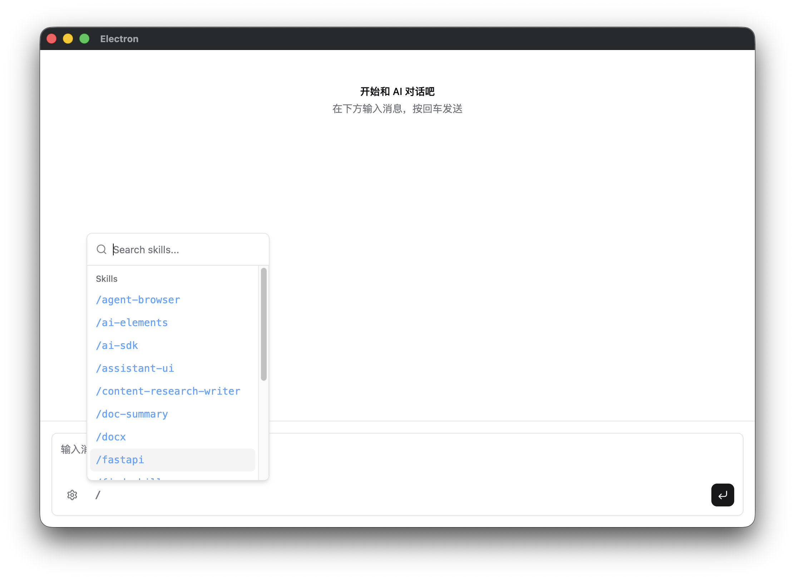
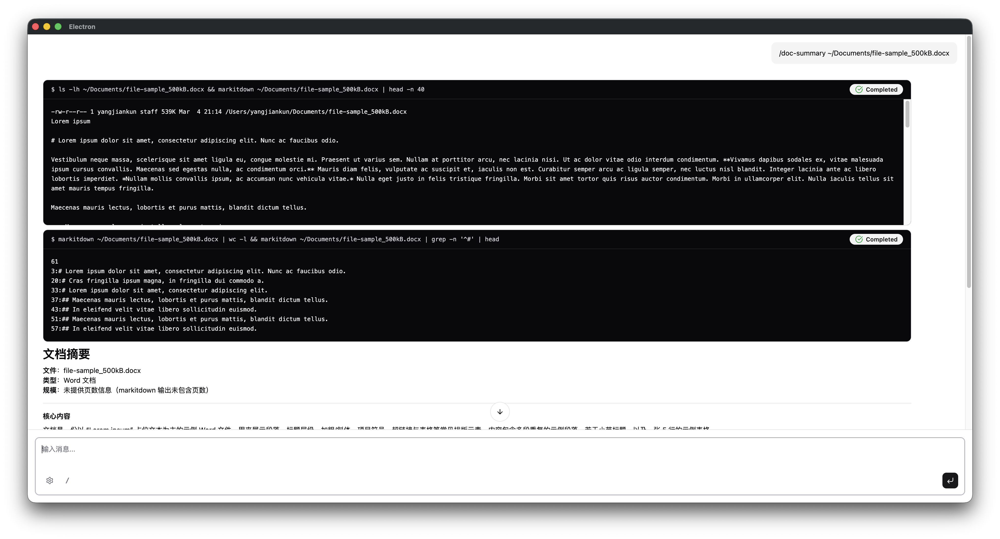

# 不写代码，扩展 agent 能力——Skill 系统

---

上一篇结束时，agent 有了两类工具：自己写的 shell，以及通过 MCP 按需接入的外部服务。工具集理论上可以无限扩展。

但我很快发现了另一个问题——工具层的问题解决了，行为层还没有。

每次让 agent 帮我整理文档，它给的格式都不一样。有时是段落，有时是列表，有时详细，有时草草几句。这不是工具不够用的问题，shell 已经够用了；是 agent 不知道在特定任务里应该怎么做、按什么格式输出。

每次手动在消息里解释格式要求，累且低效。真正想要的，是能把这些"领域规则"固化下来，用的时候一键激活。

这就是 Skill 系统要解决的问题。

---

## 工具 vs Skill

先说清楚两者的区别，不然很容易混。

**工具扩展能力**——没有 shell 工具，agent 就无法执行系统命令；有了，它就能做。工具决定的是 agent *能做什么*。

**Skill 改变行为**——agent 已经能读文件了（通过 shell），但读完之后怎么总结、按什么格式输出，靠的是当时收到的指令。Skill 决定的是 agent *怎么做*。

换一个比喻：工具是资格证书，有了才能上岗；skill 是 SOP——告诉你上岗之后按哪套流程操作。

**本质上，Skill 就是一段 prompt，只是给了它一个可以管理、可以复用的容器。**

---

## 一个文件就是一个 skill

Skill 的格式刻意设计得简单——一个放在固定目录里的 Markdown 文件，文件名叫 `SKILL.md`。

目录结构：

```
~/.agents/skills/
└── doc-summary/
    └── SKILL.md
```

文件内容分两部分：

- **Frontmatter**：`name` 和 `description`。这两个字段在每次对话开始时就加载进 agent 的系统指令，让它知道有这个 skill 存在。
- **正文**：详细的操作步骤和输出格式要求。**只在 skill 被激活时才读取**——这是关键设计，后面会解释。

这篇文章的演示用的是我自己开发的一个 `doc-summary` skill：读取 PDF、Word、Excel、PPT 文件，输出固定格式的结构化摘要。SKILL.md 长这样：

```markdown
---
name: doc-summary
description: 读取并摘要文档文件（PDF、Word、Excel、PPT）。当用户提供文件路径
并要求阅读、摘要、提取要点，或理解文档内容时触发。使用 markitdown 提取文档
文本，输出固定格式的结构化摘要。
---

# 文档摘要

使用 `markitdown` CLI 工具将文档转换为 Markdown，再生成固定格式的结构化摘要。

## 操作步骤

1. 用 shell 工具执行：`markitdown /path/to/file`
2. 阅读提取出的文本内容
3. 按下方输出格式生成摘要，不得改变结构或省略任何节

## 输出格式

严格按照以下模板输出，每一节都必须存在：

**文件**：<文件名>
**类型**：<PDF / Word 文档 / Excel 表格 / PPT 演示文稿>
**规模**：<页数 / 工作表数 / 幻灯片数>

### 核心内容
<2～3 句话概括>

### 关键要点
- <最多 5 条，每条一句话>

### 重要数据与结论
- <具体数字、日期、百分比>

### 建议阅读的章节
- <章节名或页码>：<一句话说明>
```

文件放好，重启 agent，它就知道有 `doc-summary` 这个 skill 了——不需要写一行代码。

---

## 这个 skill 是怎么写出来的

值得一提的是，这个 skill 本身就是用另一个 skill 写出来的。

我用的是 **skill-creator**——一个专门用来设计和创建 skill 的 skill。它的系统指令里包含了完整的 skill 设计原则、目录结构规范、渐进式披露的设计模式，还有初始化和打包脚本。

触发方式一样：`/skill-creator`，然后告诉它你要做什么。它引导你梳理使用场景、规划 skill 的结构、生成 SKILL.md 模板，最后用它内置的脚本完成验证和打包。

这件事本身是一个有趣的例子：**skill 不只是给 agent 用的，也是 agent 和人协作完成复杂任务的方式**——把专业知识打包进去，让 agent 在正确的时机以正确的方式调用。

---

## 两种触发方式

Skill 有两种激活路径。

**被动触发**：agent 自己判断。

agent 的系统指令里有一段所有 skill 的清单，name + description，每条约 30 个 token。你发"帮我看看这份报告"，agent 扫描清单，认出这属于 `doc-summary`，自己调用 `use_skill` 工具读取完整指令，然后开始工作。

**主动触发**：你直接指定。

输入框左下角有个 `/` 按钮。点开，或者直接在输入框里打 `/`，弹出 skill 选择器——列出所有可用 skill，支持实时过滤。选中 `doc-summary`，输入框自动填入 `/doc-summary `，追加文件路径，发送。



截图里能看到十几个 skill 并排列出——后面会说它们从哪里来。

主动触发的区别是：消息在发出去之前，前端会把完整的 SKILL.md 内容直接注入进去。agent 收到消息时已经有了完整指令，不需要再调用 `use_skill` 工具——省掉一个来回。

---

## 看结果

输入：

```
/doc-summary /Documents/file-sample_500kB.docx
```

agent 调用 shell 工具，执行：

```bash
markitdown /Documents/file-sample_500kB.docx
```

命令跑完，返回文档的 Markdown 全文。agent 读取内容，按 SKILL.md 里规定的模板生成摘要：



每次输出的结构都一样：文件信息、核心内容、关键要点、重要数据、建议阅读章节。不会因为文档内容不同、或者模型当天"心情"不同，就给你换个格式。

这是 skill 输出格式约束的核心价值——**可预期的输出**，而不是每次都得看运气。

---

## 代码改动了什么

这篇的改动量是四篇里最少的：**没有新依赖**，全靠 Node.js 内置的 `fs` 模块。

### skills.ts：四个核心导出

新建文件 `src/main/skills.ts`，四个导出：

**`initSkills(dir)`**：启动时扫描技能目录。读取每个子目录里的 `SKILL.md`，解析 frontmatter，把 name 和 description 缓存在内存里。目录不存在时自动创建。

**`getSkillsSystemPrompt()`**：生成注入系统指令的 skill 清单。只包含 name 和 description，不含完整指令——有多少 skill 都只占一百多个 token。

**`useSkillTool`**：被动触发时的工具。agent 传入 skill 名字，读取对应的完整 `SKILL.md` 内容返回。

**`injectSkillFromCommand(messages)`**：主动触发时的消息预处理。检测最后一条用户消息是否以 `/skill-name` 开头，若匹配则把完整 SKILL.md 内容直接注入：

```typescript
const match = textPart.text.match(/^\/([a-z][a-z0-9-]*)[ \t]*([\s\S]*)$/)
// 注入格式：<skill name="..."> + 完整指令 + </skill> + 用户请求
```

### server.ts：三处改动

- 启动时调用 `initSkills(join(homedir(), '.agents', 'skills'))`
- `rebuildAgent()` 里把 `getSkillsSystemPrompt()` 拼入 `instructions`，同时注册 `use_skill` 工具
- 新增 `GET /api/skills` 供前端拉列表，`/api/chat` 处理前调用 `injectSkillFromCommand`

### SkillPicker.tsx + ChatWindow.tsx

SkillPicker 是 Popover + Command 组件，打开时从 `/api/skills` 拉列表，实时过滤。ChatWindow 监听输入，检测到以 `/` 开头就自动弹出选择器。

---

## 按步骤做

vibe coding 的话，把 [docs/chapters/ch4-skills.md](https://github.com/0xyjk/desktop-agent-template/blob/main/docs/chapters/ch4-skills.md) 粘给你的 AI 工具，说"按这个规格帮我改"。

手动跟上来：

```bash
git checkout ch4
pnpm install
```

创建你的第一个 skill：

```bash
mkdir -p ~/.agents/skills/doc-summary
```

把 SKILL.md 写进去（本文"一个文件就是一个 skill"那节的内容），然后确保 markitdown 已安装：

```bash
pip install 'markitdown[all]'
```

启动：

```bash
pnpm dev
```

控制台会输出 `Skills loaded: doc-summary`。

---

## 不想自己写？去 skills.sh 直接下载

截图里那十几个 skill——`/agent-browser`、`/ai-sdk`、`/docx`、`/fastapi`、`/pdf`……都不是我一个个手写的。它们来自 [skills.sh](https://skills.sh/)——一个 skill 社区市场。

一条命令下载安装：

```bash
npx skills add <owner/repo>
```

比如安装一个处理 Word 文档的 skill：

```bash
npx skills add skills-sh/docx
```

装完，重启 agent，`/docx` 就出现在选择器里。

skills.sh 上现在有 8 万多个 skill，覆盖开发工具、文档处理、云服务、内容创作、数据分析各类场景。大多数你能想到的常用任务——写 FastAPI 接口、操作 PDF、做网页设计审查——社区已经有人做好了，直接拿来用。

截图里的 `/doc-summary` 是我们在这篇文章里手写的。它和那些从 marketplace 下载的 skill 并肩排在列表里，使用方式完全一样——因为格式是统一的，都是一个目录、一个 SKILL.md。自己写的和社区的，没有任何区别。

---

## 渐进式披露

设计这个系统时有一个权衡值得说一下。

最直接的方案是：启动时把所有 skill 的完整内容都注入系统指令。这样最简单，agent 随时有完整信息。

但问题是 token。如果你有 10 个 skill，每个 SKILL.md 500 字，系统指令就多了 5000 个 token，每一轮对话都要带着它们。

现在的方案是**渐进式披露**：启动时只加载 name + description（百来个 token），完整指令按需读取。不用 skill 的对话，完全不受影响。

这是一个普遍的设计原则——**不要让罕见路径拖累常规路径**。

---

## Skill 的边界

在你动手写各种 skill 之前，有一个边界要清楚。

**Skill 擅长的**：定义输出格式、规定操作步骤、固化领域规则。总结文档用什么结构、写报告用什么框架、分析数据先做什么检查——这些"怎么做"的问题，skill 很擅长。

**Skill 做不到的**：扩展 agent 能接触的资源。如果你写了一个"查询内网数据库"的 skill，但没有对应的数据库工具，skill 里写再详细也是空谈。Skill 改变行为，工具扩展能力——两者是互补关系，不能替代。

**Skill 的质量上限是 prompt 的质量上限**。清晰的前提、明确的步骤、具体的格式要求——一个好的 skill，就是一份好的 prompt。

你已经能写 prompt 了，skill 只是给它一个可以保存、复用、随时激活的地方。

---

## 下一步

现在有了 shell 工具、MCP 外部服务、和 skill 行为模块——三层加在一起，能处理相当范围内的任务了。

但有一类任务还不行：需要执行代码的任务。不是在 shell 里跑系统命令，而是写一段 Python 或 JavaScript、在沙箱里运行、拿到精确结果。数据处理、数学计算、批量文字操作——这类任务的最佳工具是代码，不是命令行。

下一篇讲代码执行——沙箱、安全隔离，和它打开的那些可能性。
