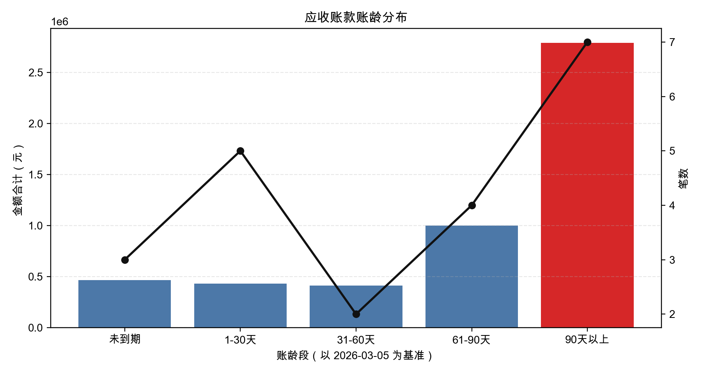

# 代码执行：让 agent 不再靠猜

---

上一篇结束时，agent 有了四层能力：对话、工具调用（shell）、MCP 外部服务、和 skill 行为模块。这已经很够用了——绝大多数日常任务都能处理。

但有一类任务，不管怎么用这四层，都做不好：**真实世界的数据处理**。

不是说做不到，是做不准。这里有一个根本性的问题，涉及 AI 的工作方式，值得先讲清楚。

---

## 没有代码执行，AI 处理数据靠猜

你把一个 Excel 文件发给 ChatGPT 或者任何不带代码执行的大模型，让它帮你算总和、找重复值、统计分布——它看起来在做，也会给你一个答案。但这个答案不是算出来的，是**猜出来的**。

大模型本质上是一个语言预测器。它没有运行加法，没有遍历行，没有做任何计算。它看过海量的数据分析文本，知道"统计应收账款"的答案大概长什么样，然后生成了一个听起来合理的数字。这就是幻觉——它看起来像在算数，其实在写作。

数字越复杂，文件越多，幻觉越离谱。

**有了代码执行，这个问题消失了。** agent 不再猜，它写 Python，运行，拿到真实结果。数字是代码算出来的，不是模型生成的。准确率从"听天由命"变成了接近 100%。

这一点的意义超过所有其他功能叠加。

---

## 数据到底有多脏

先来看看"真实世界的数据"是什么意思。

我桌面上有个 `ar_data` 目录——财务部门整理的应收账款文件，不同同事在不同时间维护的。6 个 Excel，6 种烂法：

| 文件 | 坑在哪 |
|---|---|
| `AR_2025Q4.xlsx` | 日期格式混用 6 种、有重复行、金额有 ¥ 符号 |
| `应收账款明细_202501.xlsx` | 有标题行、空行、小计行、第一列不是表头、多 sheet |
| `收款跟踪 final(2).xlsx` | 列名全不一样、日期格式又 3 种新花样、同一张票中英文各录一次 |
| `逾期客户-update.xlsx` | 部分金额单位是万元（56.7 其实是 567000）混在元里 |
| `新建 Microsoft Excel 工作表.xlsx` | 合并单元格、列名是缩写、高亮颜色标注 |
| `AR明细_陈经理整理_0215.xlsx` | 和其他文件有重叠但金额不一致（广州恒基 245000 vs 248000） |

让不带代码执行的 AI 处理这堆数据，最好的结果是它老老实实告诉你"我没法准确处理"，最坏的结果是它造了一份看起来整整齐齐、实际上全是编出来的数字的报告。

人工处理也很痛苦——光是统一日期格式这一件事，6 种格式逐列对齐，就够花一下午。

---

## 给 agent 一句话

我给 agent 发了这样一条消息：

> `~/Desktop/ar_data/` 目录下有我们财务部门整理的应收账款文件，不同同事在不同时间维护的，格式比较乱。请帮我：
> 1. 找出所有 Excel 文件
> 2. 逐一读取并合并成完整的应收明细
> 3. 清洗数据：统一日期格式、统一金额单位为元、去重、处理缺失值，如果同一张发票在不同文件金额不一致请标注出来
> 4. 以今天为基准计算账龄，分组：未到期 / 1-30天 / 31-60天 / 61-90天 / 90天以上
> 5. 画图：双轴图，柱状表示各账龄段金额合计，折线表示笔数，90天以上的柱子用红色标出

<!-- 📹 视频：assets/build-your-agent/05-code-executor/demo.mov
     发布时上传至微信视频号，在此处插入视频组件 -->

agent 写了 5 段代码，依次运行。扫目录找文件、逐个读取合并、清洗去重、标注金额冲突、计算账龄、画图——每段代码的结果留在内存里，下一段直接用。检测出了广州恒基那条金额冲突，单独写进了标注文件。最后出来这张图：



从发出请求到拿到图，不到两分钟。所有数字都是代码算出来的。

这种任务，以前的选项是：要么自己花几个小时手工处理，要么找会 Python 的人帮忙写脚本，要么忍受 AI 胡编的结果。现在这三个选项都不需要了。

---

## 有了代码执行，理论上能做什么

处理脏数据只是最直观的例子。代码执行真正打开的，是 agent 能解决问题的上限。

**任何需要精确计算的任务**：金融建模、统计分析、数学推导——只要能写成代码，结果就是精确的，不是猜的。

**任何需要处理大量数据的任务**：几千行 Excel、几十个 CSV、日志文件——代码不会累，不会漏，不会因为数据太多就开始编。

**任何需要生成文件的任务**：清洗完的数据直接写成新 Excel、生成报告 PDF、批量重命名文件——代码执行就是执行，结果是真实的文件。

**任何需要可视化的任务**：图表、热力图、趋势线——matplotlib 能画什么，agent 就能给你什么，图直接出现在对话窗口里，不需要打开任何外部工具。

更重要的是，这些能力可以叠加。agent 可以用 MCP 从外部 API 拉数据，用代码清洗处理，用 skill 规定输出格式，最后写成文件或者发布出去——整条链路，一个指令。

---

## 代码改动了什么

实现上的核心是一个持久运行的 Python 进程。

普通的 shell 工具每次调用是独立进程，跑完即销毁——变量不能在多次调用之间传递。代码执行器不一样：一个 Python 进程在整个对话期间持续运行，第一步读进来的 DataFrame，第五步还在。这是多步骤数据分析能工作的前提。

三个新增文件：

**`resources/kernel_server.py`**：常驻的 Python 子进程。从 stdin 读代码 JSON，执行，把文本输出和图片（base64 PNG）写回 stdout。matplotlib 图表自动内联到对话里，不需要保存文件。

**`src/main/tools/python_kernel.ts`**：Node.js 这边的工具定义。第一次调用时启动 Python 子进程，后续复用。注册为 `execute_python` 工具，agent 需要执行代码时自动调用。

**`PythonResult.tsx`**：UI 组件。展示代码（语法高亮）和输出（文本 + 图片）两个标签，执行完自动切换到输出标签。

```
src/main/tools/python_kernel.ts   ← 工具定义
resources/kernel_server.py        ← Python 子进程
src/renderer/src/components/
  PythonResult.tsx                ← 结果渲染
```

前置依赖：

```bash
pip install jupyter_client ipykernel matplotlib pandas openpyxl
```

---

## vibe coding 跟上来

把 [docs/chapters/ch5-code-execution.md](https://github.com/0xyjk/desktop-agent-template/blob/main/docs/chapters/ch5-code-execution.md) 粘给你的 AI 工具，说"按这个规格改"。

手动跟上来：

```bash
git checkout ch5
pip install jupyter_client ipykernel matplotlib pandas openpyxl
pnpm dev
```

试一下：

```
帮我算一下 1 到 100 的和，画一个 sin 函数的图
```

能看到代码、文本输出、和图，说明一切正常。

---

## 安全边界

说清楚：这个代码执行器**没有沙箱**。

agent 写的代码直接在你的本地环境跑，有完整的文件系统和网络权限。这是设计如此——本地自用的 agent，前提就是你信任运行在自己电脑上的代码。

习惯上，复杂的数据处理任务，在让 agent 跑之前看一眼它写的代码是合理的——不是因为不信任，是好习惯。

如果要把这套东西包装成给别人用的服务，沙箱是必须加的：Docker、或者 [E2B](https://e2b.dev/) 这类专门的代码执行沙箱服务。本地自用版本不需要。

---

## 能力层汇总

五篇做完，这个 agent 是这样的：

| 层 | 能做什么 |
|---|---|
| 对话 | 理解意图，规划步骤，组织输出 |
| shell 工具 | 本地系统操作，文件读写，系统命令 |
| MCP 服务 | 外部 API，实时数据，第三方工具 |
| Skill | 固化行为，可复用的任务规程 |
| 代码执行 | 精确计算，数据处理，可视化 |

从一个只会说话的聊天窗口，到现在这个能操作系统、接外部服务、遵守规程、写代码解决实际问题的桌面 agent。每篇加一层，每层解锁一类任务。

到这里，功能上算完整了。但还有一个问题没解决：**它没有记忆**。每次重启，上下文清零——你上次告诉它的偏好，正在进行的项目进展，全没了。

下一篇讲记忆。
