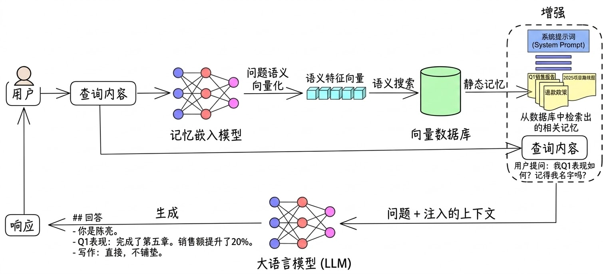

# 记忆系统：让 agent 记住你是谁

---

每次重启 agent，它就失忆了。

告诉它你叫什么、你在做什么项目、你希望它用什么语气跟你说话——这一切，下次打开全部清零。你得重新解释一遍。再下次，又一遍。这不是 agent，这是一个每次都不认识你的陌生人。

这一篇解决这个问题。

---

## LLM 接口是无状态的

在讲怎么做记忆之前，先把问题从根上说清楚。

打开任何主流 LLM 的 API 文档，发送消息的接口大概长这样：

```json
POST /v1/chat/completions

{
  "model": "gpt-4o",
  "messages": [
    { "role": "system",    "content": "你是一个智能助手。" },
    { "role": "user",      "content": "你好，我在写一个技术系列文章" },
    { "role": "assistant", "content": "好的，文章是关于什么方向的？" },
    { "role": "user",      "content": "帮我看看这段开头，感觉太平了" },
    { "role": "assistant", "content": "这句可以删掉，直接从第二句开始..." },
    { "role": "user",      "content": "你记得我叫什么吗？" }
  ]
}
```

注意 `messages` 数组——里面包含了从第一条到最新一条的**所有历史消息**。

这不是优化，这是 LLM API 的基本设计：**服务端不保存任何会话状态**。每次请求，客户端把完整的对话历史全部打包发过去，模型重新读一遍，给出下一条回复。服务端处理完即忘，不存任何东西。

其实不止是 API 层——LLM 在生成一条回复的内部过程，也是同样的逻辑。模型生成文字不是一次性输出整句话，而是一个 token 一个 token 地往外吐。每生成一个 token，它就把之前所有内容（你发的消息 + 它已经生成的部分）重新过一遍，预测下一个最可能的 token，然后追加进去，再重新过一遍，再预测下一个……直到生成一个"停止"信号为止。

没有内部状态，没有记录"我刚才想到哪了"。每一步都是拿全量上下文重新推断。

这解释了为什么 token 数直接影响速度和成本——上下文越长，每一步的计算量越大，生成的每个 token 都要付出更高的代价。也解释了为什么"无状态"不只是一个 API 设计选择，而是模型本身的工作方式。

不过服务端并不是真的什么都不留。主流 LLM 服务都有 **KV Cache**——把对上下文的计算结果缓存起来，下次收到相同前缀的请求，直接复用，不用重新算。这也是为什么你第一次发一个很长的 system prompt 会慢一点，第二次同样的内容就快很多。

副作用是：**一旦你改了 system prompt，前缀就变了，缓存直接失效**。整段重新计算，费用和延迟都会上来。我们用记忆文件动态注入 system prompt——每次保存记忆都会触发 agent 重建，也就意味着下一次对话会有一次 cache miss。这个代价通常不大，但值得知道。

这样设计有很充分的理由：服务端无状态，水平扩展就很容易——任意一台服务器都能处理任意一条请求，不需要会话亲和。对 OpenAI、Anthropic 这种规模的服务来说，这是正确的架构选择。

代价是：**所谓的"记忆"完全由客户端负责**。

你看到 ChatGPT 在长对话里还记得你几十条前说过的话——那是因为前端把那几十条消息全都塞进了这次的请求里。它"记得"不是因为服务端存了什么，是因为客户端没扔掉历史。

这个消息列表，就是所谓的**上下文窗口（Context Window）**。

上下文窗口是有大小上限的，以 Token 数衡量。对话越长，窗口填得越满；填满了，要么截断早期历史，要么请求报错。关掉应用、开启新会话——历史被清空，模型对你一无所知。

这是 LLM 的基本工作方式，不是 bug，是设计。**要给 agent 做记忆，就得在上下文窗口之外存储信息，然后在需要的时候塞回去。**

---

## 最简单的记忆：一个 Markdown 文件

我们实现了最直接的方案：一个纯文本文件，启动时读取，注入到 system prompt 里。

文件路径固定在 `~/.agents/memory.md`。你在 UI 里编辑记忆内容，点保存——agent 立刻重建，新的 system prompt 包含你刚写下的内容。

实际效果：打开记忆编辑器，写几行说明。我用它来定义 agent 的写作风格：

```markdown
## 写作风格

帮我写文章或修改文字时，遵守以下规则：

- 句子尽量短。超过 40 字就拆
- 直接陈述，不要铺垫。不要写"首先，我们需要了解……"
- 有观点，不要中立报道。对事实做出反应，不只是列举
- 禁用词：赋能、抓手、打法、闭环、此外、综上所述
- 中英文之间加空格。技术术语第一次出现时附英文原文
- 用"你"称呼读者，用"我"表达作者视角
```

保存后，agent 的 system prompt 里就多了这一段：

```
## 用户设置的全局上下文
## 写作风格

帮我写文章或修改文字时，遵守以下规则：

- 句子尽量短。超过 40 字就拆
...
```

之后每次重启、每次对话，这些信息都在。agent 记得你的偏好。

---

## 代码改动了什么

改动集中在两个文件。

**`src/main/server.ts`**

三个新增部分：

```typescript
// 读取 memory 文件
function getMemoryContent(): string {
  const memPath = join(homedir(), '.agents', 'memory.md')
  try {
    return readFileSync(memPath, 'utf-8').trim()
  } catch {
    return ''
  }
}

// rebuildAgent 里注入 memory
const instructions = [
  '你是一个智能助手。当可用工具能够帮助你更准确地解决用户问题时，主动调用工具。',
  memoryContent ? `## 用户设置的全局上下文\n${memoryContent}` : '',
  skillsPrompt
]
  .filter(Boolean)
  .join('\n\n')

// PUT /api/memory：保存后重建 agent
app.put('/api/memory', async (c) => {
  const { content } = await c.req.json<{ content: string }>()
  const memPath = join(homedir(), '.agents', 'memory.md')
  mkdirSync(dirname(memPath), { recursive: true })
  writeFileSync(memPath, content, 'utf-8')
  rebuildAgent()
  return c.json({ ok: true })
})
```

逻辑很直接：读文件，塞进 instructions，保存时立即重建。没有数据库，没有同步，就是文件操作。

**`src/renderer/src/components/MemoryEditor.tsx`**

输入框工具栏里加了一个脑图标按钮，点击弹出对话框：一个 textarea，load 当前 memory 内容，编辑后 PUT 保存。

```
src/main/server.ts         ← memory 的读写和注入
src/renderer/src/components/MemoryEditor.tsx  ← UI 编辑器
```

文件结构：

```
~/.agents/
  memory.md    ← 全局记忆，Markdown 格式
```

---

## vibe coding 跟上来

把 [docs/chapters/ch6-memory.md](https://github.com/0xyjk/desktop-agent-template/blob/main/docs/chapters/ch6-memory.md) 粘给你的 AI 工具，说"按这个规格改"。

手动跟上来：

```bash
git checkout ch6
pnpm dev
```

打开记忆编辑器（输入框左下角的脑图标），写几行关于你自己的偏好，保存，重启对话，看看 agent 是否记得。

---

## 这个方案的边界

这个实现很够用——对个人 agent 来说，能手动维护、随时编辑一份"关于我"的文档，已经解决了最常见的场景。

但有几个地方它做不到：

**它是静态的。** 你写什么，它记什么。agent 不会自动从对话里提取信息更新记忆，需要你手动维护。

**它有大小限制。** System prompt 不是无限的。几千字没问题，但如果你想把整个公司的产品文档、几年的对话历史、或者一个知识库塞进去，就不行了。

**它没有选择性。** 所有记忆每次都全量注入，不管本次对话用不用得上。

生产级的 AI 助手是怎么绕过这些限制的？

---

## AI 助手的记忆机制

ChatGPT 的 memory 功能、Claude Projects 的知识库——你跟它们聊了一段时间，它开始"记住"你的事。但这不是魔法，背后的逻辑其实不复杂。

**第一步：提取**。每次对话结束（或者对话中），用 LLM 分析消息历史，提取值得记住的关键信息：

> 用户提到他们在做一个 Electron 应用，技术栈是 React + TypeScript，已经做到第五章了。

**第二步：存储**。把提取出来的信息写进数据库，关联用户 ID，打上时间戳。

**第三步：检索**。下次对话开始，根据用户历史记录，把相关的记忆片段取出来，拼进 system prompt。

最终注入的内容和我们手写的没什么两样，只是整个过程是自动的——用户不需要手动维护，系统自己学。

这套流程本质上还是"把东西塞进上下文窗口"，只是多了"从哪里取"的决策层。

---

## 当记忆变大：RAG

假设你要给 agent 一个公司内部的知识库——几千份文档、产品手册、历史工单。这些东西加起来可能有几百万字，根本塞不进 context window。

这时候需要的不是塞，而是**检索**——找出当前问题最相关的内容，只把那部分塞进去。这就是 **RAG（Retrieval-Augmented Generation，检索增强生成）**。

它的运作方式是这样的：

**离线阶段（建索引）**

把所有文档切成小块（chunk），每块几百字。用一个 Embedding 模型把每块文字转换成一个向量——一串几百到几千维的浮点数，代表这段文字的"语义位置"。把所有向量存到向量数据库里。

**在线阶段（回答问题）**

用户提问。把问题也用同一个 Embedding 模型转成向量。在向量数据库里做相似度搜索，找出语义上最接近的几块文档片段。把这些片段拼进 system prompt，让 LLM 基于它们回答问题。



**为什么向量检索有效？**

Embedding 模型学会了把语义相近的文字映射到相近的向量空间。"公司的退款政策是什么"和"如何申请退款"在字面上不一样，但向量距离很近。所以检索的是语义相似，不是关键字匹配——这比传统搜索对信息的理解更准确。

**RAG 的典型应用场景**：

- 企业内部知识库问答（文档、规章制度、历史工单）
- 客服系统（基于产品手册回答用户问题）
- 个人笔记助手（几年的 Obsidian 笔记，按需检索）
- 法律、医疗等专业文档查询

**RAG 的局限**：

检索不是万能的。如果问题需要综合多份文档的信息来回答，而这些文档语义上并不接近，检索可能全拿错。比如"我们 Q1 的销售额和 Q4 比如何"——Q1 报告和 Q4 报告分散在不同地方，单次向量检索很难同时命中两份。

另一个问题是上下文碎片化。检索回来的是一段一段的片段，LLM 看到的是割裂的信息，有时候会产生奇怪的推断错误。

对个人 agent 和小规模知识库来说，RAG 有些过重——把文档全量塞进 context window 往往更简单、更准确。RAG 真正的价值在于规模：当知识库大到 context window 装不下，才必须引入检索层。

---

## 和人类记忆的不同

我一直觉得这个对比很有意思，值得多说两句。

人类的记忆系统其实设计得很聪明。它会主动遗忘——不重要的信息被清除，重复强化的信息被巩固。这不是缺陷，是压缩算法：大脑保留的是有用的规律和关键事件，而不是每件事的原始录像。情绪、重复次数、关联密度——这些因素决定了什么会被记住，什么会消失。你记得第一次骑自行车，记不得上周四的午饭吃了什么。

AI 的"记忆"完全不是这么回事。

在上下文窗口里，它完美记得每一句话、每一个细节，不打折扣。但窗口一关，全部清零，没有梯度，没有优先级，一视同仁地消失。外部存储（我们的 memory.md，或者向量数据库）能弥补这个缺口，但这是工程师在窗口外面搭的脚手架，不是"记忆"本身。

更根本的差距在于：人类的记忆是连续的、具身的、有感情色彩的。某个气味能唤起二十年前的一段记忆，因为那次记忆编码时伴随着强烈的情绪。AI 没有这个。它的"记忆"是静态的文本片段，没有关联，没有情绪，没有时间感——除非你把这些关联显式地写进去。

所以当你看到一个 AI 助手说"根据你之前说过的……"——那不是它真的记住了，那是有人在背后做了关键词提取、分类、存储、检索，然后塞给它看。它只是在读一张别人整理好的便条，不是在回忆。

这没什么好失望的。只是搞清楚它是什么，才能用好它。

---

## 能力层汇总

六篇做完，agent 现在是这样的：

| 层 | 能做什么 |
|---|---|
| 对话 | 理解意图，规划步骤，组织输出 |
| shell 工具 | 本地系统操作，文件读写，系统命令 |
| MCP 服务 | 外部 API，实时数据，第三方工具 |
| Skill | 固化行为，可复用的任务规程 |
| 代码执行 | 精确计算，数据处理，可视化 |
| 记忆系统 | 跨会话保留上下文，认识你是谁 |

从一个只会说话的聊天窗口，到这个记得你是谁、能操作系统、接外部服务、遵守规程、写代码解决实际问题的桌面 agent——六篇，六层能力。

这个系列到这里，一个完整、可用的本地 AI 助手就搭完了。浏览器控制、事件驱动、多 agent 协作——这些更复杂的话题，留到进阶系列里讲。
