# AI 大模型发展史：从 ChatGPT 到 Agent 时代（2022-2026）

> 从生成式 AI 到推理模型，从工具调用到自主 Agent，一文回顾 AI 大模型的关键里程碑。

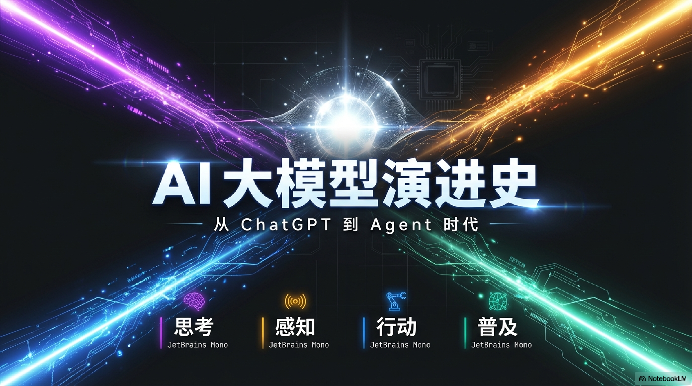

---

从 2022 年底 ChatGPT 的惊艳亮相，到 2026 年初本地 Agent 的全面爆发，AI 在短短四年间完成了一次角色蜕变：从被动响应的信息助手，进化为能够自主执行任务的本地执行官。

这不是一次线性升级，而是一场"角色定位"的根本性变革。如果说 2022 年的 AI 是一个博学但被动的图书管理员，2024 年它成了一个能独立思考的参谋，到 2026 年，它已经是一个能替你动手干活的雇员——而且不知疲倦，不要工资。

这篇文章沿着四条主线——思考、感知、行动、普及——梳理这段进化史中的关键节点。

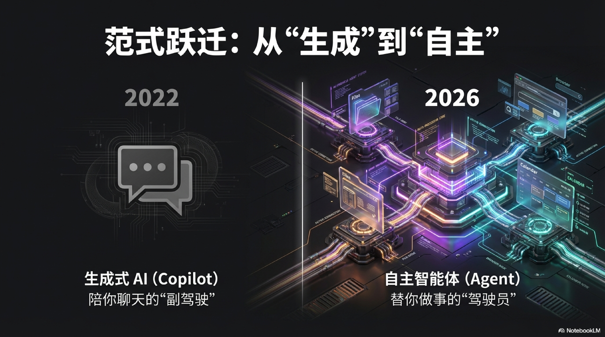

## 四条演进主线

### 一、思考：从预测词语到真正推理

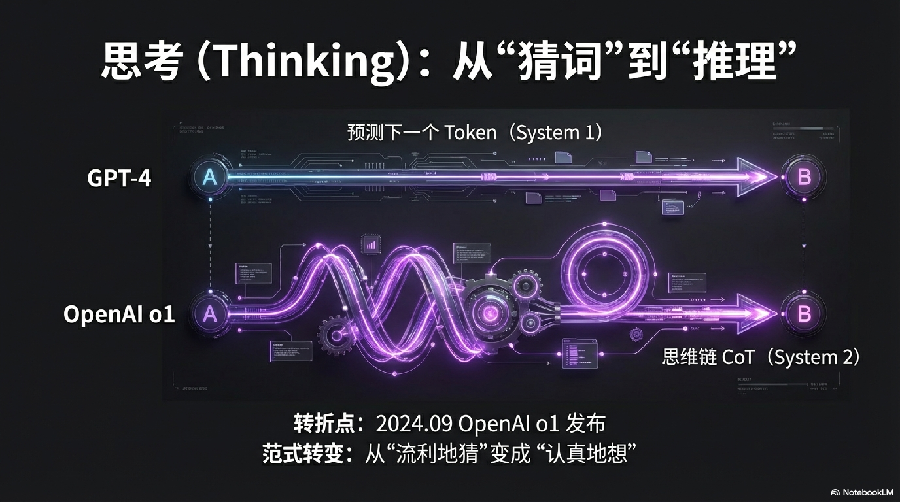

AI 最早的本质是"猜下一个词"——给定前文，预测最可能出现的下一个 token。这让它能写文章、回答问题，但遇到需要多步推理的题目就会出错，像一个博学但不爱动脑的人。用诺贝尔经济学奖得主 Daniel Kahneman 的框架来说，早期 AI 只有"系统 1"——快速直觉反应，没有"系统 2"——慢速深度思考。

**2022 年底 ChatGPT 的爆发**，让世界第一次大规模感受到这种能力的上限。它上线仅两个月用户突破一亿，成为人类历史上增长最快的消费级应用，远超 TikTok 用 9 个月、Instagram 用两年半达到同一里程碑的速度。它流利、它博学，但它不会真正"想"。你问它"9.11 和 9.8 哪个大"，它可能自信地告诉你 9.11 更大——因为它本质上在做模式匹配，而不是数学运算。

转折发生在 **2024 年 9 月**。OpenAI 发布 **o1**，首个推理模型。它在回答前会先在内部"想一想"（Chain-of-Thought），数学、代码、逻辑题的正确率大幅跃升。在国际数学奥林匹克的基准测试中，o1 的得分从 GPT-4 的 13% 飙升至 83%。这不只是更快，是范式的转变——从"流利地猜"变成"认真地想"。OpenAI 的研究负责人 Mark Chen 将其描述为"教会模型在说话之前先思考"。

**2025 年 1 月**，DeepSeek 发布 **DeepSeek R1**，用不足 OpenAI 百分之一的训练成本（据报道约 560 万美元），达到与 o1 相近的推理水平。它在论文中明确提出 **RLVR**（Reinforcement Learning from Verifiable Rewards）：无需人工标注，只靠可自动验证的奖励信号（比如数学题对错）做强化学习，纯 RL 就能催生推理能力。更令人震惊的是，在训练过程中，模型自发涌现出了"自我反思"和"回溯检查"等行为——没有人教它这么做，它自己学会了。这件事震动全球，重新定义了"顶级 AI 能力需要多少钱"。DeepSeek R1 发布当周，美国科技股市值蒸发超过一万亿美元，英伟达单日跌幅近 17%。

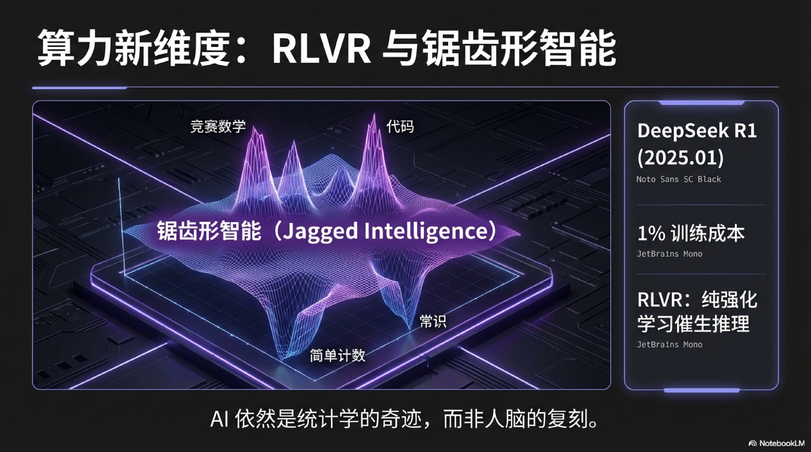

今天，推理模型已成标配，**Test-time Compute**（推理时多花算力慢慢想）成为继预训练规模之后新的扩展维度——OpenAI 的研究显示，推理时的算力投入和最终表现之间存在近似线性的 Scaling Law。但能力边界依然奇怪——同一个模型，能解开竞赛级数学题，却曾经数不清 "Strawberry" 里有几个字母 "r"。哈佛商学院的 Ethan Mollick 教授与波士顿咨询（BCG）在一项联合研究中，将这种现象命名为 **Jagged Intelligence（锯齿形智能）**：AI 的能力边界不是一条平滑的线，而是一道参差不齐的锯齿——在某些任务上超越 99% 的人类，在另一些看似简单的任务上却不如小学生。这提醒我们：AI 依然是统计学的产物，不是人类大脑的复刻。使用 AI 的人需要建立一种新的直觉——知道何时可以信任它，何时必须亲自把关。

### 二、感知：从读文字到看、听、生成视频

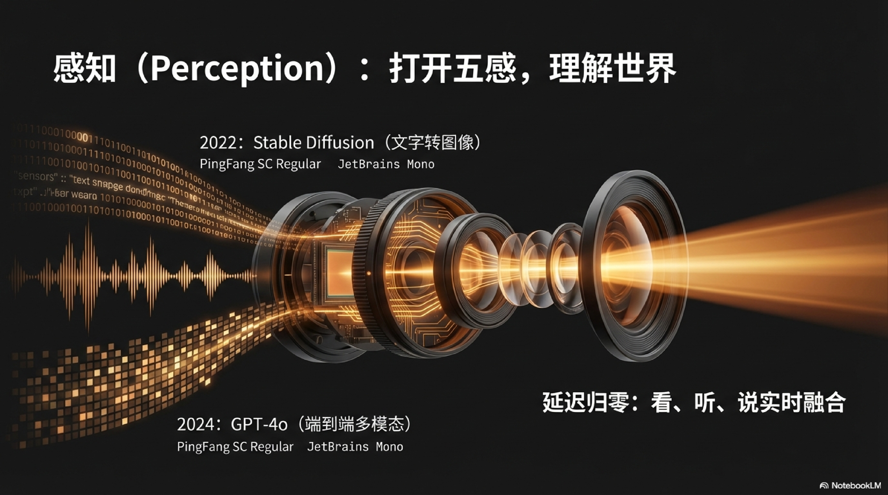

语言模型诞生时只能处理文字——它的世界是一维的、纯文本的。过去三年，它的感知边界被逐步打开，从图像到语音再到视频，AI 正在获得越来越接近人类的"感官"。

**2022 年**，图像生成先爆发。**Stable Diffusion** 开源，任何人用一台普通电脑就能把文字变成图像——AI 创作第一次真正进入普通人手中。在此之前，OpenAI 的 DALL·E 2 和 Google 的 Imagen 已经展示了文生图的可能性，但它们都是闭源的、受限访问的。Stable Diffusion 的开源打破了这道门槛，上线第一个月就有超过 1000 万用户尝试，围绕它涌现出 Midjourney、Civitai 等庞大的创作者生态。艺术家和设计师群体对此反应截然分裂——有人视其为解放创造力的工具，有人视其为对原创作品的系统性掠夺。

随后是理解方向的突破。**GPT-4（2023.03）** 开始支持图像输入，AI 能"看懂"一张图并回答问题——你可以拍一张冰箱里的照片，它能告诉你这些食材可以做什么菜。**GPT-4o（2024.05）** 则更进一步——它是第一个真正端到端的多模态模型，文字、语音、视觉由同一个模型统一处理，而不是靠插件拼接。OpenAI 在发布会上的实时演示让人想起电影《Her》中的场景：打开手机对着面前的东西说话，它能实时回应，延迟低至 232 毫秒，接近人类正常对话的反应速度。Sam Altman 在发布后发了一条推文，只有一个词："her"。

视频是最后也是最难的边界。**2024 年 2 月**，OpenAI 发布 **Sora**，文字直接生成长达一分钟的连贯视频，物理规律、光影变化、镜头运动都达到了令人震惊的一致性。这不仅是视觉的升级，更意味着 AI 开始理解物理世界的运动规律和因果逻辑——Sora 的技术报告将其定位为"世界模拟器"（World Simulator）。Kling（快手）、Veo（Google）、Seedance（字节）相继跟进，视频生成从"演示级"走向"可用级"。

感知能力的扩展意味着：AI 理解世界的方式，正在从"阅读关于世界的描述"变成"直接感知世界本身"。当一个系统能同时看、听、说、读的时候，它与人类的交互就不再是冰冷的命令行输入，而是自然的、类人的沟通。

### 三、行动：从聊天到替你做事

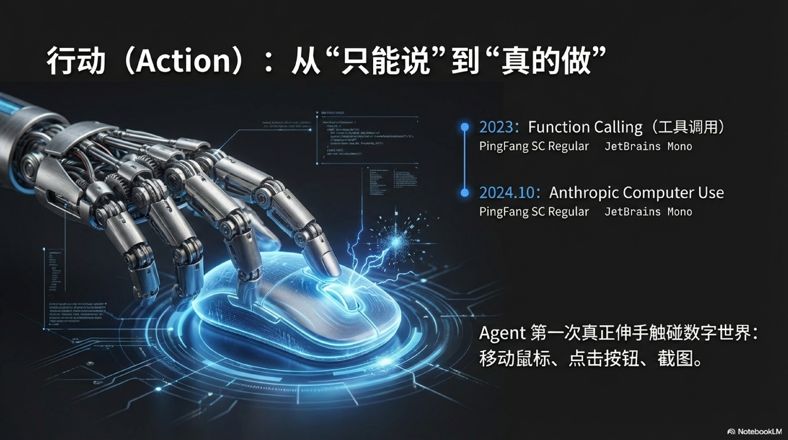

这是过去两年变化最剧烈的一条线，也是最接近"AGI"想象的方向。如果说思考赋予了 AI "大脑"，感知赋予了它"感官"，那么行动能力就是它的"四肢"——它终于能从"纸上谈兵"变成"真枪实干"。

#### 第一步：给 AI 装上工具（2023）

**2023 年 6 月**，GPT-4 引入 **Function Calling**。AI 第一次能结构化地调用外部工具——查天气、搜数据库、发邮件。它不再只是"说"，开始能"做事"。这看似是一个小小的 API 更新，但其意义深远：它标志着 LLM 从一个"语言生成器"转变为一个"任务调度中心"。开发者社区迅速嗅到了机会，2023 年下半年出现了 AutoGPT、BabyAGI 等早期 Agent 项目，GitHub 上一度掀起"万物皆可 Agent"的热潮。虽然这些早期项目大多因为模型能力不足而停留在"演示阶段"，但它们为后来的 Agent 浪潮播下了种子。

#### 第二步：让 AI 操控电脑（2024）

**2024 年 10 月**，Anthropic 推出 **Computer Use**，Claude 能像人一样操控电脑桌面：移动鼠标、点击按钮、截图、输入文字。Agent 第一次真正伸手触碰真实世界。这意味着 AI 不再需要专门为它开发 API——任何人类能在电脑上完成的操作，AI 理论上都能完成。虽然初期的操控精度和速度还不够理想，但方向已经明确：**AI 的执行边界 = 人类的操作边界**。

同年 **11 月**，Anthropic 发布 **MCP**（Model Context Protocol），一个开放标准协议，统一了 LLM 与外部工具、数据源的连接方式。MCP 的意义类似 USB 接口——在此之前每个工具都要单独适配，有了 MCP，Agent 能力开始可组合、可复用。短短几个月内，围绕 MCP 的生态迅速成型：数据库、浏览器、代码编辑器、文件系统等几十个 MCP Server 被开发出来，形成了一个 Agent 能力的"应用商店"。

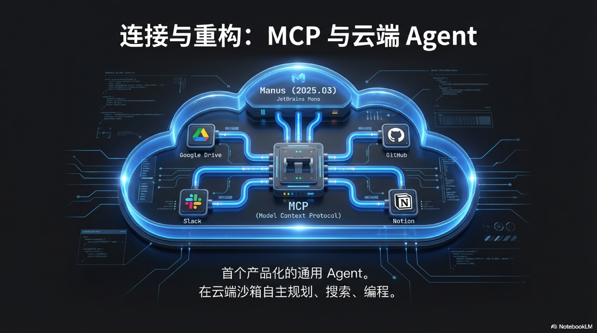

#### 第三步：云端 Agent 产品化（2025）

**2025 年 3 月**，**Manus** 发布，首个真正产品化的通用 Agent：给它一个目标，它自己规划步骤、搜索、写代码、操控浏览器，在云端沙箱里完成复杂任务。发布后 72 小时内邀请码被炒到数百美元，一码难求。同月，Anthropic 推出 **Claude Code**，让 Agent 直接在代码库里自主工作——读文件、写代码、跑测试、提 PR，全程不需要人介入。这也催生了一种新的软件工程模式：开发者从"写代码的人"变成了"审代码的人"。

软件开发的范式同步被重构。Andrej Karpathy 在 **2025 年 2 月**提出 **Vibe Coding**（氛围编程）：不需要真正写代码，只管用自然语言说需求，AI 全程生成和调试。他在社交媒体上写道：*"I just see things, say things, run things, and copy-paste things, and it mostly works."*（我只是看、说、跑和复制粘贴，大多数时候就能跑通。）他提出了一个更深的洞察——**代码的坍缩**：代码从"长期资产"变成了"一次性中间产物"，免费、短暂、可随意丢弃。这对整个软件工程的价值体系是一次根本性的冲击：如果代码可以随时重新生成，那么"代码质量""技术债"这些概念的意义是否需要被重新审视？

#### 第四步：本地 Agent 爆发（2026）

云端 Agent 有一个根本性的问题：你的数据必须上传到别人的服务器。你的聊天记录、工作文件、个人习惯——一切都暴露在第三方的基础设施中。对于个人用户来说，这是隐私焦虑；对于企业来说，这是合规红线。

**2026 年初**，**OpenClaw** 横空出世，45 天突破 100,000 GitHub Stars（截至目前累计 190,000+），成为 GitHub 史上增长最快的开源项目之一。它运行在用户自己的机器上，将 WhatsApp、Telegram、Slack 等消息平台与本地 LLM + Agent 深度整合，替你发消息、跑脚本、管日历——数据不出本地，一条命令启动。

它的爆发不是偶然。它卡位的，是"只会聊天的 AI"与"过于工程化的 AutoGPT"之间长达两年的断层：普通人第一次真实感受到"AI 可以替我操作电脑"，而且不需要把隐私交出去。OpenClaw 的成功验证了一个判断：**AI Agent 的终局不在云端，而在本地。** 用户不想要一个替他做事但看得见他一切的全能管家，他要的是一个住在自己家里的助手。

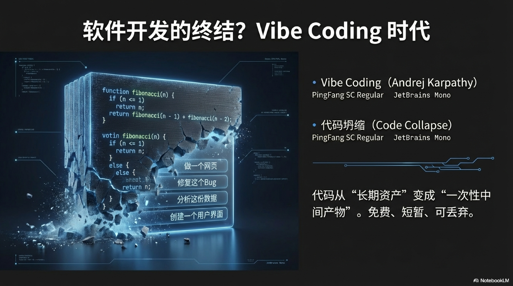

能力边界的跃迁路径清晰可见：**信息 → 决策 → 执行**；从"只能说"到"真的做"。

### 四、普及：从大公司专利到人人可用

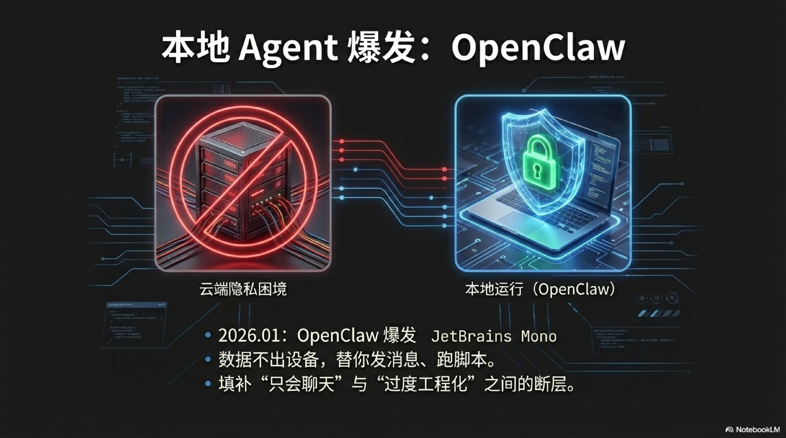

AI 能力的演进，始终伴随着另一条线——**谁能用得上**。技术本身的强弱固然重要，但真正改变世界的，是它从实验室走向每个人手中的速度。

**2023 年 7 月**，Meta 开源 **Llama 2**，开源大模型生态全面爆发。在此之前，训练和运行一个强力大模型需要巨额算力和闭源授权。Llama 2 之后，任何人都可以在自己的机器上运行一个，自由微调、自由部署。开源社区的热情在随后两年持续燃烧——Mistral（法国）、Qwen（阿里）、GLM（智谱）等一批高质量开源模型涌现，形成了对 OpenAI 闭源路线的有力制衡。Meta 的 AI 负责人 Yann LeCun 多次公开表示："开源是 AI 安全的最佳路径"——这一判断正在被越来越多的事实验证。

**2025 年初 DeepSeek R1** 则是另一个维度的普及——不只是模型开源，而是证明了**顶级推理能力不需要顶级预算**。训练成本不足 OpenAI 百分之一的模型，能达到同等水平。这直接动摇了"只有大公司才能做前沿 AI"的认知。随之而来的是一场 API 价格战：以 GPT-4 级别的能力为基准，2024 年初每百万 token 的调用成本约为 30 美元，到 2025 年底已降至不到 1 美元——跌幅超过 97%。推理从"烧钱的奢侈品"变成了"可以随意调用的基础设施"——这才是 OpenClaw 这类本地 Agent 能够爆发的真正经济基础。

开发门槛也在同步下降。**Vibe Coding** 的出现意味着，写代码这件事本身的门槛被拆掉了——软件开发从"需要学编程"变成了"需要能描述需求"。Y Combinator 2025 年冬季批次中，有约四分之一的创业公司的代码库中超过 95% 由 AI 生成。Qwen（阿里）、GLM（智谱）等国内开源模型持续跟进，确保这场普及不只发生在英语世界。

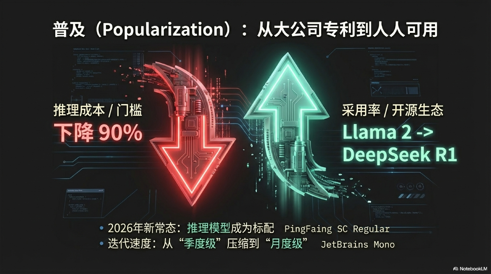

2026 年 2 月的密集发布——**Claude Opus 4.6、Gemini 3.1 Pro、Qwen 3.5-Thinking、GLM-5、Doubao-Seed-2.0**——是这条线的最新注脚：推理模型已成标配，模型迭代从"季度级"压缩到"月度级"。AI 进入高速消耗品时代，顶级能力正在以越来越快的速度变得普通。正如 Anthropic CEO Dario Amodei 在 2025 年发表的长文《Machines of Loving Grace》中所预言的：AI 的发展速度不是线性的，它在加速，而我们感知这种加速的能力正在跟不上变化本身。

---

## 大事记

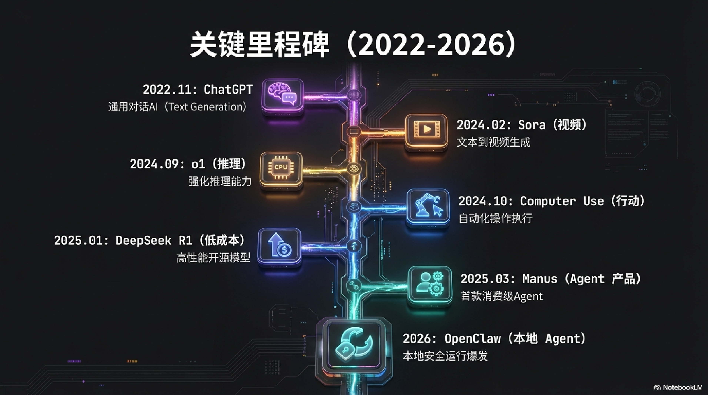

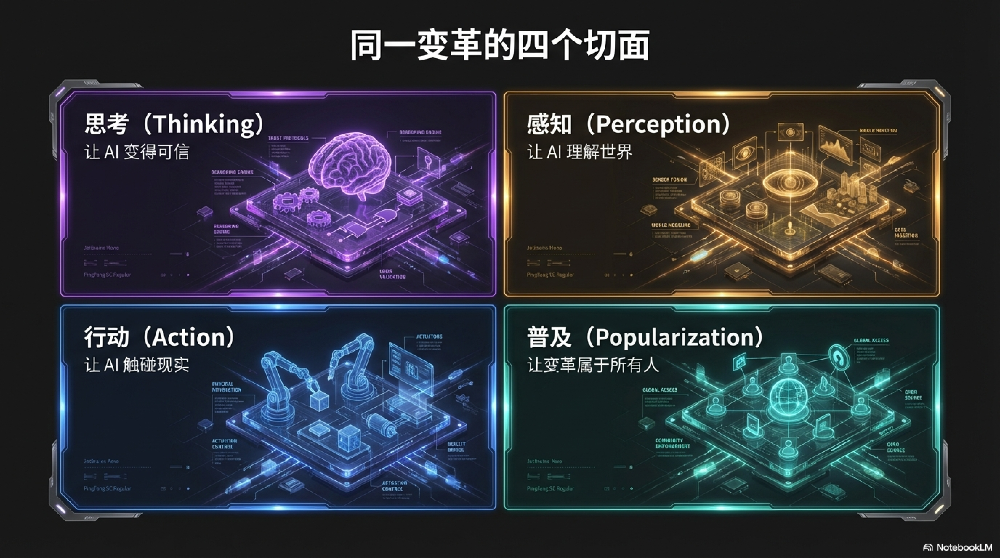

| 时间 | 事件 |
|------|------|
| 2022.08 | Stable Diffusion 开源，图像生成平民化 |
| 2022.11 | ChatGPT 发布，两个月用户破亿 |
| 2023.03 | GPT-4 发布，支持图像输入 |
| 2023.06 | Function Calling 上线，Tool Use 时代开启 |
| 2023.07 | Llama 2 开源，开源生态全面爆发 |
| 2024.02 | Sora 发布，文字生成视频 |
| 2024.03 | Devin 发布，"首个 AI 软件工程师" |
| 2024.05 | GPT-4o 发布，首个端到端多模态模型 |
| 2024.09 | o1 发布，推理模型范式开启 |
| 2024.10 | Computer Use，Agent 操控真实电脑 |
| 2024.11 | MCP 发布，工具连接标准化 |
| 2025.01 | DeepSeek R1，低成本推理震撼全球 |
| 2025.02 | Vibe Coding 概念提出，代码开始"坍缩" |
| 2025.03 | Manus + Claude Code，Agent 产品化落地 |
| 2026.初 | OpenClaw，本地 Agent 爆发 |
| 2026.02 | 各大厂密集更新，推理模型成标配 |

---

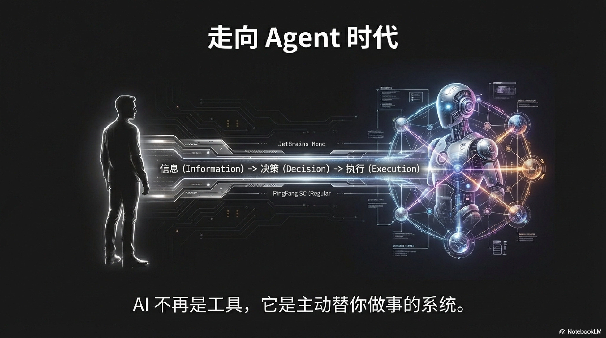

四条演进主线，本质上是同一件事的四个切面：AI 正在从一个你需要主动去用的工具，变成一个主动替你做事的系统。思考能力让它变得可信，感知能力让它理解世界，行动能力让它触碰现实，而普及则决定了这场变化属于所有人，而不只是少数人。

现在是 2026 年初。推理成本趋近于零，Agent 开始在本地运行，模型迭代的速度快过大多数人学会上一个版本的速度。一个深层的问题浮出水面：当 AI 能够处理越来越多的执行细节，人类的核心竞争力将不再是"如何操作工具"，而是你的**意图**（Intentionality）——如何清晰地定义目标、如何做出 AI 无法替代的价值判断、如何在"万物皆可自动化"的浪潮中，保持对复杂系统的掌控力和对模糊问题的洞察力。

下一个问题不再是"AI 能做什么"，而是"我们想让它做什么，以及不想让它做什么"。
