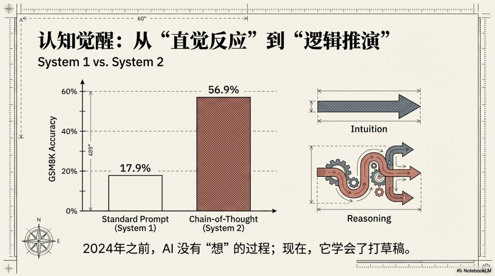
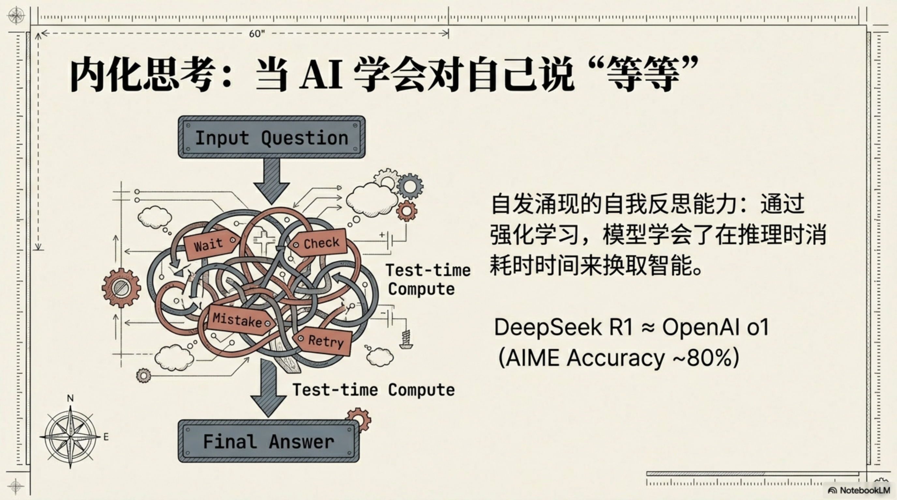
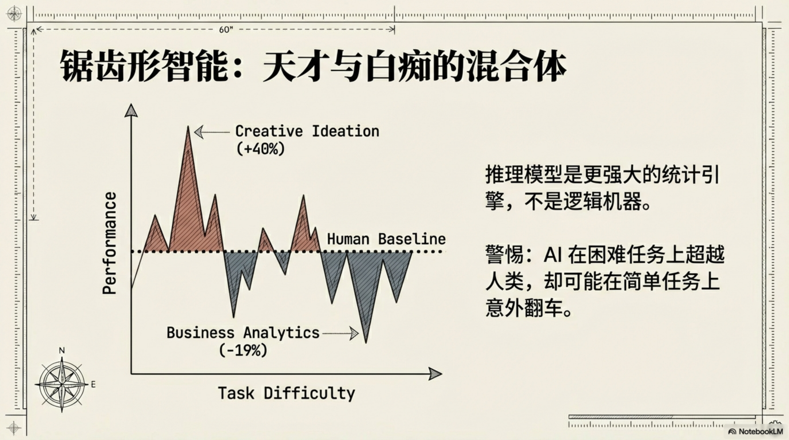

# AI 是怎么学会思考的

诺贝尔奖得主 Daniel Kahneman 把人类思维分成两个系统：系统 1 快速、直觉、自动；系统 2 缓慢、费力、逻辑。你看到"2+2"脱口而出"4"，是系统 1。你面对"17×34"拿起笔一步步算，是系统 2。

2024 年之前，所有的 AI 大模型只有系统 1。

这不是比喻——是字面意思。传统 LLM 看完问题，直接输出答案，中间没有任何"想"的过程。2024 年，这件事变了。

---

## 一、系统 1 的天花板

理解推理模型，先要理解传统 LLM 的本质限制。

一个语言模型回答问题的过程，叫做**前向传播**（Forward Pass）。模型接收你的输入，经过一次性的神经网络计算，输出结果。这个过程只发生一次。没有回头检查，没有重新思考，没有"等等，我再算一遍"。

你问它"97×83 等于多少"，它会立刻给出一个数字。有时候对，有时候错——但不管对错，它的内部过程是一样的：一口气说完，没有打草稿。

这在简单任务上没有问题。但遇到需要多步推理的题目——数学证明、复杂逻辑分析、代码调试——这种"脑子里不打草稿就直接说答案"的方式就会频繁出错。

研究者做过测试。用一道需要 4 步推导的数学题，直接问大模型答案，错误率极高。但如果要求它"一步一步解释"，同一个模型的正确率会显著提升。**问题不在于模型不聪明，而在于它没有被迫展开推理过程。**

---

## 二、Chain-of-Thought：教 AI 把步骤写出来

2022 年 1 月，Google Brain 的研究员 Jason Wei 等人发表了一篇论文，改变了所有人对大模型能力的认知。

论文题目叫《Chain-of-Thought Prompting Elicits Reasoning in Large Language Models》——**思维链**（Chain-of-Thought，简称 CoT）。

核心发现很简单：如果你在提示词里给模型看几个"逐步解题"的示范例子，它的复杂推理能力会大幅提升。

数据有多惊人？在 GSM8K——一个小学数学应用题基准——PaLM 540B 模型，用标准提示的正确率是 17.9%，用 CoT 提示后跳到了 56.9%。不到两倍的 prompt 修改，正确率提升了 3 倍。

更离谱的是另一项发现：你甚至不需要提供示范例子。只要在问题末尾加一句话——*"Let's think step by step"*（让我们一步一步思考）——同样有效。研究者叫它 zero-shot CoT。这句咒语让同样的模型在 MultiArith 数学基准上的正确率从 17.7% 跳到 78.7%。

> 一句"让我们一步一步来"，正确率提升了 4 倍多。

为什么会这样？本质上，CoT 让模型把推理过程"写在纸上"。每一步的输出，成为下一步的输入。模型不再需要把所有的中间步骤都压缩在一次前向传播里——它可以慢慢展开。

但 CoT 有一个根本限制：它依赖 prompt 技巧，不是模型自身的习惯。你得主动引导它，它才会思考。没有人提醒，它还是会直接脱口而出。这就像一个学生——只有老师说"把步骤写出来"，他才会认真演算；平时直接报答案，经常错。

---

## 三、推理模型：从被提示思考到主动思考

2024 年 9 月 12 日，OpenAI 发布了 o1。

o1 做的事情，表面上和 CoT 很像：输出答案之前，先经历一段"思考过程"。但本质完全不同。CoT 是外部 prompt 的技巧；o1 是把推理**内嵌进模型本身**——它不需要你提醒，它默认就会先想再说。

数字说明一切。

AIME 是美国数学竞赛的资格赛题，面向高中生中最顶尖的一批人。GPT-4o 平均能解 12%——15 道题里答对不到 2 道。o1 呢？**83.3%**。同一套题，正确率提升了近 7 倍。

竞技编程基准 Codeforces 上，GPT-4o 的评级是 Elo 808，大约相当于第 11 百分位。o1 的评级是 Elo 1,673，第 89 百分位。从菜鸟玩家跳到了高手段位。

最令人震惊的是一个叫 GPQA Diamond 的基准——博士级别的物理、生物、化学难题，连领域内的 PhD 专家作答正确率也只有 69.7%。o1 达到了 77.3%，**成为第一个超越人类 PhD 专家的模型**。

OpenAI 补充说明：这不代表 o1 在所有方面都超过了 PhD，但在这组特定题目上，它做到了。

o1 背后的核心逻辑叫 **Test-time Compute Scaling**——推理时扩展。过去 AI 的进步主要靠训练时投入更多算力和数据；o1 开辟了另一个维度：**在推理时多花计算资源，换取更好的答案**。你问一道难题，它可以在内部"想"几百步、几千步，然后再告诉你答案。

Google DeepMind 的研究发现，通过优化推理时的计算分配，一个小模型有可能超越 14 倍大的模型。推理时的算力，成了新的杠杆。

---

## 四、DeepSeek R1：推理能力的民主化

2025 年 1 月 20 日，DeepSeek 发布了 R1。

三件事让这次发布震动了整个行业。

第一，**性能追平 o1**。在 AIME 2024 上，DeepSeek-R1 正确率 79.8%，o1 是 79.2%。在 11 项主流基准测试中，两个模型互有胜负，基本持平。

第二，**成本低得离谱**。DeepSeek 公布的训练成本约 560 万美元——这是 DeepSeek-V3 基础模型最终训练阶段的费用，按 H800 GPU 的租用价格计算。这个数字有意义，也需要上下文：它不包括前期研究、失败的实验、硬件购置成本。但即便如此，相比 OpenAI 训练 GPT-4 的数亿美元量级，它仍然是数量级的降低。

第三，**也是最耐人寻味的**——自发涌现的自我反思能力。

DeepSeek 的研究者用了一种叫 **RLVR**（Reinforcement Learning with Verifiable Rewards）的训练方法：不给模型任何人工标注的推理示范，只告诉它答案对还是错，让强化学习自己找路。

训练过程中，研究者追踪了一类词汇：*wait、mistake、however、retry、verify、check*。这些词是"自我检查"的标志——"等等"、"不对"、"让我验证一下"。

在训练的第 8000 步之后，这些词的出现频率显著增加。没有人教它，它自己摸索出了"先别急着下结论，回头检查一下"这个策略。

论文里研究者写道："这对我们来说也是一个顿悟时刻，让我们见证了强化学习的力量和美丽。"

2025 年 1 月底，DeepSeek R1 发布后，美国科技股一日内蒸发了超过万亿美元市值——市场意识到，AI 能力的垄断壁垒，可能没有想象的那么高。

---

## 五、推理的边界：锯齿形智能

推理模型令人印象深刻，但有一个陷阱值得认真对待。

2023 年，哈佛商学院和 BCG（波士顿咨询）合作做了一个规模罕见的实验：758 名顾问，随机分组，一部分使用 GPT-4，一部分不使用，完成真实的咨询工作任务。

结果是"锯齿形"的：**在 AI 擅长的任务上，使用 AI 的顾问质量提升了 40%，速度快了 25%。但在 AI 不擅长的任务上，使用 AI 的顾问，正确率比不使用 AI 的顾问低了 19 个百分点。**

用了 AI，反而做得更差。

失败的那道题是什么？需要同时整合电子表格财务数据和访谈记录，做定量加定性的混合分析。AI 给出了听起来很有说服力的答案，顾问选择信任了它——结果一步错，步步错。

研究者把这个现象叫做**锯齿形智能前沿**（Jagged Frontier）：AI 的能力边界不是一条整齐的线，而是锯齿状的。有些任务远超人类预期，有些任务糟糕程度同样出乎意料。危险在于，你往往不知道自己正站在哪一侧。

推理模型让锯齿的高峰更高了——它在数学竞赛和博士级科学题上超越了人类专家。但锯齿的低谷并没有消失。一个在 AMC 上拿满分的模型，依然会在"Strawberry 里有几个字母 r"这样的问题上出错——因为它不是在逐个数字母，它是在用统计模式猜测答案。

> 推理模型是更强大的统计引擎，不是逻辑机器。

理解这个区别，决定了你能不能用好它。

---

## 结语

从 2022 年的 CoT 论文，到 2024 年的 o1，再到 2025 年的 DeepSeek R1——3 年时间，AI 从"被提示才会思考"进化到"自发反思、主动检查"。这是一次真实的范式转变。

推理能力是锋利的刀，但它只存在于文字的维度里。AI 从"会说话"到"真正思考"，这一步已经完成——从 2022 年一句 *"Let's think step by step"* 提升 4 倍正确率，到 2025 年 DeepSeek R1 自发涌现出自我反思能力，这是一次真实的范式转变。

理解这个转变，才能真正用好推理模型——知道在哪些场景该依赖它，在哪些场景该对它保持审慎。

---

*数据来源：[Wei et al. 2022（arXiv: 2201.11903）](https://arxiv.org/abs/2201.11903)、[OpenAI o1 发布博客](https://openai.com/index/learning-to-reason-with-llms/)、[DeepSeek R1 论文（arXiv: 2501.12948）](https://arxiv.org/abs/2501.12948)、[Snell et al. 2024（arXiv: 2408.03314）](https://arxiv.org/abs/2408.03314)、[BCG/HBS Jagged Frontier（HBS WP 24-013）](https://papers.ssrn.com/sol3/papers.cfm?abstract_id=4573321)*
