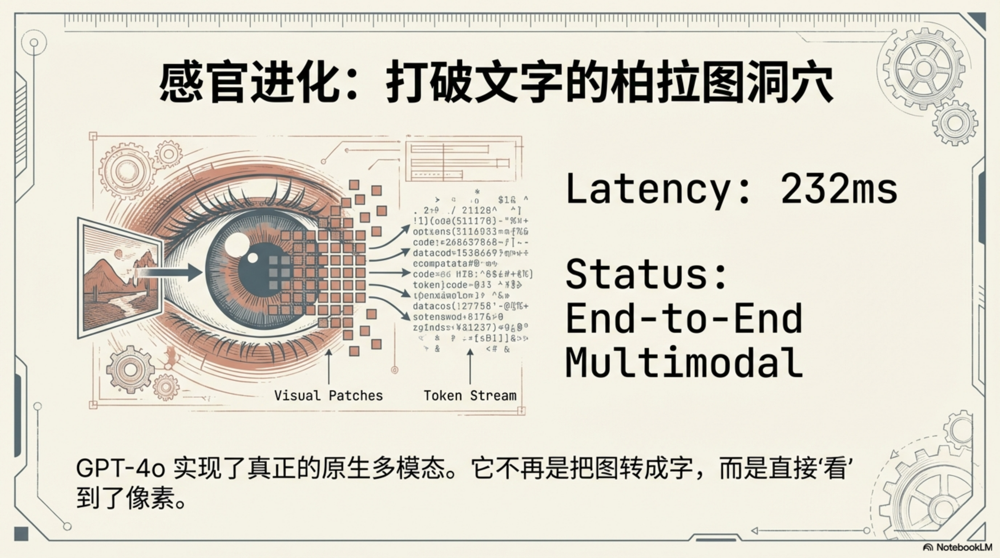
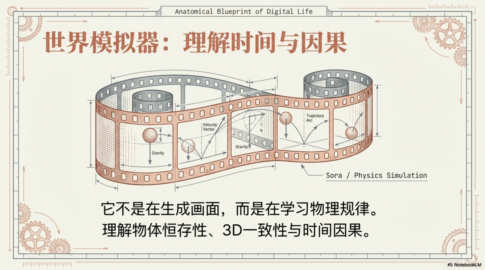

# AI 是怎么学会"看"和"听"的

> 从读文字到看世界——多模态 AI 的感知进化

你对手机说"这是什么花"，它看一眼就能告诉你是薰衣草。这件事在 2022 年还是科幻，2024 年已经是日常。AI 从"只会读文字"变成了"能看、能听、能说"——这个转变是怎么发生的？

会推理、能说话的 AI，世界仍然是一维的——只有文字。要真正理解我们所在的世界，它需要眼睛和耳朵。这篇讲的就是：AI 的感知边界，是如何一步步被打开的。

---

## 一、文字世界的天花板

据研究，人类 80% 以上的信息通过视觉获取。一张照片传递的信息量，往往超过一千字的描述。

但语言模型天生活在"文字的柏拉图洞穴"里。它读过无数关于彩虹的描述，却从未真正"看见"一道彩虹。它知道"红色是波长 620-750 纳米的光"，却无法感受红色本身。就像一个从小生活在黑暗中的人，通过阅读来理解颜色——能说得头头是道，但感知是缺失的。

现实需求让这个问题变得迫切：用户想拍照问问题，想语音对话，想让 AI 帮自己看懂截图。纯文字的 AI，越来越不够用了。

要打破这道墙，需要两件事：让 AI 能**生成**图像，让 AI 能**理解**图像。这是两条不同的技术路径，在 2022 年到 2023 年间几乎同步爆发。

---

## 二、扩散模型：AI 学会"画画"

在 AI 学会看懂图像之前，它先学会了画图——而且画得出奇地好。

**2022 年 8 月 22 日**，Stable Diffusion（稳定扩散）开源发布。这是 Stability AI 联合德国 LMU Munich 的 CompVis 研究组、RunwayML 等机构共同推出的文生图模型，训练数据来自 LAION-5B——一个由德国非营利组织 LAION 整理的 50 亿图文对数据集。更重要的是，它对硬件的要求出奇地低：只需要 2.4 GB 显存的消费级显卡就能运行。

在此之前，OpenAI 的 DALL·E 2 和 Google 的 Imagen 已经展示了文生图的能力，但它们都是闭源的、受控访问的。Stable Diffusion 的开源，才真正把这扇门打开了。

背后的技术原理，是一个叫**潜在扩散模型**（Latent Diffusion Model）的东西。要理解它，先要弄懂**扩散模型**（Diffusion Model）这个更基础的概念。

### 扩散模型的逻辑

想象你把一张清晰的照片，一步步往上撒沙子——先模糊，再模糊，最后变成一片噪声。这叫"前向扩散"。

扩散模型学的，是这个过程的**反向**：给它一片随机的噪声，让它一步步把噪声去掉，最终"还原"出一张图像。

但还原出什么图像？这就需要文字来引导。**CLIP**（对比语言-图像预训练，Contrastive Language-Image Pre-training）起到了"翻译官"的作用：它把文字描述和图像映射到同一个数学空间，让"一只穿宇航服的猫"这几个字，能够直接和对应的视觉特征对应起来。

2020 年 UC Berkeley 的 Ho 等人发表了奠基性的论文，提出**去噪扩散概率模型**（DDPM，[Denoising Diffusion Probabilistic Models](https://arxiv.org/abs/2006.11239)），证明了扩散模型能生成高质量图像。2022 年，LMU Munich 的 Rombach 等人在 CVPR 上提出了关键改进（[arXiv: 2112.10752](https://arxiv.org/abs/2112.10752)）：把扩散过程从"像素空间"移到"潜在空间"——先把图像压缩成紧凑的数学表示，在这个压缩版本上做扩散，大幅降低了计算成本。这篇论文，直接构成了 Stable Diffusion 的技术基础。

Stable Diffusion 开源后，Midjourney、Civitai 等平台和工具迅速涌现，形成了庞大的创作者生态。艺术家和设计师群体对此反应截然分裂——有人视其为解放创造力的工具，有人视其为对原创作品的系统性威胁。这场争论至今未有定论。

---

## 三、GPT-4V：AI 学会"看懂"

能画图，不等于能理解图。这是两种截然不同的能力。

生成是从文字到图像，理解是从图像到文字——但更重要的区别在于：理解需要**推理**，而不只是模式匹配。

**2023 年 3 月**，OpenAI 发布 GPT-4 技术报告，其中悄悄提到了视觉能力。但真正公开给用户的，是半年后的事：**2023 年 9 月 25 日**，OpenAI 发布 GPT-4V 系统卡（[System Card](https://cdn.openai.com/papers/GPTV_System_Card.pdf)），ChatGPT Plus 用户开始能上传图片。2023 年 11 月 6 日，API 才正式对开发者开放。

GPT-4V 能做的，远不止"这是一只猫"。你可以给它一张餐厅菜单的照片，问"有没有适合乳糖不耐受的菜"；你可以截一张代码报错截图，它能直接看出问题在哪；你可以拍下白板上密密麻麻的笔记，它能整理成结构化的文档。

技术上，这是怎么实现的？

GPT-4V 的做法，是把图像处理成 AI 能读懂的语言：将图片切成若干个小块（patch），每个小块转化为一个向量——这个向量就是视觉版的 Token。这些视觉 Token 和文字 Token 被送入同一个 Transformer，统一处理。模型不需要"切换模式"，图像信息和文字信息在同一个计算空间里交互。

这意味着 AI 处理"一张有文字的图"，和处理"一段文字"，本质上是同一套机制。视觉，变成了另一种语言。

这里有一个值得停下来想的问题：AI 既然能看图、听声音、生成视频，为什么还叫"**语言**模型"？

因为所有这些新能力，都没有替换掉语言模型，而是向它**靠拢**。图像切成 patch 变成向量，声音编码成特征序列——最终，它们都被翻译成了语言模型能处理的格式。LLM 是枢纽，其他模态是向它说话的外设。"多模态"不是把 LLM 换掉，而是给它装上了眼睛和耳朵——但核心引擎从未改变。

---

## 四、GPT-4o：真正的端到端多模态

视觉能力有了，语音能力有了，但 2024 年 5 月之前，这两者都是拼接起来的——语音先转成文字，文字送给 LLM，LLM 输出文字，文字再转成语音。每个环节都有信息损失：说话时的停顿、语气、情绪，在文字转换这一步就丢失了。

**2024 年 5 月 13 日**，OpenAI 发布 **GPT-4o**（"o"代表 omni，全能）。这是第一个真正端到端的多模态模型——文字、语音、图像，由**同一个模型**统一处理，而不是靠拼接。

效果的区别立竿见影：

- 延迟降至 [232 毫秒](https://openai.com/index/hello-gpt-4o/)（平均 320ms），接近人类对话的反应速度
- 能感知声音中的情绪：兴奋、紧张、悲伤——因为声波本身被直接处理，而不是先翻译成文字
- 能实时响应对话中的停顿、语气转折

OpenAI 的发布会现场，工作人员对着手机说"我心跳加速"，GPT-4o 回应"听起来你很紧张，深呼吸——"。这个场景让在场的人想起一部电影。

Sam Altman [发布会后在 X 上发了一条推文](https://x.com/sama/status/1790075827666796666)，只有一个词：

> her

——那是斯派克·琼斯 2013 年电影里那个 AI 的名字。这条一字推文，说出了所有人感受到的东西。

---

## 五、Sora：AI 开始理解物理世界

如果说图像是空间的切片，视频就是空间加上时间。这让视频生成比图像生成难了不止一个数量级。

生成一张连贯的视频，AI 需要理解：时间轴上的因果逻辑（人先走到桌边，才能拿起杯子）、物理规律（杯子落地会碎，不会穿过地板）、镜头运动的合理性（摄像机不会突然跳转）。这些，是图像生成模型完全不需要考虑的问题。

**2024 年 2 月 15 日**，OpenAI 发布 **Sora**。它能根据一段文字描述，生成最长 60 秒、分辨率达 1080p 的连贯视频——光影、物体运动、镜头语言，都达到了令人震惊的水准。

Sora 的技术架构叫 **Diffusion Transformer**（DiT）：把视频帧切成时空 patch，用 Transformer 建模这些 patch 之间的关系——包括空间上的（同一帧不同位置）和时间上的（不同帧的同一位置）。这让模型能在更大的上下文窗口里"看"整段视频，而不是逐帧独立生成。

OpenAI 在[技术报告](https://openai.com/research/video-generation-models-as-world-simulators)里给 Sora 的定位是"世界模拟器"（world simulator）：

> *"We explore large-scale training of generative models on video data... Video generation models as world simulators."*

这个定位意味着：Sora 的目标不只是"生成像素"，而是学习物理世界的运动规律本身。

当然，它还远不完美。手指数量可能出错，液体物理行为难以准确模拟，复杂的因果逻辑有时会断裂。但方向已经明确——AI 正在从"读关于世界的描述"，变成"直接理解世界本身"。

快手的 [**Kling**](https://ir.kuaishou.com/news-releases/news-release-details/kuaishou-unveils-proprietary-video-generation-model-kling/)（2024 年 6 月）、Google DeepMind 的 [**Veo**](https://deepmind.google/models/veo/)（2024 年 5 月）相继跟进，字节跳动的 **Seedance** 也于 2025 年入场。到 2024 年底，视频生成已经从"震撼演示"走向"可用工具"——至少对于短视频内容创作来说，门槛正在快速下降。

与此同时，**音频生成**也在 2024 年迎来了爆发。**Suno** 和 **Udio** 让任何人都能用一句话——"一首带雨声的爵士小品"——在几秒内生成一首完整的歌曲，包括人声、编曲和歌词。图像生成让 AI 学会画画，视频生成让 AI 学会拍电影，音频生成让 AI 学会作曲。感知能力的三条腿，在 2024 年几乎同时站稳了。

---

## 六、不只是"加了个摄像头"

多模态 AI 常常被简化成"给语言模型加了个摄像头和麦克风"。这个理解是错的。

真正发生的，是**感知方式的根本转变**。

文字是高度压缩的符号系统——它描述世界，但不是世界本身。图像、声音、视频，是世界更直接的表达。当 AI 能同时处理这些模态，它理解世界的方式就从"阅读地图"变成了"置身其中"。

这个变化对产品形态的影响是深远的：

- 语音助手不再是"把语音转成文字后查询"的流程，而是真正理解对话上下文
- AR 眼镜有了意义——AI 能实时看到你看到的，而不只是等你描述
- 机器人能用眼睛感知环境，而不只是依赖传感器数值
- 用户与 AI 的交互，从"打字输入指令"变成了"自然地说话、指指点点"

当 AI 的感知边界扩展到接近人类的时候，一个更大的问题出现了：拥有了语言能力、推理能力、感知能力的 AI——还缺少什么？

**缺少行动力。**

理解了但不能动手，终究只是"智能参谋"，不是"能干同事"。多模态打开了 AI 的感官边界，它看见了、听见了、理解了——但感知世界，和改变世界，是两件事。

---

