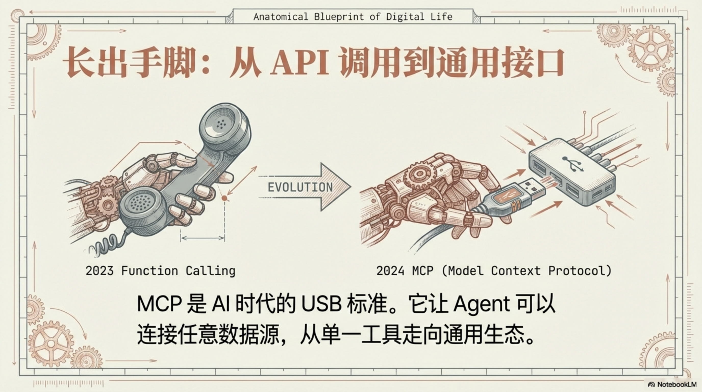
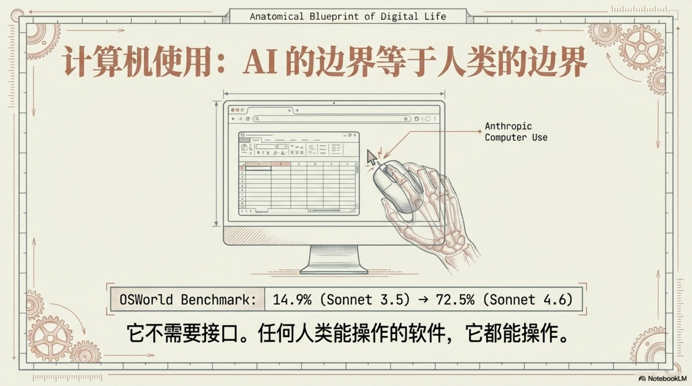

# AI 的手脚进化史：从聊天到做事

> 从 Function Calling 到 MCP，从 Computer Use 到 Agent 落地，AI 用两年时间长出了真正意义上的"手"和"脚"。

2023 年，你让 AI 帮你订一张去上海的高铁票。它的回答大概是：你可以去 12306 或携程搜索，建议提前选好座位，周末票源紧张。

2025 年，你说同一句话。AI 打开浏览器，搜索班次，比价，选出最便宜的那趟，跳转到支付页面，然后停下来问你：请确认支付。

两年，从"动嘴"变成了"动手"。

---

AI 有了语言能力、推理能力、感知能力。但这一切停留在"理解"层面——它能写订票教程，但自己不会去订。它是一个博学的参谋，不是能替你出差的员工。

要从参谋变成员工，AI 需要两样东西：**工具**（能调用外部系统）和**自主性**（能规划并连续执行）。这两样东西，2023 年到 2025 年分四步到位。

## 第一步：给 AI 装上工具箱（2023）

**[2023 年 6 月 13 日](https://openai.com/index/function-calling-and-other-api-updates/)**，OpenAI 更新 API，宣布 gpt-4 和 gpt-3.5-turbo 支持 **Function Calling（函数调用）**。

这是什么意思？

在此之前，AI 的输出只有一种形式：文字。你问它"现在几点"，它只能说"我无法获取实时信息"。Function Calling 改变了这一点——开发者可以用 JSON 格式描述一批函数（"查天气""搜数据库""发邮件"），模型在回答时，如果判断需要调用某个函数，就输出一段结构化的调用指令，而不是自然语言。

类比：这就像给一个只会写信的秘书配了一部电话。

一个月后，同样是 OpenAI，又推出了一个特殊的"工具"——**Code Interpreter（代码解释器）**，后来改名 Advanced Data Analysis。

它的逻辑和 Function Calling 一脉相承，但工具换成了一个 Python 运行环境：AI 写好代码，沙箱直接执行，把结果返回给模型。这解决了一个长期痛点——AI 在做数字计算时容易出错，不是因为它"不懂数学"，而是因为它在用"猜"的方式生成答案。有了 Code Interpreter，AI 不再猜，它写代码、跑代码、看结果。1 万行数据的统计、复杂公式的求解、图表生成——从"容易出错"变成"几乎不出错"。

这个逻辑后来被彻底放大：如果 AI 能写代码并执行，它就不需要在脑子里"算"任何东西——把计算扔给机器。Vibe Coding 的底层逻辑，就发源于此。

生态反应非常快。同年 3 月，BabyAGI 和 AutoGPT 已经出现——在 Function Calling 之前，它们就开始尝试让 GPT-4 "自主执行任务"，方式是把工具描述直接塞进 prompt，然后让模型反复对话。AutoGPT 在几个月内累积了超过 10 万 GitHub Stars，成为当时增长最快的开源项目。

这场热潮很快退烧。

AutoGPT 最常见的失败模式是：进入死循环。它不记得自己已经做过什么，同一个搜索执行了五遍。或者陷入"规划-重新规划"的幻觉循环，耗尽 API 调用额度，什么都没做成。最根本的问题是：模型的推理能力不足以支撑连续自主决策。

> 一个不能稳定推理的模型，给了工具也是一把双刃剑。

但这次失败是有价值的。它告诉整个行业：Agent 的瓶颈在哪里。

## 第二步：让 AI 操控任何软件（2024）

Function Calling 的边界很清晰：AI 只能调用开发者预先定义好的函数，有 API 的工具才能用。12306 没有给 AI 开接口，那 AI 就不能订票。

**[2024 年 10 月 22 日](https://www.anthropic.com/news/3-5-models-and-computer-use)**，Anthropic 发布 **Computer Use（计算机使用）**，直接跨过了这道门槛。

Claude 可以像人一样操控电脑：看屏幕截图、移动鼠标、点击按钮、输入文字。它不需要 API——任何人类能在电脑上完成的操作，它理论上都能完成。12306、Excel、本地文件管理器、你公司的内网系统——全部可以。

这个跨越的意义是：**AI 的执行边界 = 人类的操作边界**。

当然，2024 年 10 月的 Computer Use 还远不够好用。在 OSWorld 基准测试（测试模型完成真实计算机任务的能力）上，Claude 3.5 Sonnet 的初始成绩是 14.9%——同期最好的竞争对手是 7.8%。"最好"意味着 85% 的任务还是完不成。速度慢，精度低，容易在操作到一半时"迷路"。

但方向已经确立，能力曲线开始陡升。到 2026 年 2 月，Claude Sonnet 4.6 在 OSWorld 上的成绩达到 72.5%——一年多里提升了近 5 倍。

## 第三步：统一语言，打通生态（2024）

工具有了，操控有了，但还有一个更隐蔽的问题。

想象这个场景：100 个 AI 应用，各自连接 200 个外部工具（数据库、浏览器、文件系统、代码编辑器……）。如果没有统一标准，每对连接都要单独开发——100 × 200 = 2 万个适配方案。新出一个模型，整套工作再来一遍。

**[2024 年 11 月 25 日](https://www.anthropic.com/news/model-context-protocol)**，Anthropic 发布 **MCP（Model Context Protocol，模型上下文协议）**。

MCP 的思路是：让工具提供方和模型提供方各实现一次标准协议，剩下的自动互通。就像 USB 接口出现之前，每个外设都有自己的专属线，接口标准化之后，任何设备插上去都能用。

MCP 的 USB 类比绝非夸大。到 2025 年 4 月，MCP 的累计下载量超过 800 万次。2025 年中期，生态里已有超过 5800 个 MCP Server，覆盖 Google Drive、GitHub、Slack、Postgres、浏览器控制、本地文件系统等几乎所有主流工具。2025 年 3 月，[OpenAI 正式宣布采用 MCP](https://openai.com/index/model-context-protocol/)，这个标准从 Anthropic 的私有协议变成了行业共识。

MCP 的深层意义是：Agent 能力变得可组合、可共享、可复用。

一个 Agent 应用不再需要从零搭建工具箱；一个工具只要支持 MCP，就能被所有兼容 MCP 的 Agent 使用。这为 2025 年 Agent 产品的爆发提供了基础设施。

## 第四步：从演示变成产品（2025）

三个基础件就位：稳定的推理模型、工具调用能力、标准化的工具生态。

**2025 年 3 月 6 日**，**Manus** 发布。

它是一个通用 AI Agent：你给它一个目标，它自己规划步骤——搜索、写代码、操控浏览器，在云端沙箱里把任务完成，全程你可以旁观，也可以随时介入。上线 7 天内，超过 200 万人加入候补名单。邀请码在二手平台被炒到 5 万元人民币。

它的走红不是因为技术上有多突破性，而是因为它第一次把"AI 自主做事"变成了普通人能感受到的产品形态。在 Manus 之前，Agent 是开发者的工具；Manus 之后，Agent 开始有了普通用户。

同月，Anthropic 推出 **Claude Code**：一个运行在终端里的 Coding Agent，直接在你的代码库中工作——读文件、写代码、跑测试、提 PR，全程不需要人盯着。

能力数字可以量化。**[SWE-bench](https://www.swebench.com/)（软件工程基准测试）** 评估模型在真实 GitHub Issue 上的修复能力：2023 年 10 月，最好的 Agent 只能解决约 2% 的问题；2025 年 11 月，Claude Opus 4.5 [达到 80.9%](https://www.anthropic.com/research/swe-bench-sonnet)——两年，约 40 倍的提升。开发者从"写代码的人"变成了"审代码的人"。Andrej Karpathy 把这种工作方式称为 **Vibe Coding（氛围编程）**——*"I just see things, say things, run things, and copy-paste things, and it mostly works."*

## 能做什么，不能做什么

Agent 落地了，但它不是万能的。理解它的边界，比知道它能做什么更重要。

**可以放心交给 Agent 的任务**，有一个共同特征：结构明确，对错可验证。代码生成、数据分析、信息检索、文件整理——这些任务 Agent 完成得稳定，错了也容易发现。

**需要人类配合的任务**：涉及主观判断、人际关系、商业决策的场景。Agent 可以提供选项，但"选哪个"这件事最好还是人来做。AI 是概率机器，它给出的是最可能的答案，不是最正确的判断。

**危险的任务**：不可逆的操作——删除文件、发送正式邮件、执行金融交易。一旦 Agent 出错，代价无法挽回。目前业界的共识是：对于高风险操作，Agent 在执行前必须先停下来问人。

一个实用的判断框架：**任务的可逆程度 × 错误的后果** 决定了你该给 Agent 多大的自主权。

搜索信息？放手让它做。起草邮件？让它写，你来审。给重要客户发邮件？你点发送键。

---

这是 AI 行动能力的四步进化：工具（2023）→ 直接操控（2024.10）→ 生态标准（2024.11）→ 产品落地（2025）。

两年时间，AI 从"动嘴"变成了"动手"。技术窗口已经打开，接下来的问题不是"能不能"——而是：你打算让它做什么，以及不打算让它做什么。
