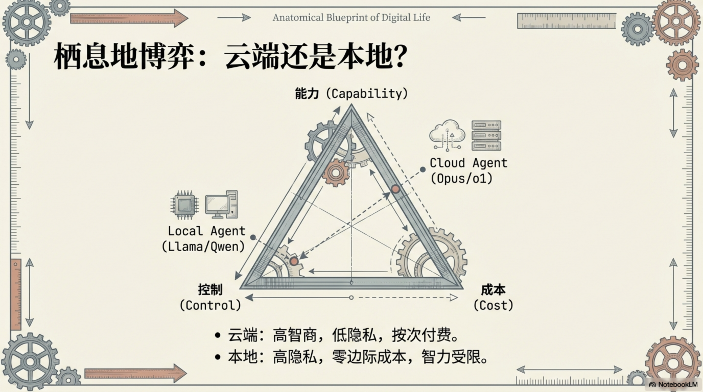
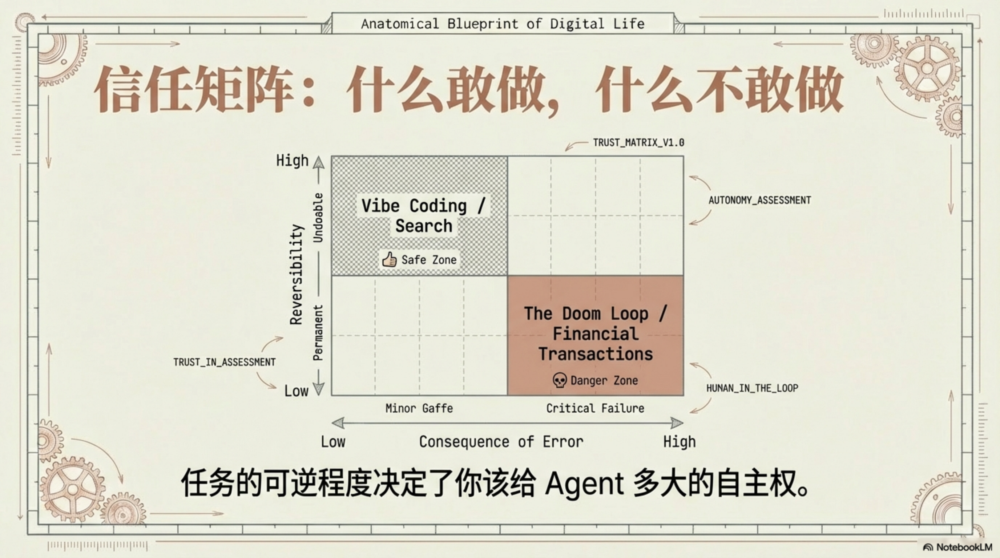
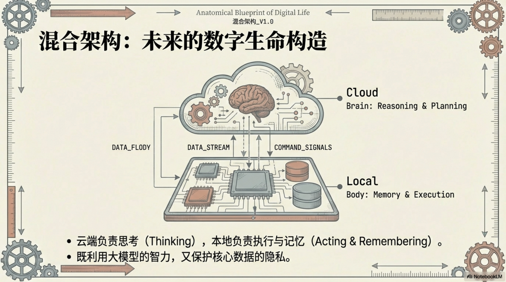

# Agent 的两条路

> 在哪里执行，决定了它能做什么。能做多少，取决于你敢给它多大的权限。

2026 年 1 月，OpenClaw 在 GitHub 爆红——3 天突破 10 万 Stars，随后攀到 18 万。它能连接 WhatsApp、Telegram、Slack 等十余个消息平台，在你自己的设备上替你发消息、跑脚本、管日历。数据不出设备，一行命令启动。

爆火三周后，[一个严重漏洞被披露](https://conscia.com/blog/the-openclaw-security-crisis/)：CVE-2026-25253，远程代码执行。第三方插件商店里有恶意插件在做数据窃取。一个帮你"动手"的工具，本身也可以被人"动手"。

这件事揭开了一个更根本的问题：Agent 能力越强，权限越大，风险也越大。而这个问题，在**本地 Agent** 身上体现得最为尖锐。

---

## 一、两条路，一个本质区别

Agent 的分类，看的不是模型跑在哪里，而是**它在哪里执行、能碰到什么**。

**云端 Agent**（Cloud Agent）：你发一条指令，任务在远程服务器的沙箱里执行，结果传回来。Manus、Devin、ChatGPT Agent 都属于这类。你看不到它的执行环境，也碰不到。它能用的工具，由平台提供；它能访问的数据，由你上传。

**本地 Agent**（Local Agent）：在你自己的设备上运行，拥有你授权的一切权限。Claude Code、Cursor、Windsurf、OpenClaw 都属于这类。它能读你的文件、执行终端命令、操控本地软件、访问你的代码库。

有人会问：Claude Code 的大模型不是跑在 Anthropic 的云端吗？它不算"混合"吗？

不算。**模型 API 在哪里，只是一个实现细节——就像你用 Chrome 浏览器，渲染引擎在本地，但网页数据从远程服务器获取。你不会因此把 Chrome 叫做"混合浏览器"。** 关键是：Agent 的执行环境在你的电脑上，它操作的是你的文件系统、你的终端、你的开发工具。这就是本地 Agent。

这个区分为什么重要？因为执行环境决定了 Agent 的能力天花板——也决定了它的风险天花板。

---

## 二、云端 Agent：能力强，但隔着一层玻璃

云端 Agent 的优势是**开箱即用，算力无上限**。

你不需要配置环境、安装依赖、操心硬件。注册一个账号，描述一个任务，它在远程沙箱里替你完成。Manus 能自主搜索、写代码、生成报告；Devin 能在云端修复 GitHub Issue；ChatGPT Agent 能操控浏览器完成在线任务。

但所有这些能力，都被关在一个沙箱里。

云端 Agent **碰不到你的电脑**。它不能读你桌面上的文件，不能操作你的本地软件，不能帮你在终端里跑一条命令。你想让它处理本地数据？先上传。你想让它操作某个没有 API 的内部系统？做不到。

它的执行边界 = 平台提供的工具集。不多也不少。

[MIT Technology Review 实测 Manus](https://www.technologyreview.com/2025/03/11/1113133/manus-ai-review/) 时发现：它擅长定义清晰的研究和数据任务，但遇到 CAPTCHA 就卡住，服务器高负荷时频繁报错，上下文窗口一长就容易中断。Devin 在 [SWE-bench 上的得分是 13.86%](https://cognition.ai/blog/devin-annual-performance-review-2025)——比之前的 AI 模型高了 7 倍，但仍然意味着 86% 的任务完不成。

云端 Agent 像一个远程办公的外包员工：能力不差，但他只能用公司给的电脑和工具，碰不到你桌子上的东西。

---

## 三、本地 Agent：你电脑的超级用户

本地 Agent 的故事完全不同。

Claude Code 跑在你的终端里。它能读你的代码库、写文件、执行 shell 命令、跑测试、提交 PR——不需要你上传任何东西，因为**它就在你的电脑上**。Cursor 和 Windsurf 嵌入 IDE，直接感知整个项目结构。OpenClaw 连接你的消息平台，替你管理日常沟通。

这些 Agent 都调用云端 LLM 做推理，但**执行动作发生在本地**。文件读写、命令执行、消息发送——全部在你的设备上完成。

这意味着什么？

**本地 Agent 的执行边界 = 你自己的操作边界。**

你能在电脑上做的一切——打开应用、编辑文件、发送消息、运行脚本、管理数据库——它理论上都能做。它不被沙箱限制，不被平台的工具集约束。你的电脑有什么软件，它就有什么工具。

能力数字可以量化。[Claude Opus 4.0 在 SWE-bench 上达到 72.5%](https://smartscope.blog/en/ai-development/ai-agent-development-claude-code-2025/)——在真实 GitHub Issue 修复任务上，接近四分之三都能搞定。[HUB International 让 20,000 名员工使用 Claude Code](https://www.prnewswire.com/news-releases/hub-international-brings-anthropics-claude-to-20-000-employees-reports-85-productivity-gains-and-90-user-satisfaction-302696485.html)，结果是效率提升 85%，平均每人每周节省 2.5 小时，用户满意度超过 90%。

但能力强大的另一面，是权限的重量。

---

## 四、权限越大，边界越重要

云端 Agent 做错了，最多是沙箱里的任务失败——你损失一些时间和 API 费用。

本地 Agent 做错了，后果可以很严重。它删了你的文件，文件就真的没了。它执行了一条危险的 shell 命令，系统可能真的出问题。它替你发了一封邮件，邮件就真的发出去了。

**本地 Agent 拥有的是你的权限，犯的也是你的错。**

这不是理论风险。OpenClaw 的 CVE-2026-25253 漏洞，让攻击者能通过恶意插件在用户设备上执行任意代码——而用户给了 OpenClaw 访问所有消息平台的权限。一个 Agent 的安全缺陷，变成了整个数字身份的入口。

所以本地 Agent 的核心设计问题不是"能做什么"，而是**"不该做什么"**。

好的本地 Agent 都在权限控制上下了重功夫。Claude Code 在执行每一条 shell 命令前都会请求用户确认；文件修改以 diff 形式展示，让你看清楚改了什么再批准。Cursor 在执行代码变更时同样需要明确授权。这些"麻烦"不是设计缺陷，是**安全机制**。

一个实用的判断框架：**操作的可逆性 × 后果的严重程度**，决定了你该给 Agent 多大的自主权。

- 搜索信息、生成草稿？放手让它做。
- 修改代码、编辑文件？让它做，但看一眼 diff 再确认。
- 删除数据、发送正式邮件、执行金融操作？你亲手点那个按钮。

---

## 五、两条路各自适合什么

不是"哪条路更好"，而是"你的场景适合哪条路"。

**云端 Agent 擅长的事**：

- 一次性的重型任务——写一份研究报告、做一次数据分析、完成一个独立的开发任务
- 不涉及本地数据的工作——纯粹基于网络信息的搜索、整理、生成
- 追求开箱即用——不想配环境，注册就能用

**本地 Agent 擅长的事**：

- 深度嵌入日常工作流——代码开发、文件管理、消息处理、日程安排
- 需要访问本地资源——你的代码库、本地文档、已安装的软件、系统工具
- 高频重复任务——每天都要做的事，用本地 Agent 自动化，长期成本更低
- 隐私敏感场景——数据不出设备，不经过第三方服务器

**一个简单的判断**：如果任务需要碰你电脑上的东西，用本地 Agent；如果任务只需要网上的信息和云端的算力，云端 Agent 更省心。

很多人的实际工作方式是两者并行：用 Claude Code 写代码、管项目，用 Manus 做行业调研、生成报告。不是二选一，而是各司其职。

---

## 六、产品速览

**云端 Agent**：

- **Manus**（2025.03）——通用任务 Agent，擅长研究报告和数据处理；遇 CAPTCHA 和高负荷时不稳定
- **Devin**（Cognition Labs）——专注软件开发，Core 版 20 美元/月，擅长明确需求的工程任务
- **ChatGPT Agent**——2025 年 7 月整合进 ChatGPT，能力全面，但受反机器人检测制约；[操作过程中截取的屏幕内容保留至用户删除对话，删除后再存留最多 90 天](https://help.openai.com/en/articles/11752874-chatgpt-agent)

**本地 Agent**：

- **Claude Code**——运行在终端，直接操作代码库，读写文件、跑测试、提 PR；SWE-bench 72.5%
- **Cursor / Windsurf**——IDE 内 Agent，感知整个项目结构，写代码、调试、重构一条龙
- **OpenClaw**——消息平台自动化，连接十余个通讯工具；GitHub 180,000+ Stars，MIT 协议，有已知安全漏洞历史

---

云端 Agent 在远程替你完成任务，方便但隔着一层玻璃。本地 Agent 就在你的电脑里，拥有你的权限，能做的事远比云端多——但也正因如此，它的边界需要你亲手划定。

AI 用四年完成了从"说话"到"动手"的蜕变。下一个问题不再是"它能做什么"——而是：你打算把多少权限交给它，以及，在哪些事情上你坚持自己按下那个按钮。

