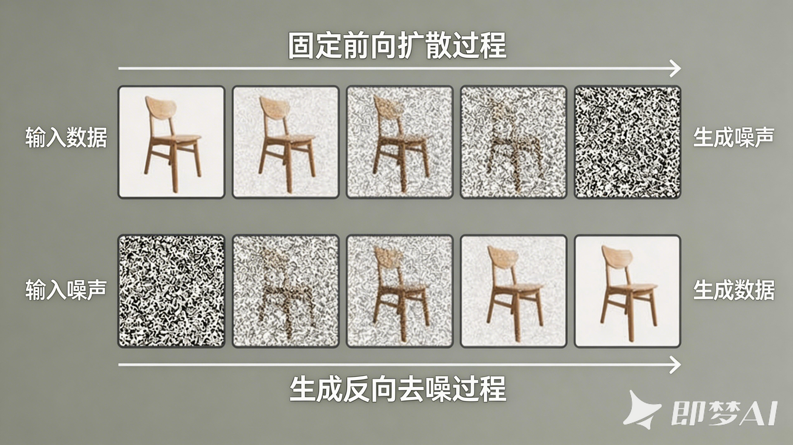
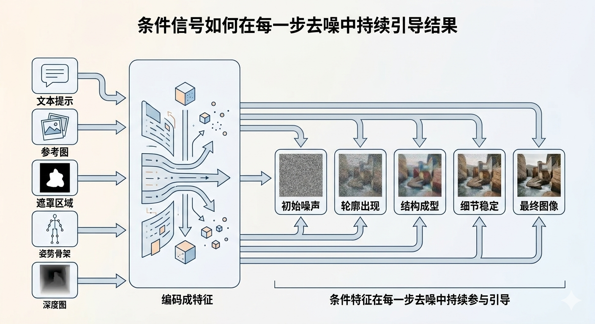
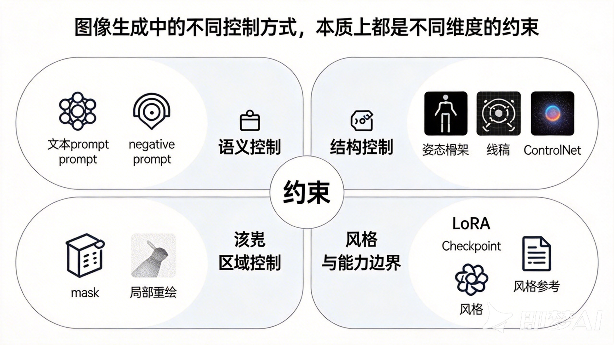

# 豆包 P 图的背后

> 它看起来像魔法，底层其实是受约束的概率生成。

豆包 P 图、即梦、Midjourney 这类产品，最容易让人产生一种错觉：它们像是真的懂你。

你说一句“把肚子 P 小一点”，它真的能改。你再说一句“背景换成海边”，它也真能换。第一次用的时候，那种感觉很像找了一个反应飞快、永不喊累的修图师。

但你多用几次，又会发现它没那么“懂”。你明明只想让肚子小一点，它却顺手给你修出几块腹肌。你想保留衣服褶皱，它偏偏把整件衣服也一起重画了。它很强，但又不完全听话。

这篇文章想讲清楚的，就是这个别扭的事实：这些产品并不是像人类修图师那样，先理解你的意图，再动手处理图片。它们做的事，更接近在一个巨大的概率空间里，一步步把噪声推回到“最像你要求的图像”的那一小块区域里。

听起来有点抽象。没关系，我们慢慢来。

## 一、文生图不是画出来的，而是“修”出来的

很多人一听“图像生成模型”，脑子里会浮现一个拟人化的画面：模型像画家一样，先理解 prompt，再从空白画布开始下笔。

这其实很误导。

更接近真实的理解是：模型先学会一种能力——**如何把被打坏的图片修回来**。有了这个能力之后，它才有机会从一团噪声里，一步步“修”出一张图。

### 训练时，模型先学会去噪

你可以把训练过程想成这样。

先拿一张正常照片。比如，一张海边的人像照。然后故意把它一点点打坏。

一开始，可能只是加一点细碎颗粒，像手机夜拍时的噪点。再往后，图像会越来越模糊，像隔着一层毛玻璃。再严重一点，你可以把它想成打了越来越厚的马赛克。继续加下去，人物轮廓、衣服纹理、背景层次都会被冲散。最后，整张图几乎只剩下一团随机斑点。

这就是“噪声”的直觉版解释。

所谓**噪声**，不是某种神秘物质。它只是会破坏图像原有结构的信息。它会让边缘变钝，让纹理消失，让五官不再像五官，让天空和海面混成一片。扩散模型最经典的做法，是在训练里逐步往真实图像里加入高斯噪声，然后让模型学习怎么反过来恢复图像。这个思路最早由 Ho 等人在 2020 年提出，叫 **去噪扩散概率模型**（Denoising Diffusion Probabilistic Models，DDPM）。[论文](https://arxiv.org/abs/2006.11239)

这里最关键的一点是：模型学的不是“记住这张照片”。

它学的是另一件事——如果一张图已经坏到这个程度，往哪个方向修一点，会更像真实世界里的照片。是让皮肤边缘重新连续起来，还是让衣服纹理回来一点？是让背景变得更平滑，还是让人物轮廓更清楚？

它在训练里反复做的，就是这种判断。

如果把镜头再往工程实现里拉近一点，还有一个很关键的改进。

今天大家熟悉的 Stable Diffusion，背后的核心思路是 2022 年提出的 **潜在扩散模型**（Latent Diffusion Model）。你不用把这个名字记住，只要理解一点：它不是直接在原始像素上反复处理，而是先把图片压缩到一个更紧凑、更省计算的 latent 空间，再在那里做去噪。

这样做的意义很现实：计算量一下子降了很多，图像生成才真正从“研究上可行”走向“产品里可用”。[论文](https://arxiv.org/abs/2112.10752)

### 生成时，模型只是在反着走训练过程

一旦你接受了上面那个训练逻辑，生成图片这件事就没那么神秘了。

生成时，模型不是凭空开始“创作”。它只是把训练时学会的能力反过来用。

训练时，它看过无数“清晰图片怎么一步步变坏”的过程。生成时，它就从最坏的起点开始——一团随机噪声——然后一步一步往回修。

可以把它写成一个很朴素的过程：

```text
一团噪声 -> 少一点噪声 -> 轮廓开始出现 -> 纹理慢慢稳定 -> 最终图像
```

这个过程不是一次完成的，而是迭代很多步。每一步，模型都要回答一个问题：**当前这张还很乱的图，下一步应该往哪里修，才更像真实图片？**

如果把这个过程压缩成一张图，大概就是下面这样：



这就是为什么我更喜欢把扩散模型理解成“修图机器”，而不是“画图机器”。

“画图”这个说法，太像一次性出结果了。扩散模型恰恰不是。它是一点点收敛出来的。

### 为什么说它是概率生成

问题来了：如果它只是把噪声修回图片，那最后为什么会修出一只猫，而不是一辆自行车？为什么会修出海边，而不是办公室？

因为它修的不是“任意图片”，而是**在条件限制下最可能出现的图片**。

这就是“条件概率生成”的意思。

如果你不给任何条件，模型就只能从噪声里随便收敛到一张“像图片的图片”。

如果你给它一句 prompt——比如“海边，夕阳，穿白裙子的女生”——那模型在每一步去噪时，就不再是盲修，而是朝着“更像这段描述”的方向修。

它不是先想清楚整张图，再一次性落笔。它更像是在一个巨大的可能性空间里，一边参考条件，一边缩小结果范围。最后出来的那张图，不是“唯一正确答案”，而是“在当前模型看来很有可能成立的一种答案”。

所以文生图不是那种你下一个命令、它就精确执行一个结果的系统。它不像 Photoshop 那样可预期、可定位、可逐项修改。它更像一个受约束的采样系统。

这也为后面的“不听话”埋下了伏笔。

## 二、条件是怎么喂给模型的

我们可以用文字、参考图、局部重绘区域、姿势草图这些信息来控制生成，而它们进入模型之前，都会先被翻译成模型能处理的数值特征。

### 先翻译，再引导

模型不直接“看懂”一句话，也不直接“看懂”一张参考图。对它来说，文字和图片最后都要先变成某种内部表示。

如果你看到“高维向量”这种词先别紧张。你可以先把它粗略理解成：模型把这些输入翻译成了一套自己内部能比较、能传递、能持续调用的坐标化便签。

- 文字描述会先变成语义特征
- 参考图会先变成视觉特征
- 局部重绘区域会先变成空间约束
- 边缘图、深度图、骨架图这类输入，会先变成结构特征

你可以把这一步想成：先把人类能读懂的提示，翻译成一套机器内部的便签。

这些便签不会直接替模型把图变出来。它们更像一套持续出现的导航信号。

画成结构图，它更接近下面这个意思：



### 为什么说它们会“反复参与引导”

这里最好的类比，是夜里开车。

你在一个完全陌生的城市里开车。起点不是目的地，中间也不会一脚油门直接冲到终点。你只能一段一段地走。

这时候，导航最重要的作用，不是出发前告诉你一句“终点在浦东”就结束了。真正有用的是它在每个路口都继续说话：前面 300 米左转，这段别上高架，靠右行驶，进辅路。

扩散模型里的条件信号，就是这样的。

当前那张带噪的图，相当于你车现在所在的位置。文字描述、参考图、局部重绘区域、姿势图这些条件，不是开头给一次信息就消失了，而是在每一步采样时都继续参与判断：

- 这一步要更像人脸一点
- 这一步别把背景也改坏了
- 这一步人物姿势要贴着参考骨架
- 这一步衣服颜色要往指定方向靠

如果你更喜欢修图的类比，也可以把它想成修复一张老照片。

桌上摆着几样参考：一张文字说明，一张人物参考照，一个遮罩区域，一张姿势草图。你不可能只看一眼这些材料就闭眼开修。你每修一笔，都会重新抬头看一下参考，确认别修偏了。

模型也是一样。区别只是，人类修图师用眼睛对照，扩散模型用数值特征对照。

### 这也是各种控制手段的统一解释

一旦你接受“先编码成特征，再在采样过程中持续引导”这个视角，很多看起来五花八门的控制手段，就没那么散了。

到这里，其实可以先别急着记产品名词。

不管它在界面上叫 prompt、参考图、ControlNet、mask，还是 LoRA，它们底层都在做同一件事：**给去噪过程增加约束**。

你可以先把它们理解成几类不同的“控制旋钮”，至于名字，后面再慢慢对上就行。

如果把这些旋钮摆在一张图上，它们的关系大概是这样的：



差别只在于，这些约束作用的维度不同。

- 有的在控制语义——画什么
- 有的在控制结构——怎么摆
- 有的在控制区域——哪块能改
- 有的在控制风格和能力边界——模型本来擅长什么

这就是为什么同一套底层原理，最后能长出文生图、图生图、局部重绘、姿势控制、多图融合这些完全不同的产品能力。

## 三、它为什么会不听话

现在回到文章开头那个问题。

你让它把肚子 P 小一点，它为什么会给你修出腹肌？

因为它收到的不是一个精确、可验证的 Photoshop 指令。它收到的是一个条件信号，然后它要在自己的统计经验里，去找“最可能符合这个信号的图像方向”。

这两者差别很大。

### prompt 是软控制，不是硬命令

我们习惯把 prompt 理解成命令，但对图像生成模型来说，prompt 更像一种**软控制**。

“把肚子 P 小一点”这句话，对人类修图师来说很明确：局部收一点，别动别的地方。

但对模型来说，这句话会激活一整片语义相关区域。

在训练数据里，“更小的肚子”可能经常和下面这些东西一起出现：

- 更明显的腰线
- 更紧致的腹部轮廓
- 更健身风格的身体状态
- 更清楚的肌肉线条

于是模型在采样时，可能不是理解成“局部收缩 8 个像素”，而是理解成“把这个区域往更瘦、更健身、更符合这类照片统计特征的方向推一推”。

结果就可能从“小肚子没了”，一路滑到“腹肌出来了”。

它不是故意跟你抬杠。它只是猜偏了。

### 模型擅长统计相关，不擅长读心

这件事说穿了并不神秘。

扩散模型强的地方，是它学到了海量图文对之间的统计关系。什么样的描述常常配什么样的视觉结果，它很敏感。

但“我真正想保留什么，只想改哪一点，哪些东西绝对别动”，这些是更细颗粒度的意图。对模型来说，它们并不总是清晰的。

这也是为什么现在很多产品都在拼编辑能力，而不只是拼谁生图更好看。

如果把视角稍微从“模型原理”切到“产品竞争”，你会发现大家最近发力的方向其实很一致：不是只让图更好看，而是让编辑更可控、更稳定、更像是真的在“按你的意思来”。

比如，Google 在 `2025-08-26` 发布 `Gemini 2.5 Flash Image` 时，官方重点强调的能力里，就包括多图融合、角色一致性，以及用自然语言做更精确的局部编辑。[官方博客](https://developers.googleblog.com/introducing-gemini-2-5-flash-image/)

字节 Seed 团队在 `2025-04-15` 发布的 `Seedream 3.0 Technical Report` 里，也把复杂 prompt 对齐、中文复杂文本渲染、原生 2K 分辨率输出和明显加速列成重点改进项。[官方技术报告](https://seed.bytedance.com/en/public_papers/seedream-3-0-technical-report)

这些升级背后的目标，其实都很朴素：让模型少一点“自作聪明”，多一点“按你的意思来”。

只是这件事远比做一张好看的图难。

因为好看，可以靠统计规律。听话，需要更强的条件对齐、局部控制、一致性建模，甚至还要补上一些世界知识和后训练对齐。

## 四、生成图片真正可控的，只有 6 类东西

如果把产品名词都拿掉，只保留第一性原理，图像生成里真正可控的因素，其实可以归纳成 6 类。

这 6 类不是某个框架私有的术语，而是一种更底层的视角。你一旦接受它，很多产品功能都会自动归位。

### 1. 目标分布：你希望结果“像什么”

这是最直观的一类控制。

你想生成一个赛博朋克城市夜景，还是一张婚纱照？你想要写实风格，还是动漫风格？你想要“干净的产品图”，还是“胶片感的人像”？

这些都在决定最终结果应该落到哪一片图像分布里。

prompt、negative prompt、风格描述、类别描述、部分参考图语义，基本都属于这一类。

它们做的事，不是直接指定每个像素，而是缩小“什么样的图算合格”的范围。

### 2. 初始状态：生成从哪里开始

很多人以为生成图片永远从纯噪声开始。其实不是。

- 文生图通常从纯噪声开始
- 图生图通常从已有图片编码后的 latent 开始
- 修图、重绘、风格迁移，也往往从“已有图像 + 加噪后的状态”开始

这就是为什么“P 图”和“生图”不是两套原理。

前者只是没有从完全随机出发，而是从一张已经带有结构信息的图开始。SDEdit 这类工作展示的正是这种思路：先给已有图片加噪，再让模型在条件下把它重建回来。[论文](https://arxiv.org/abs/2108.01073)

起点不同，最后结果的自由度就不同。

从纯噪声出发，想象空间最大，但也最容易跑偏。从原图 latent 出发，保留原图结构的机会更大，但可改动空间也会更受限。

### 3. 生成路径：模型怎么从起点走到终点

就算目标一样、起点一样，路径不同，结果也会变。

这类控制，在产品或开源工具里常常会表现成一些参数项。你不必记住名字，只要知道它们控制的是“这条生成路径怎么走”。

常见的几类包括：

- 走得快还是走得稳
- 一共走多少步
- 多大程度上强行贴近条件
- 保留原图多少、放开改动多少

它们控制的不是“审美喜好”，而是生成轨迹本身。

你可以把它理解成导航策略。有的路线更快，但可能粗糙；有的路线更稳，但要多走几步；有的路线更强调条件一致性，但可能让图变得僵硬。

Classifier-Free Guidance 就是一个很典型的例子。它的核心思路，是同时估计“无条件去噪方向”和“有条件去噪方向”，再在推理时把更符合条件的方向放大。[论文](https://arxiv.org/abs/2207.12598)

所以 CFG 开大时，图常常更贴 prompt，但也更容易失真、过饱和，或者看起来“太用力”。

### 4. 条件信号：模型生成时参考哪些额外信息

这是最容易被产品表象遮住，但其实最核心的一类。

prompt 控制，本质上就是条件信号控制。

参考图、角色图、边缘图、深度图、姿势骨架、ControlNet、多图融合输入，本质上也都属于条件信号。它们控制的是不同维度：

- prompt 更偏语义
- 参考图更偏身份、材质、局部视觉特征
- 边缘图和骨架图更偏结构
- 深度图更偏空间关系
- 多图融合更偏跨图像的信息拼接

这些输入之所以能控制结果，不是因为模型“看见了原图就照着抄”，而是因为它们先被编码成特征，然后在每一步去噪里反复影响更新方向。

ControlNet 的价值就在这里。它相当于把额外结构条件更稳定地接入扩散模型，让“照着骨架画”“照着线稿画”“照着深度关系画”这件事变得更可靠。[论文](https://arxiv.org/abs/2302.05543)

### 5. 可修改区域：哪些地方能动，哪些地方别动

这类控制解决的是空间边界问题。

如果没有区域约束，模型往往会在你不想动的地方也一起重画。你本来只想改衣服颜色，它顺手把脸、背景、光线一起洗了一遍。

mask 的作用，就是告诉模型：主要改这里，别处尽量保持。

局部重绘、局部修复、扩图，本质上都属于这一类。

RePaint 这类工作展示了这个逻辑：在掩码区域里重新采样，同时尽量保持未掩码区域一致。[论文](https://arxiv.org/abs/2201.09865)

所以“哪一块能改”不是一个 UI 层的小功能，它直接决定了逆扩散过程中自由度被限制在哪个空间范围里。

### 6. 模型能力边界：模型本身会什么，不会什么

最后这一类，经常被用户忽略。

很多人以为 prompt 写得更长，就能强行把模型逼出它不会的能力。其实不行。

如果模型本身不擅长中文排版，不擅长某种特定画风，不擅长稳定保留角色一致性，那你再怎么写 prompt，也只能在它现有能力边界内挣扎。

checkpoint、LoRA、adapter、VAE、refiner 这些名字听起来很杂，但你不用一个个记。粗略理解就够了：它们很多时候改变的不是一次采样里的局部方向，而是模型本身会什么、偏好什么、表达上限在哪里。

这也是为什么字节在 `Seedream 3.0` 里会把复杂中文字形排版专门拿出来讲。不是 prompt 工程突然变强了，而是模型自己的能力边界变了。[官方技术报告](https://seed.bytedance.com/en/public_papers/seedream-3-0-technical-report)

## 五、为什么这些约束真的能控制结果

讲到这里，其实可以把整件事压缩成一句话：

> 生成图片，本质上是在所有可能图片里，找到一张最符合给定约束的结果。

那些看起来花哨的控制手段，真正做的事都是同一种事：缩小模型的自由度。

- 目标分布告诉它“最后大概要像什么”
- 初始状态告诉它“从哪里出发”
- 生成路径告诉它“怎么走过去”
- 条件信号告诉它“每一步往哪边靠”
- 可修改区域告诉它“哪块能动”
- 模型能力边界决定了“它最多能做到什么程度”

从这个视角再看产品层的“黑科技”，很多东西就不再神秘了。

为什么你写一句话就能让它生成图？因为文字先被编码成语义特征，再在采样时持续引导去噪方向。

为什么你上传两张图就能让它融合？因为多张图也可以先被编码成条件特征，再一并参与采样。

为什么你画一个 mask 就能只改局部？因为 mask 直接限制了可修改区域。

为什么同样一句 prompt，换个模型结果差很多？因为模型能力边界不一样。

Google 的 `Gemini 2.5 Flash Image` 官方介绍里，已经把这种多模态能力写得很明确：模型可以综合文本和图像等多种输入信息来完成生成与编辑。[官方博客](https://developers.googleblog.com/introducing-gemini-2-5-flash-image/)

你看到的是“一个提示词就能搞定”，模型内部看到的其实是一大组编码后的条件，再配上一条反复纠偏的采样轨迹。

这就是今天这些产品越来越像魔法的原因。

不是因为它们真的会画画，也不是因为它们真的懂你。

而是因为它们已经很会把各种约束揉进一条去噪路径里了。

## 六、理解原理，也是在理解它的边界

回到文章最开始那个场景。

你让它把肚子 P 小一点，它却给你修出腹肌。这件事好笑，但它其实很诚实。

它提醒你：今天这些图像模型已经很强了，强到一句话就能改图、扩图、重绘、融合多张图，强到界面层看起来只剩下一个输入框。

但它们依然不是精确执行器。

它们是受条件约束的概率生成系统。它们靠的是统计规律、条件对齐、迭代去噪和越来越强的多模态特征注入，而不是像人类修图师那样真正理解“你心里那一点微妙的意思”。

这不是坏消息。

恰恰相反。只有当你理解了这一点，prompt、参考图、ControlNet、mask、LoRA 这些东西才不再像零散技巧，而会重新排成一张清楚的地图。

你也会更容易明白，为什么有些时候该改 prompt，有些时候该换参考图，有些时候该上 mask，有些时候干脆该换模型。

产品把复杂性藏在了按钮后面，所以你感受到的是魔法。

而原理把魔法拆开之后，剩下的其实是一件非常朴素的事：从噪声出发，在约束之下，一步步逼近一张最可能的图。

这，就是“豆包 P 图”的背后。
